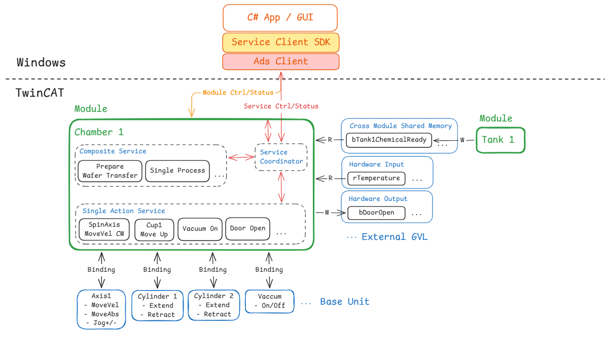
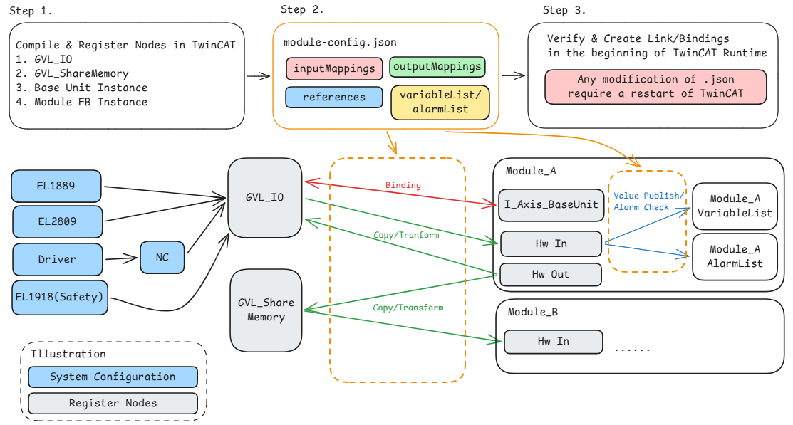
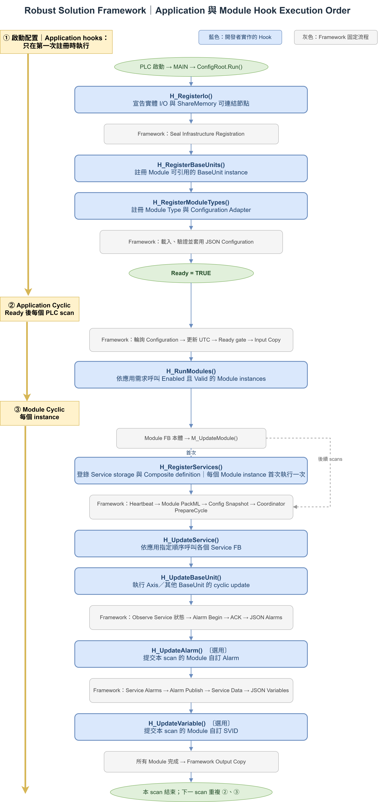
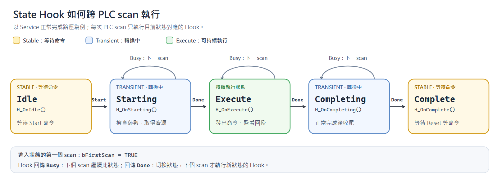
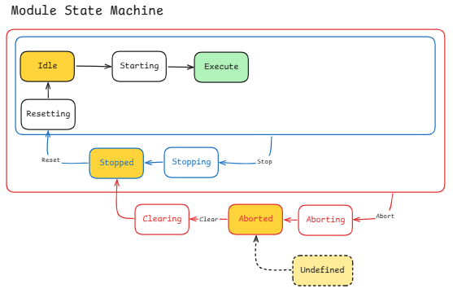
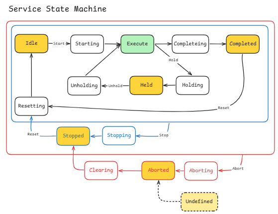

# Robust Solution Framework 概念說明之一圖勝千文

本文件以架構圖說明 Robust Solution Framework 在 TwinCAT 端的主要功能物件，以及它們如何協作。閱讀重點是 **Module、Service、Base Unit 各自負責什麼**；圖上方的 C# App、Service Client SDK 與 ADS Client 僅表示上位系統的連線入口。

本文件作為系列圖解的起點。後續與架構相關的圖及說明，依序接在本文末尾，每張圖獨立說明其要回答的問題、元素職責與資料流。

## 圖解 1：TwinCAT 功能物件架構總覽



> **圖的閱讀方式**：綠框是 Module；框內的虛線區分 Composite Service、Single Action Service 與 Module 內部的 Service Coordinator。藍框表示 Base Unit 或外部 GVL 訊號。`R`／`W` 以 Chamber 1 為視角，分別表示讀取／寫入。`Binding` 表示啟動時建立的 Base Unit 參照關係，並非每次設備命令都經過的執行元件。圖中 Tank 1、Cylinder、Vacuum Base Unit 等用來示範可擴充的架構，不代表目前範例專案均已實作。

### 1.1 一句話掌握三種元素

**Module 管理設備單元與其生命週期；Service 完成設備動作或流程；Base Unit 提供可被 Service 使用的底層設備能力。** 控制由 Module 向下協調，執行結果與狀態由 Base Unit、Service 向上彙整。

| 元素 | 核心職責 | 圖中的例子 |
|---|---|---|
| Module | 對外提供控制與狀態介面；管理自身 PackML 狀態、Service、I/O 與 Base Unit 的週期更新。 | Chamber 1、Tank 1 |
| Service | 封裝一項設備操作或一段製程流程；處理參數、執行狀態、完成條件與錯誤。 | SpinAxis MoveVel CW、Prepare Wafer Transfer |
| Base Unit | 封裝設備命令、回授及共用資源的占用規則。 | Axis1、Cylinder 1 |

Service Coordinator 畫在 Module 內，表示它是 **Module 管理 Service 的機制**：登錄 Service，選擇控制來源，轉送命令，並觀察各 Service 的狀態。它不是與 Module、Service、Base Unit 平行的一種設備功能物件。

### 1.2 Module：一個設備單元的邊界

Module 將屬於同一設備單元的 Service、Base Unit 參照、輸入、輸出與對外狀態組合起來。以 Chamber 1 為例，其對外資料包含 Module Ctrl／Status，以及各 Service 的 Ctrl、Param／Status。上位端透過 ADS 存取公開資料；PLC task 週期性呼叫 Module，Module 再執行內部邏輯。

Module 的主要工作包括：

1. **維護 Module 生命週期**：處理 PackML 命令、模式與狀態；Module 的停止、中止及復歸會影響所管理的 Service。
2. **管理 Service**：登錄各 Service，透過 Service Coordinator 分配有效控制與參數，並彙整 Service 的狀態、錯誤及資料。
3. **組合設備依賴**：持有啟動時已綁定的 Base Unit 介面，將需要的介面與 Service ID 傳給對應 Service。
4. **安排週期更新**：呼叫 Service 後，再更新所屬 Base Unit；最後發布 Module 的狀態、Alarm、Data 與 Variable。
5. **使用外部訊號**：從映射後的輸入取得設備或其他 Module 的資訊，並產生要寫出的輸出。

圖中的 Service Ctrl／Status 箭頭表示公開的控制與狀態關係。在目前範例中，公開資料存放於 `GVL_Module.Chamber1_Control[slot]`；Service Coordinator 位於 Module 的執行路徑內，ADS Client 不直接呼叫 Service FB instance。

### 1.3 Service：執行一項動作或一段流程

Service 有自己的控制、參數、PackML 狀態與執行結果。Module 在每次週期呼叫時提供有效控制、參數、Context、Service ID，以及該 Service 所需的設備介面。

**Single Action Service** 專注於一項操作，例如軸移動、開門或切換真空。它驗證參數、發出設備命令、判斷完成或失敗，並在停止與中止時執行必要的清理。部分動作使用 Base Unit；部分動作透過 Module 提供的 I/O 訊號完成。因此，圖中的每個 Single Action Service 與 Base Unit 不必一一對應。

**Composite Service** 負責一段由多個動作構成的流程。它宣告所依賴的 Service，並透過 Service Coordinator 逐步提交內部命令、觀察依賴 Service 的狀態，再決定下一步。圖中方塊的位置只表示同屬 Chamber 1；某個 Composite 實際依賴哪些 Service，以其宣告的依賴清單為準。

Service Coordinator 會依 Module 狀態與 Composite 的資源占用情況，選擇 Module-wide、Composite 或上位個別 Service 命令作為有效控制。Module 不在 `Execute` 時，由 Module 生命週期控制所屬 Service；在 `Execute` 時，未被 Composite 占用的 Service 才能接收上位的個別控制。Service 產生的狀態由 Module 觀察並對外發布。

### 1.4 Base Unit：設備能力與資源占用

Base Unit 將設備的操作與回授整理成介面。例如 Axis Base Unit 提供移動、停止、復歸，以及位置與錯誤等資訊。Service 使用介面發出命令、讀取結果；Base Unit 管理底層設備及其資源占用。

當同一個 Base Unit 可被多個 Service 使用時，Service 以自己的 Service ID 取得與釋放資源，避免兩個 Service 同時控制同一設備。Module 負責呼叫該 Base Unit 的週期更新；同一 Base Unit instance 應由單一 Module 的週期組合負責更新，以免重複執行。

圖中的 `Binding` 發生在**初始化階段**：設定管理流程解析設定檔，Module adapter 驗證並取得所需的 Base Unit 參照，最後將介面交給 Module。進入週期執行後，Service 透過 Module 傳入的介面直接使用 Base Unit；週期路徑不重新解析 JSON 或 ADS symbol。

### 1.5 三者如何協作

架構圖可以分成兩個時間階段閱讀：

| 階段 | Module | Service | Base Unit |
|---|---|---|---|
| 初始化 | 建立公開資料與 Service 組合；取得已驗證的 Base Unit 參照；登錄 Service 與 Composite 依賴。 | 宣告能力、參數與依賴關係，準備持久的控制及狀態儲存區。 | 註冊為可綁定來源，提供型別化設備介面。 |
| 週期執行 | 接收映射後的輸入；更新 Module 狀態；透過 Coordinator 選擇控制並呼叫 Service；更新 Base Unit；彙整對外狀態與輸出。 | 依有效控制執行動作或流程；提出設備命令；發布狀態、資料與錯誤。 | 執行週期更新，處理命令、設備回授與資源占用。 |

在目前範例的系統週期中，`FB_ApplicationConfigRoot.Run()` 依序進行 **input mapping → Module polling → output mapping**。Module 內部則先執行 Service，再更新 Base Unit。因此，Service 本 scan 提出的非同步設備命令，其完成結果仍須依設備與後續 scan 的回授判定。

### 1.6 External GVL：Module 與外部訊號的交界

圖右側的 External GVL 表示 PLC 內供映射使用的訊號，不是 Windows 作業系統的共享記憶體。Hardware Input 提供 Module 可讀取的設備值；Hardware Output 接收 Module 要寫出的值。Cross Module Shared Memory 用於模組間交換狀態：圖例中由 Tank 1 寫入 `bTank1ChemicalReady`，Chamber 1 讀取它，再由 Chamber 自行判斷後續行為。

外部訊號應清楚定義寫入者、讀取者與資料更新時機。跨 Module 狀態透過訊號交換，不表示 Chamber 直接呼叫 Tank 的 Service。圖中的 `rTemperature`、`bDoorOpen` 與 `bTank1ChemicalReady` 是用來解釋 R／W 方向的示例；實際映射由應用程式設定決定。

### 1.7 以 Prepare Wafer Transfer 串起架構

以下採目前 Chamber 1 範例的 `Endpoint1PrepareWaferTransfer` 說明三種元素的分工：

1. 上位端寫入公開的 Service 控制與參數；Module 在週期中由 Service Coordinator 判定並送出有效控制。
2. Composite Service 取得流程控制權，依序呼叫它宣告的 `LiftPinAxisMoveAbs` 與 `VacuumOff` 依賴 Service。
3. `LiftPinAxisMoveAbs` 使用 Module 傳入的 Axis Base Unit 介面提出移動命令；Module 隨後更新 Axis Base Unit，並於後續週期觀察移動結果。
4. `VacuumOff` 透過 Chamber 的 I/O 訊號執行真空關閉動作。Composite 觀察依賴 Service 的狀態，決定流程完成或失敗。
5. Module 彙整 Service Status、錯誤及相關資料，更新公開的 Module／Service 狀態，供上位端讀取。

這個例子也顯示圖中的 Base Unit 方塊是「可供 Service 使用的設備能力」示意；具體 Service 是否使用 Base Unit，取決於該動作的實作。

### 1.8 圖示範圍與延伸閱讀

目前範例專案實作了 Chamber 1、Service Coordinator、Composite／Single Action Service，以及兩個 Axis Base Unit。Tank 1、Cylinder Base Unit、Vacuum Base Unit、`bTank1ChemicalReady` 與圖中的部分動作名稱是架構擴充示意；Windows 端 SDK 也僅用於說明連線關係。

## 圖解 2：透過設定檔調整 Module 對外資料連接



專案先提供已編譯的 Module、Base Unit、資料欄位與可註冊節點；`module-config.json` 再從這些既有資源中選擇連接。設定在 TwinCAT Runtime 啟動時驗證並套用，修改 JSON 後須重新啟動 PLC。圖中的 `Module_A`、`Module_B` 與端子型號用於說明連接關係；目前範例專案的具體 Module Type 是 `Chamber1`。

### 2.1 Step 1：準備可連接的 PLC 元素

圖左上列出設定檔可以使用的基礎。PLC 專案須先定義 `GVL_IO`、`GVL_ShareMemory`、Base Unit instance、Module FB instance，以及 Module 的 `HwInput`、`HwOutput` 和 Base Unit 介面引腳。實體端子與 PLC 變數之間的 TwinCAT System Configuration 連線也在這一側建立。

「已編譯」與「已註冊」是兩件事：欄位與 FB 必須先存在於編譯後的 PLC 程式；PLC 初始化時，應用程式的 `FB_ConfigRoot` 註冊外部 I/O、共享訊號、Base Unit 與 Module Type，各 Module adapter 再宣告其可供設定使用的資料節點。設定檔以這些已註冊節點為選擇範圍，不會新增 FB、欄位或實體硬體連線。圖中的 `EL1918(Safety)` 僅作固定硬體側示意；安全功能設定不屬於本圖所述 JSON 連接調整範圍。

### 2.2 Step 2：在 `module-config.json` 選擇連接

設定檔依 Module Type、Slot 與啟用狀態選擇已存在的 Module instance，並以四類設定描述對外連接：

| 設定項 | 選擇的關係 | 圖中對應位置 |
|---|---|---|
| `inputMappings` | 已註冊的外部或共享資料節點 → Module 可寫入的輸入節點。 | `GVL_IO`／`GVL_ShareMemory` → `Module_A.Hw In`、`Module_B.Hw In` |
| `outputMappings` | Module 可讀取的輸出節點 → 已註冊的外部或共享資料節點。 | `Module_A.Hw Out` → `GVL_IO`／`GVL_ShareMemory` |
| `references` | Module 的實際介面引腳名稱 → 已註冊的 Base Unit 來源。 | 已註冊 Axis Base Unit → `Module_A.I_Axis_BaseUnit` |
| `variableList`／`alarmList` | 選擇該 Module 已宣告且可讀的資料節點，並設定發布資訊或警報條件。 | Module 資料節點 → `VariableList`／`AlarmList` 的設定項 |

圖中的 `Hw In` 是資料來源示例；`variableList` 與 `alarmList` 也能選擇同一 Module 內其他已註冊且可讀的節點。`references` 指向 Base Unit instance 所提供的介面，例如範例設定中的 `GVL_IO.NC_Axis1`，不是把一般 `GVL_IO` 資料位元組複製到軸介面。

### 2.3 Step 3：啟動時驗證並建立連結

TwinCAT Runtime 啟動後，Configuration Manager 讀取 JSON，依註冊資訊解析節點與 Module 引腳，檢查名稱、方向、型別、大小及必要的 Reference 是否有效。通過檢查後，框架建立 I/O mapping、Base Unit binding，以及 Variable／Alarm 的 Runtime Binding 與 NodeHandle；週期執行使用這些已驗證的連結。

設定檔只在初始化時套用。修改 `module-config.json` 的 mapping、reference、發布項目或 Module 啟用狀態後，須重新啟動 PLC 才會使用新設定；此流程不提供運轉中的 hot reload。

### 2.4 下半圖：連結建立後如何傳遞資料

**I/O mapping（綠色 Copy／Transform）**：`FB_ApplicationConfigRoot.Run()` 在每個 PLC scan 先執行 input mapping，再呼叫已啟用的 Module，最後執行 output mapping。來源與目標型別、大小完全相同且沒有 `transform` 時，連結以 `MEMCPY` 複製；設定數值型 `scale`／`offset` 時則執行明確的數值轉換。圖中的箭頭表示設定好的來源與目標，JSON 不會在每個 scan 重新解析。

**Base Unit binding（紅色 Binding）**：初始化時將已註冊的 Base Unit 來源解析到 Module 的具名介面引腳。週期執行時，Module 將已取得的介面交給所需 Service，Service 透過該介面操作設備；Binding 不是設備命令的週期複製路徑。

**跨 Module 共享訊號**：`Module_A.Hw Out` 可透過 `outputMappings` 寫入 `GVL_ShareMemory`，`Module_B.Hw In` 再透過 `inputMappings` 讀取。依目前「先做所有輸入映射、執行 Module、最後做所有輸出映射」的順序，Module A 在本 scan 結尾寫出的共享值，會在下一個 scan 的 input mapping 進入 Module B。兩個 Module 的資料交換仍受共享訊號寫入者與資料時序的約束。

**Variable／Alarm 發布（藍色箭頭）**：框架依啟動時建立的 NodeHandle 讀取已註冊 Module 節點，在本機建立資料快照。`variableList` 設定項將讀值與 ID、名稱、單位等資訊發布為 Variable；`alarmList` 設定項還會判斷 condition，交由 Module Alarm Manager 管理警報生命週期及確認狀態。因此這兩條箭頭不表示從 `Hw In` 直接 `MEMCPY` 到兩份 List。完整的 `AlarmList` 也可包含 Service 與 Module Hook 產生的警報，JSON 控制的是其中的 configured alarm 項目。

### 2.5 以 Chamber1 的溫度訊號為例

目前範例設定將 `GVL_IO.Term2_EL3602.Chl[1]` 映射到 `Chamber1` 的 `HwInput.rTemperature`，並以 `scale = 0.01`、`offset = 50.0` 將來源 `DINT` 轉為目標 `REAL`。同一個 `HwInput.rTemperature` 又被選為 `variableList` 的溫度顯示來源，以及 `alarmList` 的溫度過高判斷來源。若來源需要改到另一個**已註冊且型別相容**的節點，可以修改設定檔並重啟 PLC；Module 的溫度欄位與 Service 程式不必因此改寫。

另一個獨立例子是 `references`：範例把 `SpinAxis_BaseUnit` 引腳綁定到已註冊的 `GVL_IO.NC_Axis1`。設定檔選的是來源；Module adapter 仍會驗證該來源是否提供所需的 Axis 介面。

### 2.6 可調整範圍與邊界

| 只需修改設定檔並重新啟動 PLC | 須修改、建置或部署 PLC 專案 |
|---|---|
| 選用已編譯、已註冊的 Module Type／Slot；啟用或停用既有 instance。 | 新增 Module Type、FB instance 或超出既有容量的 Slot。 |
| 在已註冊且符合方向、型別規則的節點間調整 input／output mappings。 | 新增 Module 欄位、外部 I/O 節點、硬體配置或其註冊程式。 |
| 選擇已註冊的 Base Unit 來源綁定既有 Reference Port。 | 新增 Base Unit 類型、介面引腳或 Service 操作流程。 |
| 調整 configured Variable／Alarm 的來源與發布定義。 | 新增原本未宣告的資料來源或改變 Module 的程式邏輯。 |

因此，本架構的「動態」是**啟動時由設定檔選擇既有元素間的連接**。

## 圖解 3：Application 與 Module Hook 的執行順序




前兩張圖分別介紹功能物件的職責，以及設定檔如何建立連接；這張圖接著回答：**PLC 啟動與每個 scan 中，Framework 何時呼叫應用程式和 Module 自訂的 Hook？** 圖中的藍框是開發者實作的 Hook，灰框是 Framework 決定順序的固定流程，綠色橢圓表示啟動、Ready 或本 scan 結束等時點。

### 3.1 先分清楚三個時間範圍

| 時間範圍 | 執行單位 | 主要工作 |
|---|---|---|
| 啟動配置 | 一個 Application Config Root | 註冊可用資源、載入並驗證 JSON，直到 Configuration Ready。 |
| Application Cyclic | Ready 後的每個 PLC scan | 複製輸入、呼叫已啟用的 Module、複製輸出。 |
| Module Cyclic | 每個被呼叫的 Module instance | 管理 Module／Service 生命週期、設備更新及對外資料發布。 |

圖左側的 ①、②、③ 正是這三個範圍。`MAIN` 每個 scan 呼叫 `ConfigRoot.Run()`；其中的資源註冊只嘗試一次，而 Ready 後的週期工作會持續執行。Module 的 Service 登錄則有自己的「每個 instance 首次呼叫」時點，須與 Application 層的資源註冊分開看。

### 3.2 啟動配置：Application Hook 建立可用資源

`FB_ApplicationConfigRoot` 在首次配置流程中，依序開啟 Infrastructure node registration，呼叫下列 Application Hook，並交由 Framework 完成驗證與封存：

1. **`H_RegisterIo()`**：宣告可供連接的實體 I/O 及 `GVL_ShareMemory` 等 Infrastructure nodes；Framework 隨後 seal 此次註冊。
2. **`H_RegisterBaseUnits()`**：註冊可供 Module reference binding 使用的 Base Unit instances。
3. **`H_RegisterModuleTypes()`**：將已編譯的 Module Type 與其 Configuration Adapter 註冊到系統。

完成資源註冊後，Framework 載入並驗證 JSON，建立圖解 2 所述的 mappings、references、Variable／Alarm runtime bindings。Configuration Manager 進入 `Ready = TRUE` 後，Application 才開始執行 Input Copy、Module polling 與 Output Copy。這些 Hook 宣告的是**可供設定選用的資源**，不負責在每個 scan 重新解析 JSON。

### 3.3 Application Cyclic：Ready 後每個 PLC scan

每次 `Run()` 先輪詢 Configuration，更新 UTC 時間與 System Context。Ready 時，Framework 固定依下列順序執行：

```text
Input Copy → H_RunModules() → Output Copy
```

**Input Copy** 將已配置的外部／共享來源寫入 Module 輸入節點。**`H_RunModules()`** 由應用程式決定要呼叫哪些 Module instances；目前 `Chamber1` 範例依 slot 檢查 Runtime Config 的 `Enabled` 與 `Valid`，再將控制、狀態、System Context、Runtime Config、Node Reader 及 Base Unit 介面傳給 Module。所有 Module 呼叫完成後，**Output Copy** 才把 Module 輸出節點寫往外部或共享目的節點。

因此，圖中的 `H_RunModules()` 是 Application 與 Module 之間的組合點；Module 的處理順序由應用程式在此 Hook 中明確安排。Configuration 尚未 Ready 時，這三項功能週期工作不會執行。

### 3.4 Module 首次呼叫：登錄 Service 一次

以 `Chamber1` 為例，Module FB 本體先確認必要的 Base Unit 介面可用，再呼叫 `FB_ModuleBase.M_UpdateModule()`。對該 Module instance 的第一次有效呼叫，Framework 先啟動 Service Coordinator 的登錄階段，再呼叫 **`H_RegisterServices()`**，最後 seal 登錄結果。此 Hook 宣告各 Service 的控制、參數與狀態持久儲存區，以及 Composite Service 的依賴定義。

這是**每個 Module instance 一次**的組合工作；後續 scan 直接使用已登錄的 Service，不會每次重新登錄。它也不等同於 Application 啟動時的 `H_RegisterIo()`：兩者分屬不同層級、不同觸發時點。

### 3.5 Module Cyclic：先執行 Service，再更新 Base Unit

Service 登錄完成後，`M_UpdateModule()` 每次依 Framework 固定順序執行：

1. 檢查 Heartbeat 並更新 Module PackML 狀態。
2. 讀取本 scan 的 configured value snapshot，建立 Service Context。
3. 由 Service Coordinator 依 Module 狀態準備各 Service 的有效控制與參數。
4. 呼叫 **`H_UpdateService()`**：應用程式依指定順序呼叫各 Service FB；Service 可在此階段提出 Base Unit 命令或更新 Module I/O。
5. 呼叫 **`H_UpdateBaseUnit()`**：對此 Module 所屬的 Axis／其他 Base Unit 執行 cyclic update。
6. Framework 觀察本 scan 的 Service 狀態，更新 Module 對外狀態，再處理 Alarm、Data 與 Variable 的發布。

Service 命令先於 Base Unit 的 cyclic update；設備的非同步完成條件須依後續回授判斷。Service Coordinator 在兩個 Hook 後觀察 Service 狀態，使本 scan 的 Service Error／Data 可以參與後續 Module 彙整；Module PackML 的部分轉換判斷則使用進入本次呼叫時已有的 Service 狀態。

### 3.6 Alarm 與 Variable：選用 Hook 的插入位置

Module 功能更新後，Framework 先啟動 Alarm Manager 的本 scan 週期、處理上位確認要求，再依 configured value snapshot 評估 JSON Alarm。接著呼叫選用的 **`H_UpdateAlarm()`**，讓 Module 透過 `M_AddAlarm()` 提交本 scan 自訂的警報；之後彙整 Service Alarm，結束並發布 Alarm 週期。

Alarm 發布後，Framework 彙整 Service Data，建立 JSON configured Variable 項目，再呼叫選用的 **`H_UpdateVariable()`**，讓 Module 透過 `M_AddVariable()` 發布本 scan 的自訂 SVID。圖中兩個 Hook 的位置表示：開發者只提供 Module 專屬資料，Alarm lifecycle、Service Data 彙整與公開 List 的共同流程仍由 Framework 統一管理。同一識別碼發生重疊時，configured 項目依既定規則優先於對應的 Hook 項目。

### 3.7 讀圖時要留意的 scan 時序

- **輸入先於所有 Module，輸出晚於所有 Module**：若 Module A 在本 scan 透過 output mapping 寫入共享 GVL，Module B 透過 input mapping 讀取的新值會在下一個 scan 進入其輸入節點。
- **快照早於 Service 更新**：JSON Alarm／Variable 使用 Module 在 Service 更新前取得的 configured value snapshot；同一 scan 稍後由 Service 改變的來源值，會在後續 snapshot 才反映。
- **Service 先於 Base Unit**：Service 本 scan 提出命令，Base Unit 隨後執行 cyclic update；新的設備結果與 Module 轉換判斷依各自的觀察時機反映。
- **登錄 Hook 與更新 Hook 的頻率不同**：`H_RegisterServices()` 每個 Module instance 只在首次有效呼叫時登錄；`H_UpdateService()`、`H_UpdateBaseUnit()` 與選用的 Alarm／Variable Hook 則隨該 instance 的每次週期呼叫執行。

以 `Chamber1` 為例：啟動時先註冊 I/O、兩個 Axis Base Unit 與 `Chamber1` Module Type；配置 Ready 後，每個 scan 先複製輸入，再呼叫 enabled 且 valid 的 Chamber1 instance。該 instance 首次呼叫時登錄其 Service 與 Composite 定義；之後依圖中的順序執行 Service、Axis Base Unit、Alarm、Data 與 Variable，最後由 Application 寫出輸出。這段流程展示了**Framework 固定時序**與**應用程式 Hook 內容**的分工。

## 圖解 4：狀態機共通讀法與 Module 狀態機

Module 和 Service 都繼承 Framework 的 PackML 狀態機，但各自管理的對象不同：**Module 協調一組 Service 的生命週期；Service 在自己的狀態 Hook 中執行設備動作或流程。** 本節先說明 Hook 的執行規則，再讀 Module 圖；下一節對照 Service 圖，回答新增動作應寫在哪個 Hook。

### 4.1 閱讀狀態機前要知道的事



[查看可縮放的 SVG 原圖](./assets/state-hook-scan-lifecycle.svg)

這張小圖取 Service 的正常完成路徑，將「接受命令」「執行目前狀態的 Hook」及「Hook 完成後換狀態」分開。圖中的 `Start` 是命令；`Busy` 與 `Done` 是 Hook 的回傳結果，並不是上位命令的接受／拒絕回覆。命令仍須通過目前狀態與模式的檢查；**命令被接受，也不代表設備動作已完成。**

| 本文用語 | 判讀方式 | 典型狀態與 Hook 行為 |
|---|---|---|
| Stable State（等待狀態） | 保持目前狀態，直到允許的命令觸發轉換；其狀態 Hook 不以 `Busy`／`Done` 決定離開時機。 | `Stopped`、`Idle`、`Aborted`、`Held`、`Complete`。Module 的 `H_OnIdle()` 會主動提出 `Start`，所以 Module 的 `Idle` 通常很短。 |
| Transient State（轉換狀態） | Hook 在每個相關 PLC scan 執行；回傳 `Busy` 時留在此狀態，回傳 `Done` 時移至下一狀態。 | `Starting`、`Completing`、`Stopping`、`Aborting`、`Clearing`、`Resetting`、`Holding`、`Unholding`。 |
| `Execute`（持續執行狀態） | `H_OnExecute()` 同樣回傳 `Busy`／`Done`，但可長時間持續執行；`Busy` 留在 `Execute`，`Done` 才進入 `Completing`。Framework 的 `bTransitionActive` 不把它列作 Transient。 | 軸持續移動、等待真空回授、執行 Composite 步驟。不能單憑「正在做事」判斷狀態是否為 Transient。 |
| `Undefined`（初始特殊狀態） | 啟動時的預設／尚未確立狀態；預設 Hook 回傳 `Done` 後直接到 `Aborted`，再循 `Clear → Stopped → Reset` 進入可操作流程。 | 不在此處編寫一般 Service 動作。 |

每次進入新狀態，該狀態 Hook 第一次被呼叫時的 `bFirstScan` 為 `TRUE`，可用來初始化僅做一次的資料；後續 scan 持續呼叫同一 Hook 時為 `FALSE`。`Done` 會切換目前狀態，但**新狀態的 Hook 要到下一次呼叫狀態機才執行**。例如 `H_OnStarting()` 回傳 `Done` 後，本 scan 可觀察到 `Execute`，`H_OnExecute()` 不會在同一次狀態機呼叫中接著執行。

本文使用 Stable／Transient／持續執行三類來對應**此 Framework 的 Hook 行為**；狀態名稱及主要轉換參考 PackML。PackML 的狀態定義可參閱 [OPC Foundation：PackML Execute State Machine](https://reference.opcfoundation.org/specs/OPC-30050/6.3.8)，實際可用路徑與 Hook 行為仍以本專案實作為準。

### 4.2 Module 圖：管理一組 Service 的狀態



圖中的主路徑可讀作 `Stopped → Resetting → Idle → Starting → Execute`。Module 進入 `Execute` 後，Service Coordinator 才能依個別上位命令或 Composite 流程選擇 Service 控制；當 Module 不在 `Execute`，Coordinator 以 Module 的控制要求管理所屬 Service。圖中的 Stop、Abort 路徑表示 Module 對整組 Service 的生命週期控制，不是 Module 自己直接操作某支軸或某個 I/O。

| Module 狀態或路徑 | Framework 預期執行的內容 |
|---|---|
| `Undefined → Aborted` | 初始狀態的預設 Hook 完成後直接進入 `Aborted`；圖中的虛線不是經過 `Aborting`。 |
| `Aborted → Clearing → Stopped` | 接受 `Clear` 後，Module 等待所有已登錄 Service 進入 `Stopped`，再完成 `Clearing`。 |
| `Stopped → Resetting → Idle` | 接受 `Reset` 後，Module 等待所有 Service 進入 `Idle`，再完成 `Resetting`。 |
| `Idle → Starting → Execute` | `H_OnIdle()` 會提出內部 `Start`；目前 `Starting` 依繼承的預設 Hook 完成，進入持續運作的 `Execute`。 |
| `Stopping → Stopped` | 接受有效的 `Stop` 後，Module 等待所有 Service 進入 `Stopped`；尚未全部到達時保持 `Stopping`。 |
| `Aborting → Aborted` | 接受有效的 `Abort` 或外部故障後，Module 等待所有 Service 進入 `Aborted`；尚未全部到達時保持 `Aborting`。 |

這裡的「所有 Service」由 Service Coordinator 的 `AllIdle`、`AllStopped`、`AllAborted` 判斷。Module 的 `H_OnAborting()`、`H_OnClearing()`、`H_OnResetting()`、`H_OnStopping()`、`H_OnIdle()` 在 `FB_ModuleBase` 中是 `FINAL`，**不是衍生 Module 放入個別設備動作的擴充點**。衍生 Module 使用 `H_RegisterServices()` 登錄 Service、在 `H_UpdateService()` 逐一呼叫 Service，並在 `H_UpdateBaseUnit()` 更新設備。單項動作的狀態邏輯寫在對應 Service。

每個 Module scan 先更新 Module PackML，再由 Coordinator 準備並執行 Service；Service 結果於本 scan 稍後被觀察。因而 Module 等待 `AllStopped` 等整體條件時，會依**前一次已觀察到的 Service 狀態**判斷，不能預期 Service 本 scan 剛到達目標狀態，Module 同一時間就已完成轉換。圖解 3 的執行順序可用來對照這個時序。

### 4.3 Module 圖的範圍

本圖聚焦 Demo 中 Module 使用的啟動、運作、停止與中止主路徑。`Complete` 與 Hold 相關分支在下一張 Service 圖說明；不要因為 Module 圖未畫出這些分支，就把兩層的完成與暫停語意混為一談。

## 圖解 5：Service 狀態機與 Hook 實作位置



Service 將一項動作的準備、執行、正常收尾與中斷收尾分開。圖中寫作 `Completed` 的黃色狀態，在 PLC 列舉及 Hook 名稱中是 **`E_PackMLState.Complete`／`H_OnComplete()`**；以下沿用程式名稱 `Complete`。

### 5.1 正常完成路徑：從 Start 到 Complete

| 狀態 | 應處理的事 | Demo Project 的例子 |
|---|---|---|
| `Stopped` | 等待有效的 `Reset`；尚未進入可啟動的 `Idle`。 | Service 復歸流程的起點。 |
| `Resetting` | 完成回到待命前需要的復歸；完成後回傳 `Done`。 | SpinAxis MoveAbs 的 `H_OnResetting()` 直接回傳 `Done`。 |
| `Idle` | 等待 `Start`，必要時維持待命狀態。 | MoveAbs 在 `H_OnIdle()` 防禦性釋放舊資源；MoveVelCW 因軸可能仍在移動，刻意保留其資源占用。 |
| `Starting` | 驗證參數、鎖存本次使用的值、取得 Base Unit 資源，確認可開始。未準備好時回傳 `Busy`。 | SpinAxis MoveAbs 驗證速度／加減速度並取得軸資源；MoveVelCW 將參數鎖存，供後續動作使用。 |
| `Execute` | 每個 scan 發出或維持動作命令、監看回授與錯誤；完成條件未達成回傳 `Busy`，達成回傳 `Done`。 | VacuumOn 設定 `VacuumOnCtrl` 並等待 `IsVacuumOn`；MoveAbs 呼叫 `M_MoveAbs()` 並等待完成。 |
| `Completing` | 動作已符合完成條件，進行正常收尾；收尾完成後回傳 `Done`。 | MoveAbs 撤銷 MoveAbs 請求並釋放資源；MoveVelCW 撤銷 MoveVel 請求，但繼續保有軸資源。 |
| `Complete` | 保持完成狀態，直到有效的 `Reset` 或其他允許的命令。 | MoveVelCW 到達目標速度即完成 Service，軸仍可能運動；`H_OnComplete()` 因此不釋放其資源。 |

**`Complete` 的意思由 Service 定義的完成條件決定，不等同於設備已停止。** `MoveAbs` 以定位完成作為條件；`MoveVelCW` 以進入目標速度作為條件。若要從 `Complete` 回 `Idle`，需走 `Resetting`；若要使仍在運動的軸停止，須走對應的 Stop／Abort 動作，而不能把 Reset 當成實體 Stop。

### 5.2 中途控制：Hold、Stop、Abort

| 路徑 | 適用情境與 Hook 工作 | 回到哪裡 |
|---|---|---|
| `Execute → Holding → Held → Unholding → Execute` | 需要暫停並恢復同一次動作時，於 `H_OnHolding()` 完成暫停，`H_OnHeld()` 維持暫停狀態，`H_OnUnholding()` 完成恢復準備。 | 恢復到 `Execute`。 |
| `… → Stopping → Stopped` | 收到有效的 `Stop` 時，由 `H_OnStopping()` 執行受控停止、等待設備結果並清理資源。 | 經 `Resetting` 回 `Idle`。 |
| `… → Aborting → Aborted` | 收到有效的 `Abort`、外部故障或 Service 自行提出 Abort 時，由 `H_OnAborting()` 執行異常路徑所需的清理。 | `Clear → Clearing → Stopped`，再 Reset。 |

Hold 表示暫停／恢復同一動作，Stop 表示結束目前動作，Abort 表示異常中止；三者不能共用一段沒有區分的「停止設備」程式。**目前 Demo 的 Service 沒有覆寫 Hold 系列 Hook**；Framework 的預設 `Holding`／`Unholding` Hook 會立即回傳 `Done`。若新 Service 需要真正暫停實體設備，必須先實作對應的暫停、維持與恢復邏輯，再使用這條路徑。

`Aborted` 是等待 `Clear` 的穩定狀態；`H_OnClearing()` 適合清除已記錄的 Service 錯誤，完成後才到 `Stopped`。`H_OnResetting()` 則處理從 `Stopped` 或 `Complete` 返回 `Idle` 的準備。圖中虛線 `Undefined → Aborted` 代表初始特殊路徑。

### 5.3 新增 Service 動作：要寫在哪個 Hook？

先定義**動作何時算完成**，再決定 `H_OnExecute()` 是等待條件後回傳 `Done`，還是持續回傳 `Busy`，直到外部 Stop。其餘邏輯依發生時機放入下表的 Hook。

| 新動作需要加入的邏輯 | 放置位置 | 判斷原則 |
|---|---|---|
| 驗證參數、鎖存一次性參數、取得設備資源、確認啟動條件 | `H_OnStarting()` | 完成準備才回傳 `Done`；失敗時記錄錯誤並進入適當的 Stop／Abort 路徑。 |
| 發出動作、每個 scan 更新設備命令、讀回授與判斷完成 | `H_OnExecute()` | 未達完成條件回傳 `Busy`；自然完成才回傳 `Done`。需要僅執行一次的初始化可使用 `bFirstScan`。 |
| 動作正常完成後撤銷命令、整理正常完成所需的資源 | `H_OnCompleting()` | 清理規則由動作決定；完成後回傳 `Done`，不可一律假設要立即釋放資源。 |
| 完成狀態下持續監看、維持該動作的資源策略 | `H_OnComplete()` | 這是穩定狀態 Hook，不回傳 `Done`；勿以它代替 `H_OnCompleting()` 的收尾。 |
| 外部 Stop 後，實際停止設備並等待停止確認 | `H_OnStopping()` | 非同步停止未完成時回傳 `Busy`，完成後再釋放資源並回傳 `Done`。 |
| 異常中止時撤銷命令、處理設備錯誤及資源 | `H_OnAborting()` | 即使資源從未取得，也應避免操作其他 Service 所占用的設備。 |
| 清除 Service 錯誤；準備由 `Aborted` 轉至 `Stopped` | `H_OnClearing()` | MoveAbs 以 `M_ClearAllError()` 清除錯誤。 |
| 從 `Stopped`／`Complete` 回到可啟動狀態前的準備 | `H_OnResetting()` | 完成後回傳 `Done`，進入 `Idle`；不等同於對運動設備執行 Stop。 |
| 實作真正的暫停、暫停期間監看、恢復 | `H_OnHolding()`／`H_OnHeld()`／`H_OnUnholding()` | 只有設計了設備暫停語意時才使用這組 Hook。 |
| 編排多個既有 Service 的先後順序 | Composite Service 的 `H_DeclareServices()` 與 `H_OnCompositeExecute()` | Composite 的 `H_OnExecute()` 由 Framework 固定處理；在 `H_OnCompositeExecute()` 寫製程步驟。 |

Module 的 `H_UpdateService()` 負責**每個 scan 呼叫各 Service**，`H_UpdateBaseUnit()` 負責更新設備；它們不是放置某個 Service 的 Starting／Execute／Stopping 行為的位置。若動作有多個 Execute 內部步驟，可覆寫 Service 的 `H_GetExecuteSubState()`、`H_GetExecuteSubStateName()` 對外顯示進度，而不必為每一步新增 PackML 狀態。

### 5.4 用 Demo 的四種動作對照

1. **VacuumOn：單一輸出加回授**。`H_OnExecute()` 將 `VacuumOnCtrl` 設為 `TRUE`；`IsVacuumOn` 成立後回傳 `Done`。這是「輸出命令與完成回授」放在 Execute 的最小例子。
2. **SpinAxis MoveAbs：有準備與清理的自然完成動作**。`H_OnStarting()` 驗證參數並取得軸資源；`H_OnExecute()` 呼叫 MoveAbs 並監看完成／錯誤；`H_OnCompleting()` 撤銷請求並釋放資源。`H_OnStopping()` 另行提出實體 Stop、等待結果；`H_OnAborting()` 執行異常清理。這說明正常完成、Stop、Abort 應各走自己的 Hook。
3. **SpinAxis MoveVelCW：完成後仍可能持續運動**。`H_OnExecute()` 在 `InVelocity` 成立時回傳 `Done`；`H_OnCompleting()` 撤銷請求但保留軸資源，直到後續 Stop／Abort。`Complete` 是「已達目標速度」的 Service 結果，不是「軸已停止」。
4. **SpinAxis JogCW／Prepare Wafer Transfer：持續動作與多 Service 流程**。JogCW 的 `H_OnExecute()` 持續回傳 `Busy`，由外部 Stop 結束；Prepare Wafer Transfer 在 `H_DeclareServices()` 宣告依賴，於 `H_OnCompositeExecute()` 依序啟動 LiftPin MoveAbs 與 VacuumOff，觀察每一步結果後前進。

Demo 的 `NaturalCompletion`、`ExecuteUntilExternalStop` 是 Service 對外發布的完成行為分類；**真正促成狀態轉換的仍是 Hook 回傳的 `Busy`／`Done` 或有效命令**，不是單靠該分類欄位。

### 5.5 完成新 Service 前的檢查

- `Starting` 是否驗證了必要參數，且只在可控制設備時取得資源？
- `Execute` 的完成條件是否明確；每次 scan 是否都維持必要命令並處理回授、錯誤？
- 正常完成、Stop、Abort 是否各自完成所需的設備動作與資源處理？`Done` 是否代表該路徑真正完成？
- 若 `Complete` 後設備可能仍運作，資源占用與後續 Stop／Abort 是否仍能正確處理？
- 若提供 Hold，是否真的有暫停及恢復設備的實作？若是多 Service 流程，是否由 Composite 管理依賴與步驟？

對照程式：[PackML 狀態機基底](../robust_solution_simple_module/RobustSolutionFramework/POUs/30_PackML_Base/FB_PackMLBase.TcPOU)、[Module 基底](../robust_solution_simple_module/RobustSolutionFramework/POUs/10_Module/FB_ModuleBase.TcPOU)、[Service 基底](../robust_solution_simple_module/RobustSolutionFramework/POUs/20_Service/FB_ServiceBase.TcPOU)、[VacuumOn](../robust_solution_simple_module/RobustSolutionDemoProject/POUs/10_Chamber1/Services/Vacuum/FB_Chamber1VacuumOnService.TcPOU)、[SpinAxis MoveAbs](../robust_solution_simple_module/RobustSolutionDemoProject/POUs/10_Chamber1/Services/SpinAxis/FB_Chamber1SpinAxisMoveAbsServices.TcPOU)、[SpinAxis MoveVelCW](../robust_solution_simple_module/RobustSolutionDemoProject/POUs/10_Chamber1/Services/SpinAxis/FB_Chamber1SpinAxisMoveVelCWServices.TcPOU)、[SpinAxis JogCW](../robust_solution_simple_module/RobustSolutionDemoProject/POUs/10_Chamber1/Services/SpinAxis/FB_Chamber1SpinAxisJogCWServices.TcPOU)、[Prepare Wafer Transfer](../robust_solution_simple_module/RobustSolutionDemoProject/POUs/10_Chamber1/Services/FB_Chamber1Ep1PrepareWaferTransfer.TcPOU)。

<!-- 後續架構圖解請從此處接續，使用「## 圖解 6：主題」及其後續編號。 -->
