# Robust Solution 功能物件開發規格

| 文件屬性 | 內容 |
|---|---|
| 文件狀態 | Draft（討論中） |
| 文件版本 | 0.4 |
| 最後更新 | 2026-09-10 |
| 適用框架 | Robust Solution Module Framework |
| 目前完成範圍 | 第 1～14 章初稿；各章待確認事項尚待逐項定案 |

> 本文件仍在逐章討論與修訂中。標示為「待確認」的內容尚未形成最終契約，不得作為實作驗收依據。

## 1. 文件目的與適用範圍

### 1.1 文件目的

本文件定義工程師使用 Robust Solution Module Framework 開發功能物件時必須遵守的共同契約，目標如下：

1. 讓不同工程師開發的 Module、Service、BaseUnit 與相關擴充物件可以用一致的方式組合、執行、診斷及測試。
2. 明確區分框架負責的行為與功能物件實作者負責的行為，避免重複實作或繞過框架機制。
3. 規範功能物件的 Interface、生命週期、資料所有權、錯誤處理、資源使用與組態整合方式。
4. 提供可驗證的符合性條件，使 code review 與測試能判斷一個功能物件是否可以安全地接入框架。
5. 將穩定契約與目前實作範例分開，使框架能持續演進，而不會把單一 Module 的實作方式誤認為通用規則。

本文件不是既有程式碼的逐行說明。除非條文明確標示為目前實作限制，規範應描述呼叫端與功能物件必須共同遵守的可觀察行為，而不是限制內部 Implementation 的寫法。

### 1.2 目標讀者

本文件適用於下列角色：

- 開發新 Module Type 或 Module Instance 組成的 PLC 工程師。
- 開發 Module 所提供之 Service 的 PLC 工程師。
- 開發 Axis、Valve、Robot 或其他 BaseUnit 的 PLC 工程師。
- 開發 Module Configuration Adapter、Registry、I/O Mapping 或 Reference Binding 的框架維護者。
- 撰寫功能測試、整合測試與驗收測試的工程師。
- 審查功能物件是否符合框架契約的 reviewer。

### 1.3 建議先備知識

讀者應具備以下基礎：

- TwinCAT 3 PLC 與 IEC 61131-3 Structured Text。
- Function Block、Interface、Reference、Union、Enum 與 PLC cyclic execution model。
- PackML State、Command 與 Mode 的基本概念。
- 非同步 PLC 命令常見的 Execute、Done、Error 與命令撤銷模式。
- 基本單元測試與 fake test double 的概念。

本文件會定義本框架採用的 PackML profile 與命令契約，因此讀者不應只根據一般 PackML 經驗推斷框架行為。

### 1.4 適用的功能物件

本文件涵蓋下列功能物件與整合角色：

#### 1.4.1 Module

對外呈現 Module-level Control、Status、Variable、Alarm、Data 與選配能力，並負責組合及協調其 Service 的功能物件。

#### 1.4.2 Service

由 Module 提供、具有明確控制生命週期的一項操作或製程能力。Service 可以使用一個或多個 BaseUnit 完成工作。

#### 1.4.3 BaseUnit

封裝可共享設備資源及其命令、回授與資源所有權規則的功能物件，例如 Axis BaseUnit。

#### 1.4.4 Module Configuration Adapter

位於通用組態機制與特定 Module Type 之間的 Adapter，負責套用 Runtime Configuration、註冊 I/O node、綁定 BaseUnit reference，並驗證 Module Type 專屬的組成需求。

#### 1.4.5 Framework Extension

與 Module 共同運作、但不一定由所有 Module 支援的擴充能力，例如：

- Wafer Transfer
- Process Station
- Material Context
- 未來新增的設備協調或物料處理能力

選配能力必須在各自章節中明確標示符合條件；未標示為必要能力前，不得要求所有 Module 實作。

### 1.5 規範範圍

本文件預計規範以下內容：

- 功能物件的責任、Interface 與彼此間的 seam。
- Module、Service 與 BaseUnit 的建立及組合方式。
- PLC 每個 scan 的呼叫順序與資料流向。
- PackML 命令、狀態轉移、完成行為與 request/response correlation。
- Service 對 BaseUnit 的資源取得、使用、清理及釋放規則。
- Error、Alarm、Variable 與 Data 的發布及生命週期。
- Module runtime configuration、I/O mapping、reference binding 與 registry 整合。
- Identifier 的保留值、唯一性範圍與穩定性。
- 必要測試、驗收條件、命名規則與 Definition of Done。
- 版本演進與相容性要求。

### 1.6 不在本文件範圍內

除非後續章節另有明文規定，本文件不定義：

- 特定機台或製程的操作流程及 recipe 內容。
- 實體 I/O wiring、Electrical Drawing 或 Safety PLC 設計。
- 上位控制器的人機介面呈現方式。
- MES、SECS/GEM、資料庫或其他外部系統的完整通訊協定。
- 各設備原廠函式庫內部行為。
- PLC task priority、task cycle time 與整機效能配置的專案特定數值。
- 單一 Module Type 的完整功能需求；此類需求應由該 Module 的專屬規格定義。

若專屬功能規格與本文件衝突，必須先釐清並更新框架規格或明確記錄例外，不得由實作者自行選擇其中一套行為。

### 1.7 規範用語

本文件使用以下詞彙表示要求強度：

| 用語 | 意義 |
|---|---|
| **必須（MUST）** | 符合框架的必要條件。未遵守即視為不符合規格。 |
| **不得（MUST NOT）** | 框架明確禁止的行為。 |
| **應該（SHOULD）** | 預設應遵守；若不遵守，必須具有明確理由、風險評估與測試證據。 |
| **不應（SHOULD NOT）** | 預設應避免；若採用，必須說明理由並驗證不會破壞契約。 |
| **可以（MAY）** | 選配做法，不影響基本符合性。 |

範例、說明（Note）、理由（Rationale）與圖示用來協助理解；除非其中明確使用上述規範用語，否則不構成額外要求。

### 1.8 契約、目前實作與範例的區分

本文件中的資訊分為三類：

| 類別 | 用途 | 變更原則 |
|---|---|---|
| Framework Contract | 呼叫端及實作者共同依賴的穩定行為 | 變更前必須評估相容性並更新規格版本 |
| Current Implementation Profile | 目前專案的容量、schema version、支援型別等限制 | 可以隨框架版本調整，但必須同步記錄 |
| Example | 示範其中一種符合契約的做法 | 可以被其他符合契約的 Implementation 取代 |

例如，Module ID 必須全域唯一屬於 Framework Contract；目前每種 Module Type 最多建立多少個 instance 屬於 Current Implementation Profile；Chamber1 Module 如何命名內部 Service FB 則屬於 Example。

### 1.9 符合性原則

功能物件只有在下列條件均成立時，才能宣告符合本規格：

1. 對外可觀察行為符合該物件類型的所有 MUST 與 MUST NOT 條文。
2. 未遵守 SHOULD 或採用 SHOULD NOT 行為時，已在設計或 code review 記錄理由及風險。
3. 已完成規格要求的最低測試集合。
4. 沒有繞過框架所擁有的生命週期、資源鎖、Alarm 或組態機制。
5. 專屬 Interface 與資料型別沒有破壞共同 Identifier、資料所有權及相容性規則。

最終的測試清單與 Definition of Done 將於後續章節定義。

### 1.10 文件維護原則

- 規格內容必須與可觀察的框架行為一致。
- 修改 Framework Contract 時，必須同時更新受影響的測試與版本紀錄。
- 目前實作常數不得散落於規格正文；應集中於 Current Implementation Profile 附錄。
- Module-specific 規格可以引用本文件，但不應複製共同契約後各自修改。
- 尚未完成行為定義的功能必須標示為 Draft 或 Experimental。
- Mermaid 或 PlantUML 圖的原始文字必須保留在 Markdown 中，避免只提交無法編輯的圖片。

## 2. 名詞、識別碼與資料所有權

### 2.1 語言使用原則

本章建立框架的共同語言。文件、程式命名、測試名稱及 code review 應優先使用本章定義的名詞，避免同一概念出現多個名稱。

程式碼中的 `Module`、`Service`、`BaseUnit` 是框架物件種類的正式名稱，本文保留其英文及大小寫。一般設計討論若泛指任何具有 Interface 與 Implementation 的封裝，則使用「模組化單元」或直接使用其具體物件名稱，避免把所有東西都稱為 Service 或 Component。

### 2.2 核心架構名詞

#### Framework

提供 Module、Service、BaseUnit、PackML、組態、Alarm、Data 與整合機制的共同基礎設施及契約集合。

Framework 不等同於任何單一 Module Type，也不包含專案特定的製程需求。

#### Functional Object（功能物件）

本文件用來統稱由工程師依框架契約開發、具有明確責任與 Interface 的執行物件。目前主要包含 Module、Service 與 BaseUnit。

「功能物件」是文件分類詞，不是必須新增至 PLC 程式碼的共同 base type。

#### Interface

呼叫端為正確使用一個功能物件而必須知道的全部內容，包括但不限於：

- 輸入、輸出、method、property 與資料型別。
- 前置條件與不變條件。
- 呼叫順序與時序要求。
- 狀態轉移及完成條件。
- Error、Alarm 與拒絕行為。
- 組態需求、容量限制與效能特性。

Interface 不只代表 TwinCAT `INTERFACE` 宣告，也不只是 method signature。

#### Implementation

功能物件在 Interface 背後完成行為的內部程式。只要仍符合 Interface，Implementation 可以重構或替換，且不應要求呼叫端同步修改。

#### Seam

功能物件之間可以替換行為而不需修改呼叫位置的接合點。Typed Interface、Module Configuration Adapter 及測試 fake 所替換的位置都是 seam 的例子。

#### Adapter

在 seam 上滿足指定 Interface 的具體物件。Adapter 描述的是物件扮演的角色，不代表它的 Implementation 一定很小。

#### Module Type

一類具有相同專屬 Interface、Service 集合、I/O 結構及 Reference Port 契約的 Module 定義，例如目前的 `Chamber1`。

Module Type 的公開名稱會出現在 runtime configuration 中，因此其拼字及大小寫是組態契約的一部分。

#### Module Instance

某個 Module Type 在特定 Slot 中建立並配置的一個執行實例。啟用的 Module Instance 具有非零且全域唯一的 Module ID。

#### Module

對上位控制來源呈現 Module-level Control 與 Status，並組合、協調一個或多個 Service 的功能物件。

Module 的主要責任包含：

- 接收 Module Control、Heartbeat 與 Runtime Configuration。
- 協調 Module PackML lifecycle。
- 將控制及參數路由至 Service。
- 使 Module-level Stop、Abort、Clear 與 Reset 與所有 Service 同步。
- 彙整 Service Status、Alarm 與 Data。
- 發布 Module Status、Variable、Alarm、Data 及選配能力。

Module 持有其 Service instance；Module 可以持有 BaseUnit reference，但不因此取得 BaseUnit 的永久資源所有權。

#### Service

由 Module 提供、具有獨立 PackML lifecycle 的一項操作或製程能力。

Service 的主要責任包含：

- 驗證其專屬參數。
- 在需要時取得一個或多個 BaseUnit 的使用權。
- 透過 BaseUnit Interface 發出設備命令並判斷完成、失敗或 timeout。
- 在 Stop 或 Abort 過程安全地撤銷命令、完成設備清理並釋放資源。
- 將本次可觀察的 Error 與需要保留的 Data 發布至 Service Status。

Service 不得自行管理 Module-level Alarm lifecycle，也不得繞過 BaseUnit Interface 直接操作由該 BaseUnit 擁有的設備資源。

#### BaseUnit

封裝一項可重用、可能被多個 Service 競爭使用之設備資源的功能物件。BaseUnit 透過特定 Interface 對外提供命令、結果及回授，並透過 Resource Lock 控制目前的合法呼叫者。

BaseUnit 的主要責任包含：

- 執行或轉接設備命令。
- 發布命令的接受狀態、完成狀態、錯誤與實際回授。
- 拒絕沒有資源所有權的操作。
- 維護資源的 current owner。
- 隔離設備函式庫或實體硬體的 Implementation 差異。

BaseUnit 不負責決定製程順序，也不負責 Module-level PackML lifecycle。

#### Module Configuration Adapter

每個 Module Type 用來接入通用組態系統的 Adapter。它將通用的 Module configuration 轉換及套用至該 Module Type 專屬的 runtime storage、I/O node 與 BaseUnit reference port。

#### Control Source

向 Module 寫入 Control、Request ID 與 Heartbeat 的上游控制者。Control Source 可以是上位控制器、測試程式或其他符合相同控制契約的呼叫者。

Control Source 是否存活由 Heartbeat 契約判斷，不應僅以通訊連線存在與否推斷。

#### Context

由較高層傳遞給較低層、用來描述本次執行環境的資訊集合。

- **System Context**：系統層資訊，例如 UTC 時間及 Module heartbeat timeout。
- **Service Context**：由 Module 派生並提供給 Service 的資訊，例如 Module ID 及 UTC 時間。

Context 是執行環境，不是 Service Parameter，也不應由 Service 任意修改。

#### Runtime Configuration

通過 schema、容量、型別、symbol、mapping 與 reference 驗證後，套用至 Module Instance 的執行期組態快照。

Runtime Configuration 與 Service Parameter 不同：前者定義 Module Instance 如何接入系統；後者定義一次或一類 Service 操作如何執行。

#### Reference Port

Module Type 對外宣告的一個具名 BaseUnit 依賴位置。每個 Reference Port 必須定義所接受的 Interface 型別，以及它是 required 或 optional。

Reference Port 名稱是 runtime configuration 的公開值，不得把內部 array index 或 GVL storage path 當作其外部名稱。

### 2.3 資料與控制名詞

#### Control

由上游呼叫者寫入功能物件的命令及 request correlation 資料。Control 表示請求，不代表該請求已被接受或完成。

#### Status

由功能物件發布的目前可觀察狀態、response correlation、Error、Data 或能力資訊。呼叫者不得將 Status 欄位當作 Control 寫入。

#### Parameter

描述 Service 操作條件的專屬輸入資料，例如位置、速度、加速度、timeout 或製程設定。

Parameter 何時取樣或鎖存是 Service Interface 的一部分，必須在 Service 專屬規格中明訂。

#### Request ID

由 Control Source 提供、用來關聯一次控制變更請求與 Status response 的值。Request ID 是 correlation value，不是 Module、Service、Alarm 或物料的 identity。

#### Response ID

功能物件在處理對應的控制變更請求時回傳的 correlation value。Response ID 與 Request ID 的更新時機將由生命週期章節定義。

#### Heartbeat Index

由 Control Source 持續更新、供 Module 判斷控制來源是否仍存活的值。它不是時間戳、Request ID 或 Module ID。

#### Variable

由 Module 根據 Runtime Configuration 所宣告並週期性發布的具名值。Variable 通常來自已註冊的可讀 node，並具有 Module scope 的非零 ID、名稱、型別、單位與文字化值。

#### Data

由 Service 依其功能邏輯建立或更新，並由 Module 彙整發布的描述資料。Data 可以跨 PLC scan 保留，直到 Service 明確更新或清除。

同一 Module 中所有被彙整發布的 Data ID 必須唯一；array index 只代表 storage position。

#### Error

Service 在當前 scan 對外提供的異常觀察結果。Error 由 Module Alarm Manager 轉換及維護成 Module-level Alarm Lifecycle。

Error entry 本身不是完整的 Alarm Lifecycle storage。

#### Alarm

由 Module Alarm Manager 維護並發布、具有 identity、active state、acknowledgement state、occurrence count 及 lifecycle 的異常資訊。

Alarm 可以來自 Service Error，也可以來自 Runtime Configuration 定義的條件。

### 2.4 容量與位置名詞

#### Module Type Capacity

一個 Module Type 可以配置的 Module Instance 數量上限。

不要稱為 Global Module Count 或 shared slot capacity。

#### Total Configured Module Capacity

一份 configuration 中 `modules[]` 可以包含的最大 entry 數量，包含 enabled 與 disabled entries，並涵蓋每個支援 Module Type 的 Module Type Capacity。

不要與單一 Module Type Capacity 或 slot count 混用。

#### Slot

Module Instance 在其 Module Type 所擁有之 storage 中的位置。同一個 Slot 值可以同時存在於不同 Module Type。

Slot 是 storage location，不是 Module ID，也不是跨 Module Type 的全域位置。

#### Published List Index

VariableList、AlarmList、DataList、WaferTransferResponseList 或 ProcessStationStatusList 中的 array position。

若 entry 已具有外部 ID，Published List Index 就只代表 storage position，不得被當成外部 identity，也不得假設同一筆資料永遠位於相同 index。

### 2.5 Identifier 規格

| Identifier | 有效值與保留值 | 唯一性範圍 | 穩定性與用途 |
|---|---|---|---|
| Module Type name | `Unknown` 或未註冊名稱不得配置 enabled Module | Framework configuration schema | 公開組態值；拼字與大小寫必須穩定 |
| Slot | 目前有效範圍由該 Module Type Capacity 決定 | 同一 Module Type | 定位 type-specific storage；不是外部 identity |
| Module ID | enabled Module 必須使用非零值 | 所有 enabled Module、跨 Module Type | Module 的外部穩定 identity |
| Service ID | `0` 保留；Service instance 必須使用非零值 | 同一 Module | 識別 Service instance，並可作為 Resource Owner ID |
| Resource Owner ID | `0` 表示 unowned | 單一 BaseUnit 的 current ownership | 識別目前合法操作 BaseUnit 的 owner |
| Main Error ID | `0` 表示沒有有效 Error/Alarm | 與 Service ID 組成 Module 內 Alarm Identity | 表示框架或功能定義的主要錯誤原因 |
| Source Error ID | 可為 `0` | 不構成 Alarm Identity | 保留設備函式庫或下游來源的診斷碼 |
| Variable ID | `0` 表示 unused/invalid | 同一 Module 的 Variable publication | Variable 的外部 identity |
| Data ID | `0` 表示 unused/invalid | 同一 Module 的 aggregated Data publication | Data 的外部 identity；不同 Service 必須協調避免重複 |
| Endpoint ID | `0` 表示 unused/invalid | 同一 Module | Wafer Transfer Endpoint 的外部 identity；目前屬 Draft capability |
| Station ID | `0` 表示 unused/invalid | 同一 Module | Process Station 的外部 identity；目前屬 Draft capability |
| Request ID | 由個別控制契約定義 | 單一 request/response channel | correlation value，不是任何 domain object identity |

除非特定章節另有明文規定，新增 Identifier 時必須同時定義：

1. `0` 或其他保留值的語意。
2. 唯一性範圍。
3. 產生者與擁有者。
4. 是否允許重新使用。
5. 是否屬於外部相容性契約。
6. array index 是否只代表 storage position。

### 2.6 Resource Ownership 名詞與不變條件

#### Unowned Resource

BaseUnit 的 Resource Owner ID 為 `0`，目前沒有 Service 擁有該資源。

#### Resource Owner

成功取得 BaseUnit 使用權，且其非零 Owner ID 等於 BaseUnit current Resource Owner ID 的 Service。

#### Acquire

Service 嘗試取得 BaseUnit 使用權的操作。同一個 current owner 使用相同 Owner ID 重複 Acquire 屬於冪等操作；不得因此產生新的 ownership lifecycle。

#### Release

current Resource Owner 完成命令撤銷及必要清理後，將 BaseUnit 恢復為 unowned 的操作。非 current owner 不得釋放資源。

Resource Ownership 必須符合以下不變條件：

1. Owner ID `0` 永遠不得代表合法 owner。
2. 一個 BaseUnit 在同一時間最多只能有一個 current owner。
3. 未取得 ownership 的 Service 不得讓 BaseUnit 執行具副作用的設備命令。
4. Service 不得釋放其他 Service 所擁有的 BaseUnit。
5. Service 進入穩態 Stopped、Aborted、Complete 或 Idle 後，不得意外保留已不再需要的資源。
6. 對非同步設備命令，Service 必須先完成命令撤銷及必要清理，再釋放 ownership。

### 2.7 Alarm Lifecycle 名詞

#### Alarm Identity

同一 Module 內穩定的 `(ServiceId, MainErrorId)` 組合。

- Service Alarm 使用實際的非零 Service ID。
- Configured Alarm 固定使用 `ServiceId = 0`。
- Published List Index、Message、Path 與 Source Error ID 都不是 Alarm Identity 的一部分。

#### Alarm Lifecycle

從某一 Alarm Identity 第一次 active occurrence 開始，到該 identity 同時滿足 `Active = FALSE` 且 `Acknowledged = TRUE` 並被移除為止的期間。被移除後再次發生，會開始新的 Alarm Lifecycle。

#### Active Alarm

目前來源條件仍存在的 Alarm：

- 對 Service Alarm，代表本次 Module scan 有觀察到相同 Alarm Identity 的 Service Error。
- 對 Configured Alarm，代表本次取樣有效且組態條件成立。

Active 不等同於 unacknowledged，也不等同於 latched。

#### Acknowledged Alarm

目前 lifecycle 或最近一次 recurrence 已被 Control Source 明確確認的 Alarm。Alarm recurrence 會清除 acknowledgement。

#### Latched Alarm

由 Module Alarm Manager 保留並持續發布的 Alarm Lifecycle。即使來源已 inactive，仍會保留到 `Active = FALSE AND Acknowledged = TRUE` 成立。

#### Occurrence

同一 Alarm Identity 在目前 lifecycle 中的 `FALSE -> TRUE` 轉換。第一次 occurrence 將 `OccurrenceCount` 設為 `1`；連續多個 active scan 不得增加 occurrence count。

### 2.8 功能物件關係與資料流

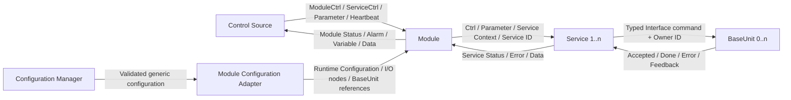

此圖表示責任與資料流，不表示所有物件都必須配置在同一個檔案或 GVL 中。

### 2.9 資料所有權

| 資料 | 主要寫入者 | 主要讀取者 | 所有權規則 |
|---|---|---|---|
| System Context | 系統基礎設施 | Module | Module 與 Service 不得任意改寫全系統狀態 |
| Module Control | Control Source | Module | Module 消費請求並發布 response，不得把 Status 當作 Control 回寫 |
| Module Status | Module／Framework | Control Source | 上游只讀；Module-specific extension 必須保留 base status 語意 |
| Service Control | Control Source 或 Module override | Service | 非特定 Module 狀態下，Module 可以依共同生命週期規則覆寫控制來源 |
| Service Parameter | Control Source | Module、Service | 取樣或鎖存時機是 Service Interface 的一部分 |
| Service Context | Module | Service | Service 只讀 |
| Service Status | Service | Module | Service 發布；Module 負責彙整，不得竄改其錯誤來源 identity |
| Runtime Configuration | Configuration subsystem | Module、Framework manager | 套用後視為該 configuration revision 的執行期快照 |
| BaseUnit command state | BaseUnit | Resource Owner | 只有合法 owner 可驅動具副作用的命令 |
| BaseUnit feedback | BaseUnit | Service、Module、測試 | 透過 typed Interface 發布，呼叫端只讀 |
| Module Variable List | Module／Framework | Control Source | ID 為 Module scope；來源必須為已驗證的 readable node |
| Service Data | Service | Module | Service 負責建立、更新與清除；Module 負責彙整 |
| Module Data List | Module／Framework | Control Source | Data ID 在 Module scope 必須唯一 |
| Service Error List | Service | Module Alarm Manager | 表示當前 scan 可觀察的 Error，不自行保存完整 Alarm Lifecycle |
| Module Alarm List | Module Alarm Manager | Control Source | Alarm Manager 擁有 lifecycle、acknowledgement 與 published ordering |

### 2.10 核心關係與不變條件

以下條件是後續各章節的共同基礎：

1. 一個 Module Instance 恰屬於一個 Module Type，並佔用該 Module Type 的一個 Slot。
2. 不同 Module Type 可以使用相同 Slot；enabled Module Instance 的 Module ID 仍必須全域唯一。
3. Module 持有並週期呼叫其 Service instance。
4. Service ID 在一個 Module 內必須唯一，且 `0` 不得指派給 Service instance。
5. Service 只能透過 BaseUnit 的 typed Interface 操作設備資源。
6. Module 對 BaseUnit reference 的持有不等同於 Resource Ownership；ownership 必須由 Service 使用非零 Owner ID 明確取得。
7. Module Alarm Manager 擁有 Alarm Lifecycle；Service 只發布本次 scan 可觀察的 Error。
8. Configured Alarm 使用 `ServiceId = 0`，因此其 Main Error ID 在同一 Module 的 configured alarm 集合中必須能維持唯一 identity。
9. Data ID 在彙整後的 Module Data List 中必須唯一，即使資料來自不同 Service。
10. 具有明確外部 ID 的 list entry 不得使用 array index 作為 identity。
11. Control 與 Status 的寫入責任不得顛倒。
12. Runtime Configuration、Service Parameter 與 Context 是三種不同資料，不得因結構方便而混為同一契約。

### 2.11 應避免的混用詞彙

| 避免用法 | 應使用的正式名詞 | 原因 |
|---|---|---|
| 用 Slot 或 array index 稱呼 Module | Module ID 或 Module Instance | Slot 只在 Module Type storage 內有意義 |
| Global Slot | Slot | Slot 並非跨 Module Type 全域唯一 |
| 用 AlarmList index 識別 Alarm | Alarm Identity | Published ordering 可以改變 |
| 用 Message 或 Source Error ID 識別 Alarm | `(ServiceId, MainErrorId)` | 診斷文字與來源碼不是穩定 identity |
| 用 inactive 表示 acknowledged | Active／Acknowledged 分別描述 | 兩者是獨立狀態 |
| 用 Error List 表示完整 Alarm 歷史 | Service Error List／Module Alarm List | 兩者的 owner 與 lifecycle 不同 |
| 用 Parameter 表示 Runtime Configuration | Parameter／Runtime Configuration 分別描述 | 操作條件與系統接線的變更週期不同 |
| 用持有 reference 表示擁有資源 | BaseUnit reference／Resource Ownership | 能存取 Interface 不代表有權執行命令 |
| 用 API 或 method signature 表示全部契約 | Interface | 正確使用還包含時序、不變條件與錯誤模式 |

### 2.12 待確認事項

以下事項需要在後續討論中定案：

1. **Functional Object 是否作為正式統稱**：目前文件以「功能物件」統稱 Module、Service 與 BaseUnit，但不建議因此建立新的 PLC base type。
2. **Service ID 與 Resource Owner ID 的關係**：目前設計直接以 Service ID 作為 Owner ID；需確認未來是否存在非 Service owner，或同一 Service 需要多個 ownership identity 的情境。
3. **Parameter 鎖存策略**：應統一規定 Starting 時鎖存，或允許每個 Service 在專屬 Interface 中選擇並聲明。
4. **必要 Reference 遺失時的 Status 語意**：目前可阻止 Module 更新，但是否必須發布 configuration invalid reason 或 Alarm 尚待定義。
5. **Wafer Transfer 與 Process Station 的規格成熟度**：目前先視為 Draft capability；需確認它們是否為所有 Module 的 base contract。
6. **Identifier 的長期配置方式**：需決定 Error ID、Data ID、Endpoint ID 與 Station ID 是否需要集中登錄區段及版本相容政策。

## 3. 整體架構與週期執行模型

### 3.1 本章目的

本章定義 Framework 的整體執行結構，以及功能物件在 PLC initialization 與 cyclic execution 階段的責任、呼叫順序和資料可見時機。

本章的順序要求屬於 Interface 的一部分。即使個別 method signature 沒有改變，只要調整呼叫順序會改變呼叫者在同一 scan 內可觀察的資料，就必須視為契約變更並重新驗證相關測試。

### 3.2 架構原則

Framework 必須遵守以下原則：

1. **責任由上而下協調**：System Orchestration 呼叫 Module，Module 呼叫 Service，Service 透過 typed BaseUnit Interface 操作設備。
2. **狀態由下而上發布**：BaseUnit 發布命令結果與回授，Service 發布 Service Status、Error 與 Data，Module 再彙整成 Module-level publication。
3. **依賴由組合者提供**：Service 必須由 Module 傳入 BaseUnit reference、Context 與 Service ID，不得在內部自行尋找或建立共享設備依賴。
4. **通用機制集中於 Framework**：PackML 基礎行為、Heartbeat、Alarm Lifecycle、Data aggregation 與 Runtime Configuration 不得由每個 Module 重複建立不同版本。
5. **以 Interface 形成 seam**：設備替換、測試 fake 與 Module Type 組態整合必須在既有 seam 上完成，不得要求呼叫端了解 Implementation。
6. **Cyclic path 必須可預測且有界**：每個 scan 的主要工作量必須受到 compile-time capacity 或已驗證 runtime count 限制。
7. **啟動期解析、週期期執行**：檔案載入、JSON 解析、symbol resolution 與 reference binding 應在 initialization 階段完成；cyclic path 使用已驗證的 runtime storage 與 node handle。
8. **不得依賴未聲明的同 scan 行為**：需要同 scan 可見性的資料，必須在本章或專屬 Interface 中明確規定其產生與消費順序。

### 3.3 邏輯架構

Framework 分為下列邏輯層次：

| 層次 | 主要角色 | 主要責任 | 不應承擔的責任 |
|---|---|---|---|
| Control Source | 上位控制器、測試程式 | 寫入 Control、Parameter、Request ID 與 Heartbeat；讀取 Status | 直接操作 Module 內部 Service instance 或 BaseUnit Implementation |
| System Orchestration | `MAIN`、PLC Task | 註冊基礎設施、驅動組態管理器、建立 System Context、依固定順序呼叫 mapping 與 Module | 實作 Module-specific 製程邏輯 |
| Configuration | Configuration Manager、Registry、Link／Reference Manager | 載入、驗證並套用 configuration；建立 mapping、reference 與 runtime binding | 在 cyclic phase 重新解讀未驗證的文字設定 |
| Module | Module Base、Module-specific FB | 協調 Module lifecycle、Service、Alarm、Data、Variable 與選配能力 | 直接取代 Service 實作設備操作流程 |
| Service | Service Base、Service-specific FB | 實作一項操作或製程能力；管理其 BaseUnit ownership 與安全清理 | 直接維護 Module-level Alarm Lifecycle |
| BaseUnit | BaseUnit Base、typed BaseUnit FB | 封裝設備命令、回授與 Resource Lock | 決定 Module 或製程的操作順序 |
| Equipment Adapter／Library | Motion、I/O、設備函式庫 | 與實體設備或原廠函式庫互動 | 暴露給上位 Control Source 作為框架 Control Interface |

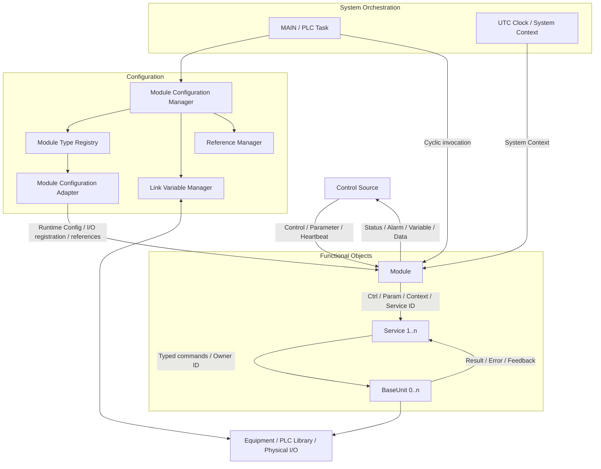

圖中的箭頭表示責任或資料流，不代表所有資料都以 method call 傳遞，也不代表 Framework 可以忽略各 Interface 所規定的方向性。

### 3.4 Instance 與 Runtime Storage 模型

每個 Module Type 擁有自己的 fixed-capacity runtime storage。相同 Slot 的 Module FB、Runtime Configuration、Control／Status 與 BaseUnit reference 必須描述同一個 Module Instance。

概念結構如下：

```text
Module Type Storage
├── Module[Slot]
├── RuntimeConfig[Slot]
├── ControlStatus[Slot]
└── ReferencePortA[Slot], ReferencePortB[Slot], ...
```

必須遵守以下規則：

1. 同一 Module Type 的 parallel arrays 必須使用相同 Slot 範圍。
2. Adapter 對某個 Slot 套用 configuration 或綁定 reference 時，必須寫入同一個 Module Instance 對應的 storage。
3. System Orchestration 必須使用該 Module Type 的 capacity 迭代 instance，不得使用 Total Configured Module Capacity 當作 type-specific array index。
4. System Orchestration 只可呼叫 `Enabled = TRUE` 且 `Valid = TRUE` 的 Module Instance。
5. 不同 Module Type 的執行順序不得被功能邏輯默認為資料同步契約；若 Module 之間需要協調，必須建立明確 Interface 與時序規格。
6. Slot 只用於定位 runtime storage；對外 publication 與 Control Source 必須使用 Module ID 識別 enabled Module Instance。

### 3.5 執行階段概觀

Framework 的運作分為兩個主要階段：

#### 3.5.1 Initialization Phase

建立並驗證 cyclic execution 所需的所有基礎設施：

- 以 Begin／逐點 Register／Seal session 註冊實體 I/O 或共享 variable node（見 8.10）。
- 註冊可供 Module 綁定的 BaseUnit reference。
- 註冊各 Module Type 的 Module Configuration Adapter。
- 載入並解析 UTF-8 JSON configuration。
- 驗證 Module Type、Slot、Module ID、mapping、reference、Variable 與 Alarm。
- 產生 Runtime Configuration 與 node handle。
- 成功完成後發布 `Ready = TRUE`。

#### 3.5.2 Cyclic Phase

只在 Configuration Manager 已發布 `Ready = TRUE` 後執行：

- 更新 input mapping。
- 依 Module Type 與 Slot 呼叫 enabled、valid Module Instance。
- 更新 output mapping。

目前 Implementation 將 configuration 視為啟動期設定。持續維持 `Execute = TRUE` 時，Configuration Manager 完成一次成功或失敗流程後不會自動重新載入檔案。

### 3.6 Initialization 與 Configuration 套用順序

Initialization 必須先完成 infrastructure registration，再啟動 configuration loading。Configuration Manager 不得在 Registry、Link Variable Manager 或 Reference Manager 尚未準備完成時套用 Module configuration。

```mermaid
sequenceDiagram
    autonumber
    participant Task as PLC Task / MAIN
    participant Link as Link Variable Manager
    participant Ref as Reference Manager
    participant Registry as Module Type Registry
    participant Config as Configuration Manager
    participant Adapter as Module Configuration Adapter

    Note over Task,Link: MAIN attempts startup registration once
    Task->>Link: M_BeginInfrastructureRegistration()
    break Begin fails
        Link-->>Task: FALSE, ErrorMessage; keep Execute = FALSE
    end
    loop Every shared scalar / array element
        Task->>Link: M_RegisterInfrastructureNode(Variable, Access)
        Note over Task,Link: First error is retained; later declarations stop processing
    end
    Task->>Link: M_SealInfrastructureRegistration()
    break Seal fails
        Link-->>Task: Roll back session nodes; retain first error; Execute = FALSE
    end
    Task->>Ref: Register BaseUnit references
    break Reference registration fails
        Note over Task,Ref: Keep Execute = FALSE; sealed nodes remain
    end
    Task->>Registry: Register Module Type adapters
    break Adapter registration fails
        Note over Task,Registry: Keep Execute = FALSE; sealed nodes remain
    end

    Task->>Config: Execute = infrastructure registered
    Config->>Config: Load and parse UTF-8 JSON
    Config->>Registry: Resolve every configured Module Type
    Config->>Adapter: Validate Slot support
    Config->>Config: Validate duplicate Slot and Module ID

    Note over Config,Adapter: Validate addressing before mutating runtime state

    Config->>Link: Clear previously applied links
    Config->>Registry: Clear all adapter-owned slots

    loop Every configured Module entry
        alt Module disabled
            Config->>Adapter: Apply disabled Runtime Configuration
        else Module enabled
            Config->>Adapter: Declare Module resources
            Adapter->>Link: Declare referenced Module I/O nodes
            Adapter->>Config: Declare named Reference Ports and tokens
            Config->>Link: Add input and output mappings
            Config->>Config: Resolve targetPort name to token
            Config->>Ref: Resolve configured BaseUnit source
            Config->>Adapter: Bind typed reference by port token
            Config->>Config: Mark port bound and validate required ports
            Config->>Link: Resolve Variable and Alarm sources
            Config->>Adapter: Apply valid Runtime Configuration
        end
    end

    alt Entire application succeeds
        Config-->>Task: Ready = TRUE
    else Any step fails
        Config->>Link: Clear applied links
        Config->>Registry: Clear all adapter-owned slots
        Config-->>Task: Error = TRUE, Ready = FALSE
    end
```

Initialization 與 configuration application 必須遵守下列契約：

1. Infrastructure registration 未完成時，Configuration Manager 的 `Execute` 必須保持 `FALSE`。
2. Module Type、Slot 與 enabled Module ID 必須先完成跨 entry 驗證，再清除或寫入 runtime state。
3. disabled Module entry 可以保留其 Module Type 與 Slot，但不得進入 cyclic invocation。
4. enabled Module 必須先由 Adapter 宣告本次 configuration 使用的 I/O node 與 Reference Port，再完成 mapping、reference binding、required reference validation，以及 Variable／Alarm source resolution，才能將 Runtime Configuration 標記為 valid。
5. 任何 application step 失敗時，Configuration Manager 必須清除已套用的 links 與所有 Adapter-owned slot，且不得發布 `Ready = TRUE`。
6. Configuration Error 必須透過 Configuration Manager 的 `Error`、`ErrorCode` 或 `ErrorMessage` 對外診斷，不得讓部分套用的 Module 繼續執行。
7. 套用至 Runtime Configuration 的 configuration revision 必須為非零；新的 application attempt 不得重用舊 snapshot 來冒充新版本。

### 3.7 System-level Cyclic Execution

System Orchestration 在每個 PLC scan 必須依下列順序執行：

```mermaid
sequenceDiagram
    autonumber
    participant Task as PLC Task
    participant Main as MAIN
    participant Config as Configuration Manager
    participant Clock as UTC Clock
    participant Link as Link Variable Manager
    participant Module as Enabled and Valid Modules

    Task->>Main: Invoke
    Main->>Main: Retry infrastructure registration if needed
    Main->>Config: Execute configuration state machine
    Main->>Clock: Update UTC time
    Main->>Main: Update System Context

    alt Config.Ready = TRUE
        Main->>Link: M_CyclicInput()
        loop Every supported Module Type and Slot
            alt RuntimeConfig.Enabled AND RuntimeConfig.Valid
                Main->>Module: Invoke once
                Module-->>Main: Status / Alarm / Data / Variable
            end
        end
        Main->>Link: M_CyclicOutput()
    else Config.Ready = FALSE
        Note over Main,Module: Skip input mapping, Module invocation and output mapping
    end
```

System-level cyclic contract：

1. Configuration Manager 必須在每個 scan 被呼叫，使其非同步檔案載入與內部 state machine 可以前進。
2. System Context 的 UTC time 與 heartbeat timeout 必須在 Module invocation 前更新。
3. `M_CyclicInput()` 必須在任何 Module invocation 前執行一次。
4. 每個 enabled、valid Module Instance 每 scan 必須被呼叫一次。
5. `M_CyclicOutput()` 必須在所有 Module invocation 完成後執行一次。
6. Module 不得自行重複執行全系統 input 或 output mapping。
7. `Ready = FALSE` 時不得呼叫任何 Module Instance，也不得執行 mapping copy。
8. Module Type 新增後，System Orchestration 必須加入其 type-specific cyclic iteration；只向 Registry 註冊 Adapter 不會自動使該 Module Type 被週期呼叫。

### 3.8 I/O Mapping 的週期語意

I/O mapping 分為兩個 phase：

#### Input-to-Module Phase

`M_CyclicInput()` 在 Module 執行前，將已配置的 source 值複製或轉換至 Module input node。Module 在本 scan 讀取到的是本次 input mapping 完成後的值。

#### Module-to-Output Phase

`M_CyclicOutput()` 在所有 Module 執行後，將已配置的 Module output node 複製或轉換至 target。Output target 在本 scan 取得的是 Module 本次執行完成後所留下的 output value。


Mapping contract：

1. cyclic mapping 必須只使用 initialization 階段已解析及驗證的 node metadata。
2. 無 transform 的 mapping 必須符合 source 與 target 型別、大小相容規則。
3. 有 transform 的 mapping 必須只用於 Framework 支援的數值型別，並依已驗證的 scale／offset 執行。
4. Module-specific 邏輯不得依賴 JSON 字串名稱；cyclic execution 應使用已建立的 link 或 node handle。
5. 任何需要跨 Module 傳值的 mapping，都必須明確規定 source 更新與 target 消費的 scan semantics；不得只依賴目前 Module loop 的偶然順序。

### 3.9 Module-level Cyclic Execution

Module-specific FB 必須先確認其 required Interface references 可以使用，再將 Service Control 轉成可由 index 存取的 view，並呼叫 `M_UpdateModule()` 完成共同流程。

在 required reference 有效且 Runtime Configuration 已由 System Orchestration 驗證的前提下，`M_UpdateModule()` 每 scan 必須且只能呼叫一次。

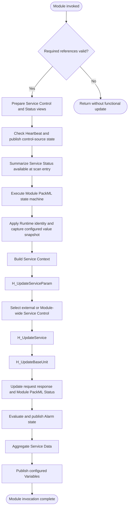

Module-level cyclic contract：

1. Derived Module 不得繞過 `M_UpdateModule()` 自行複製 Heartbeat、Module PackML、Alarm aggregation 或 Data aggregation 邏輯。
2. `ServiceControls` 與 `ServiceStatuses` 的 indexed view 必須涵蓋該 Module 的全部 Service，且 ByName 與 ByIndex storage layout 必須一致。
3. `M_UpdateServiceStateSummary()` 使用 Module invocation 開始時已存在的 Service Status；本 scan 內 `H_UpdateService()` 產生的新狀態會在下一次 Module invocation 才參與 Module transition completion 判斷。
4. Runtime Configuration 有效時，Module 必須更新 Module ID、Enabled、Module Type 與 configured value snapshot。
5. Service Context 必須在呼叫任何 Service 前，使用目前 Module ID 與本 scan 的 System Context 建立。
6. Service Parameter routing 必須先於 Service invocation。
7. BaseUnit cyclic update 必須在所有 Service 本 scan 的命令呼叫完成後執行。
8. Alarm、Data 與 Variable publication 必須在 Service 與 BaseUnit update phase 之後完成；其個別資料來源仍受第 3.11 節的 snapshot timing 約束。

### 3.10 Service Control Source 選擇

Module 依其目前 PackML State 決定 Service 使用外部 Service Control，或將 Module Control 套用至全部 Service。

| Module PackML State | Service Control Source | 目的 |
|---|---|---|
| `Idle` | 外部預載的個別 Service Control | 允許呼叫者選擇及準備要執行的 Service |
| `Starting` | 外部預載的個別 Service Control | 讓選定的 Service 完成自己的 Starting 流程 |
| `Execute` | 外部預載的個別 Service Control | 讓個別 Service 接收其操作命令 |
| 其他 State | Module Control 覆寫所有 Service Control | 使 Stop、Abort、Clear、Reset 等 Module-wide lifecycle 與全部 Service 同步 |

Module-wide override 必須同時傳遞 `ModuleCtrl.PackMLIn` 與 `ModuleCtrl.RequestId` 至每個 Service Control。Derived Module 不得只覆寫部分 Service，否則 Module Base 對「所有 Service 已停止／中止／回到 Idle」的判斷可能無法完成。

### 3.11 同一 Scan 的資料可見性

下表定義目前 Framework Implementation 中重要資料的產生與消費時機：

| 資料 | 本 scan 的產生時機 | 本 scan 的消費者 | 可見性語意 |
|---|---|---|---|
| System UTC Time | Module invocation 前 | Module、Service Context | Module 與 Service 取得本 scan 更新後的時間 |
| Input Mapping target | 所有 Module invocation 前 | Module-specific input logic | Module 取得本 scan mapping 後的 input |
| Service Status summary | `H_UpdateService()` 前 | Module PackML transition hook | 使用進入本次 Module invocation 時已存在的 Service Status |
| Configured value snapshot | Module PackML update 後、Service update 前 | 本 scan 後段的 configured Alarm／Variable publication | 即使後續 Service 改變來源 node，本次 publication 仍使用較早取得的 snapshot |
| Service Control／Parameter | Service invocation 前 | 本 scan 的 Service | Service 取得本 scan routing 後的值 |
| Service Error／Data | `H_UpdateService()` 中 | 本 scan 後段的 Module Alarm／Data aggregation | 本 scan 可以被 Module 彙整 |
| BaseUnit cyclic state | Service command phase 後 | BaseUnit／下一次 Service observation | Service 先提出本 scan 命令，再由 BaseUnit 執行 cyclic update；不得假設所有非同步結果一定在同一 scan 完成 |
| Module output node | Module invocation 中 | scan 結尾的 output mapping | Output target 取得本 scan Module execution 後的值 |

若未來調整 configured value snapshot、Service update 或 BaseUnit update 的相對順序，必須視為行為變更，並重新驗證 Alarm、Variable 與設備命令相關測試。

### 3.12 Service 與 BaseUnit 的呼叫模型

Module 的 `H_UpdateService()` 必須對每個 Service instance 執行一次，並提供：

- 對應的 Service Control。
- 本 scan 已路由的 Service Parameter。
- 由 Module 建立的 Service Context。
- Module 內唯一且非零的 Service ID。
- Service 所需的 typed BaseUnit Interface。
- 對應的 Service Status output storage。

每個 Service 的 cyclic body 必須呼叫 Service Base 的共同更新入口，使 Service PackML lifecycle、Response ID、Completion Behavior 與 Status 保持一致。Service-specific 工作應透過 state hook 或 private method 完成，不得另外建立與共同 lifecycle 平行且互不一致的狀態來源。

Module 的 `H_UpdateBaseUnit()` 必須在所有 Service invocation 後，對 Module 引用的每個 BaseUnit 執行一次 cyclic update。

目前 Service ID 只保證在同一 Module 內唯一，且 Service ID 會直接作為 Resource Owner ID。因此在尚未定義跨 Module owner identity 及 cyclic owner 以前，一個 BaseUnit Instance 必須只屬於一個 Module 的 cyclic composition，但可以由該 Module 內多個 Service 競爭使用。Configuration 不得將同一 BaseUnit Instance 綁定至會造成重複 `M_CyclicUpdate()` 的多個 Reference Port 或 Module Instance。

### 3.13 Status、Alarm、Data 與 Variable Publication 順序

Module 在功能更新完成後，依下列順序發布對外狀態：

1. 偵測 Module command／mode change request edge，必要時更新 Module `ResponseId`。
2. 將 Module PackML output 寫入 Module Status。
3. 開始本 scan 的 Alarm Manager cycle。
4. 先處理 acknowledgement request，再評估 configured Alarm 與觀察 Service Error。
5. 結束 Alarm Manager cycle，並發布 Module Alarm List 與 Alarm Status。
6. 清除本次聚合用的 Module Data publication，重新彙整各 Service Data。
7. 依本 scan 已取得的 configured value snapshot 發布 Module Variable List。

Acknowledgement 必須先於本 scan 新來源評估，避免 `AckAll` 確認一個 Control Source 尚未觀察到的新 occurrence。

Data aggregation 遇到重複 Data ID 時，不得發布第二筆相同 ID，並必須透過 Module Data Status 提供 duplicate diagnostics。超過容量時不得寫出陣列範圍，並必須發布 overflow diagnostics。

### 3.14 Gating 與失敗行為

| 條件 | 目前必要行為 |
|---|---|
| Infrastructure registration 尚未成功 | `Execute = FALSE`，不啟動 configuration loading；目前 `MAIN` 只嘗試一次，不會在後續 scan 自動重試。Node session 失敗須由 Seal rollback，重試條件見 8.10 |
| Configuration loading／parsing 進行中 | `Busy = TRUE`、`Ready = FALSE`；不執行 mapping 或 Module |
| Configuration validation／application 失敗 | 清除已套用 runtime links 與 Adapter slots；`Error = TRUE`、`Ready = FALSE` |
| Configuration 尚未 Ready | 跳過 input mapping、全部 Module invocation 與 output mapping |
| Module `Enabled = FALSE` | 保留其 configured Slot，但不執行該 Module |
| Module `Valid = FALSE` | 不執行該 Module |
| Derived Module required reference 無效 | 不得呼叫 Service 或 BaseUnit；診斷及輸出安全策略仍屬待確認契約 |
| Heartbeat timeout | 必須發布 `ModuleStatus.IsControlSourceAlive = FALSE`；目前 Module Base 不會因此自動 Stop 或 Abort |

不得把「Module 沒有被呼叫」推論為實體 output 已自動進入安全狀態。當 `Ready = FALSE`、Module disabled／invalid 或 required reference 無效時，output retain、清除或強制安全值的政策必須由後續安全契約明確定義。

### 3.15 Cyclic Path 限制

為維持可預測性，cyclic path 必須符合以下要求：

1. 不得在每個 scan 重新讀取 JSON configuration file。
2. 不得在每個 scan 重新建立 ADS handle 或以 symbol name 搜尋 node。
3. Variable 與 configured Alarm 取值必須使用 initialization 階段建立的 node handle 及本機 snapshot reader。
4. 迴圈上限必須來自 compile-time capacity、已驗證的 runtime count 或 open array bound。
5. 不得使用無上限等待阻塞 PLC Task；非同步工作必須跨 scan 推進。
6. 不得假設其他 Module Type 一定先執行或後執行，除非 System Orchestration 規格明確建立該順序。
7. 同一功能物件每 scan 的呼叫次數必須固定且可由測試驗證。

### 3.16 架構不變條件

以下條件在 initialization 與 cyclic phase 都必須成立：

1. Configuration 未 Ready 時，不得有部分 Module 進入 cyclic execution。
2. 只有 enabled 且 valid 的 Module Instance 可以執行。
3. 每個執行中的 Module 每 scan 恰好執行一次共同 Module update。
4. 每個 Module 所擁有的 Service 每 scan 最多執行一次。
5. 每個實際 BaseUnit Instance 每 scan 最多執行一次 cyclic update。
6. input mapping 一定發生在 Module invocation 前；output mapping 一定發生在全部 Module invocation 後。
7. Module-wide lifecycle command 必須能到達該 Module 的所有 Service。
8. Service 只能透過 typed BaseUnit Interface 操作設備。
9. Alarm Lifecycle 只能由 Module Alarm Manager 維護。
10. Runtime configuration error 不得留下可繼續執行的 partially-applied system。
11. array index 只定位 storage；外部行為使用對應的 stable Identifier。
12. Status publication 不得依賴 Control Source 寫入輸出欄位。

### 3.17 架構層級的最低驗證項目

後續測試章節將定義完整測試規格；至少必須能驗證：

- Configuration `Ready` 對 mapping 與 Module invocation 的 gating。
- input mapping、Module invocation、output mapping 的先後順序。
- enabled／valid Module filtering。
- Derived Module 每 scan 只呼叫一次 `M_UpdateModule()`。
- Service parameter routing 與 Control Source selection。
- Module-wide Stop、Abort、Clear、Reset 能到達所有 Service。
- Service Status summary 的跨 scan transition timing。
- Service invocation 先於 BaseUnit cyclic update。
- configured value snapshot 與 Service update 的相對時機。
- Alarm acknowledgement 先於本 scan source evaluation。
- Data duplicate ID 與 overflow diagnostics。
- Configuration application 失敗後不存在 partially-applied runtime links 或 references。

### 3.18 待確認事項

1. **Heartbeat timeout 的控制策略**：目前只發布 `IsControlSourceAlive = FALSE`；需決定是否由 Framework 自動 Stop／Abort，或交由上位控制器及 Module-specific policy 處理。
2. **Configuration Not Ready 的 output safety policy**：目前不執行 output mapping；需決定應 retain、clear，或由獨立 safety layer 強制安全值。
3. **Required reference 無效的診斷方式**：需決定 Module 應發布 configuration status、Alarm、Error reason，或完全保持 inert。
4. **Runtime configuration reload**：目前只在啟動流程套用一次；需決定未來是否支援停機狀態下 reload，以及 reload 的 transaction 與 rollback 契約。
5. **Configured snapshot timing**：目前在 Service 與 BaseUnit update 前取樣；需確認 Variable／Alarm 是否應反映 pre-service 或 post-service value。
6. **BaseUnit alias 與跨 Module sharing**：目前暫時禁止多個會進行 cyclic update 的 Reference Port 或 Module Instance 指向同一 BaseUnit；若未來允許，必須同時定義全域 owner identity、唯一 cyclic owner 與去重機制。
7. **跨 Module 資料交換**：需決定只能透過 mapping／專用 Interface，或允許明確排序的 Module pipeline。
8. **Module invocation 被跳過時的 Status freshness**：需定義 disabled、invalid 或 configuration not ready 時，既有 Status、Alarm、Data 與 Variable 是否清除、保留或標記 stale。

## 4. 共通生命週期與 PackML 契約

### 4.1 適用範圍

Module 與 Service 都以 `FB_PackMLModeSet` 所提供的 PackML state machine 作為共同生命週期。Derived FB 應透過 state hook 實作功能，不得直接修改 `PackMLOut.eStateCurrent`、`PackMLOut.eStatePrevious` 或 base FB 的 private state。

BaseUnit 不屬於 PackML 功能物件；它的命令生命週期由 typed Interface 定義，並由持有 ownership 的 Service 協調。

### 4.2 State 分類與自動轉移

PackML State 分為：

- **Transient State**：hook 回傳 `Busy` 時停留，回傳 `Done` 時由 Framework 自動轉移。
- **Stable State**：每 scan 執行 action hook，直到合法 command 或其他明訂事件觸發轉移。

| State | 類型 | Hook | `Done` 後的自動目標 |
|---|---|---|---|
| `Undefined` | Transient | `H_OnUndefined` | `Aborted` |
| `Clearing` | Transient | `H_OnClearing` | `Stopped` |
| `Stopped` | Stable | `H_OnStopped` | 無 |
| `Starting` | Transient | `H_OnStarting` | `Execute` |
| `Idle` | Stable | `H_OnIdle` | 無 |
| `Execute` | Active | `H_OnExecute` | hook 回傳 `Done` 時進入 `Completing` |
| `Stopping` | Transient | `H_OnStopping` | `Stopped` |
| `Aborting` | Transient | `H_OnAborting` | `Aborted` |
| `Aborted` | Stable | `H_OnAborted` | 無 |
| `Holding` | Transient | `H_OnHolding` | `Held` |
| `Held` | Stable | `H_OnHeld` | 無 |
| `Unholding` | Transient | `H_OnUnholding` | `Execute` |
| `Suspending` | Transient | `H_OnSuspending` | `Suspended` |
| `Suspended` | Stable | `H_OnSuspended` | 無 |
| `Unsuspending` | Transient | `H_OnUnsuspending` | `Execute` |
| `Resetting` | Transient | `H_OnResetting` | `Idle` |
| `Completing` | Transient | `H_OnCompleting` | `Complete` |
| `Complete` | Stable | `H_OnComplete` | 無 |

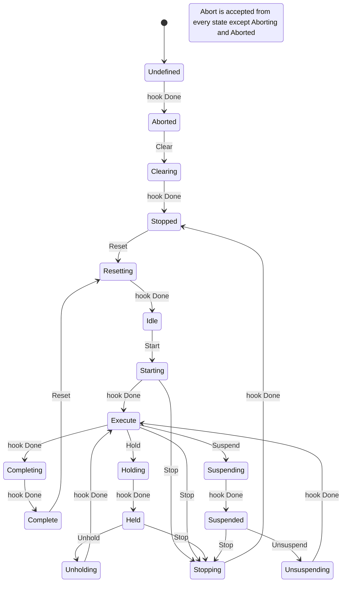

上圖用於說明主要路徑；所有 command 的合法來源仍以第 4.3 節為準。

### 4.3 Command 合法來源

| Command | 合法來源 State | 接受後進入 |
|---|---|---|
| `Clear` | `Aborted` | `Clearing` |
| `Reset` | `Stopped`、`Complete` | `Resetting` |
| `Start` | `Idle` | `Starting` |
| `Stop` | `Starting`、`Idle`、`Execute`、`Completing`、`Complete`、`Holding`、`Held`、`Unholding`、`Suspending`、`Suspended`、`Unsuspending` | `Stopping` |
| `Hold` | `Execute` | `Holding` |
| `Unhold` | `Held` | `Unholding` |
| `Suspend` | `Execute` | `Suspending` |
| `Unsuspend` | `Suspended` | `Unsuspending` |
| `Abort` | 除 `Aborting`、`Aborted` 外的所有 State | `Aborting` |

不合法的 command 必須：

1. 保持目前 State 不變。
2. 設定 `bCommandRejected = TRUE`。
3. 以穩定的 `E_PackMLErrorID` 說明拒絕原因。
4. 保持拒絕結果可見，直到 Control Source 將 `bCommandChangeRequest` 清為 `FALSE`。

### 4.4 Command request/response handshake

外部 command 使用 edge-and-latch handshake：

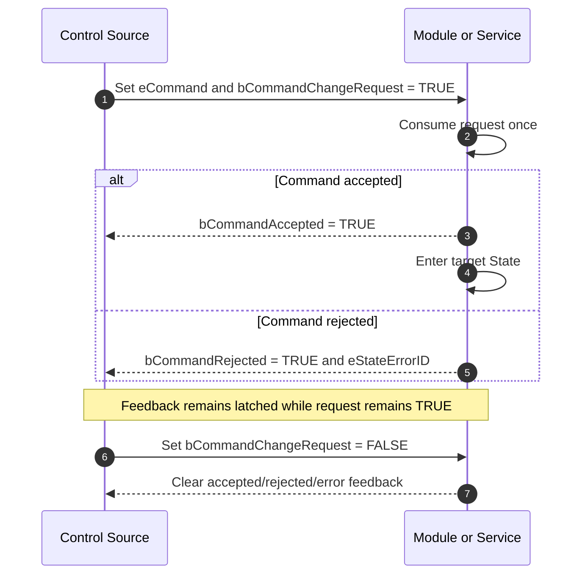

Handshake contract：

1. Control Source 必須先設定 command value，再將 `bCommandChangeRequest` 由 `FALSE` 改為 `TRUE`。
2. 同一次 request 維持為 `TRUE` 時只能被消費一次；修改 `eCommand` 不得被視為新的 request。
3. Control Source 必須將 request 清為 `FALSE`，同一 channel 才能接受下一次 command request。
4. `bCommandAccepted` 與 `bCommandRejected` 不得同時代表兩次不同 request。
5. Module 與 Service 的 `RequestId`／`ResponseId` correlation 必須由各自 base update 維護，不得由 state hook 任意改寫。
6. accepted 表示 Framework 已接受狀態轉移要求，不表示 transient work 已完成。

### 4.5 Mode change handshake 與 Mode policy

Mode change 與 command 使用相同的 edge-and-latch 概念。Mode change 只允許從 `Aborted`、`Stopped`、`Idle` 或 `Complete` 提出。

目前 `FB_PackMLModeSet` 支援：

| Mode | 是否可作為 mode-change target | Command policy | State compatibility |
|---|---|---|---|
| `Manual` | 是 | 只允許 `Reset`、`Start`、`Stop`、`Abort`、`Clear` | `Idle`、`Starting`、`Execute`、`Aborting`、`Aborted`、`Clearing`、`Stopped`、`Resetting` |
| `Production` | 是 | 允許全部 Framework command | 支援全部 State |
| `Unknown` | 否 | 在初始狀態下目前不額外限制 command | 目前不額外限制 State |

Mode policy 先於 State guard 執行，因此 command 同時違反 Mode 與 State 時，應先回報 `CommandNotAllowedInActiveMode`。

Mode request 必須在下列情況被拒絕並提供對應錯誤：

- target Mode 不受支援。
- target Mode 已是 current Mode。
- current State 不允許 mode change。
- target Mode 不支援 current State。

### 4.6 State hook 契約

每個 state hook 都會收到 `bFirstScan`：

- 進入新 State 後第一次執行該 State hook 時為 `TRUE`。
- 後續停留於相同 State 的 scan 為 `FALSE`。
- hook 不得自行保存另一份可能與 Framework 不一致的 first-scan 判斷。

Transient hook 必須在每條程式路徑明確回傳：

- `Busy`：工作尚未完成，Framework 保持目前 State。
- `Done`：本 State 的工作與必要清理均已完成，Framework 可以自動轉移。

若 transient hook 發出非同步設備命令，必須持續回傳 `Busy`，直到收到完成、錯誤或 timeout，並完成該 State 所要求的 cleanup。不得為了避免卡住 state machine 而在設備仍處於未定狀態時直接回傳 `Done`。

Stable-state hook 沒有 completion return value，只能執行該 State 允許的持續性行為或提出另一個合法 command。

### 4.7 Internal command

Derived FB 可以透過 `RequestCommand()` 要求 Framework 在後續 scan 處理一個 PackML command，例如 Service 在設備錯誤後要求 `Stop` 或 `Abort`。

Internal command contract：

1. 同一時間最多只能有一個 queued internal command。
2. 已有 queued command 或正在處理 mode-change request 時，新的 internal command request 必須被拒絕。
3. Internal command 仍必須通過 Mode policy 與 State guard，不得直接強制改寫 State。
4. 呼叫者必須檢查 `RequestCommand()` 的回傳值，或證明 request failure 不會使 state machine 永久停留在不安全狀態。
5. Internal command 通常於提出後的下一次 base invocation 才被消費，功能邏輯不得假設呼叫當下已完成 State 轉移。

### 4.8 External fault 與 Enable

- `bExternalFault = TRUE` 時，若 current State 允許 Abort，Abort 必須優先於 queued internal command 與外部 command。
- 已在 `Aborting` 或 `Aborted` 時，不得重複觸發 Abort。
- `bEnable = FALSE` 時，base FB 必須保持 current State 並將 `bTransitionActive` 設為 `FALSE`。
- Disable 是否還需要執行設備安全清理，不由 `FB_PackMLBase` 自動保證；呼叫者不得使用 Disable 取代 Stop 或 Abort。

### 4.9 Module 與 Service 的生命週期分工

Module Base 對下列 State 使用 final hook 協調全部 Service：

| Module State | 完成條件 |
|---|---|
| `Aborting` | 所有 Service 都為 `Aborted` |
| `Stopping` | 所有 Service 都為 `Stopped` |
| `Clearing` | 所有 Service 都為 `Stopped` |
| `Resetting` | 所有 Service 都為 `Idle` |
| `Idle` | Module Base 會提出內部 `Start` request |

Derived Module 不得覆寫這些 final hook 來繞過 Service synchronization。Module-specific 行為應放在 Module update hooks、Service 或明確新增的 Framework extension seam。

Service 必須自行實作它所需要的 state hook，尤其是 Starting validation、Execute operation、Stopping cleanup、Aborting recovery，以及穩態 State 的 defensive release。

### 4.10 Service Completion Behavior

Service 必須在每次 base update 時明確發布一種 `E_ServiceCompletionBehavior`：

| 值 | 語意 | `H_OnExecute` 的預期行為 |
|---|---|---|
| `NaturalCompletion` | 操作達成明確完成條件後自行結束 | 完成時回傳 `Done`，進入 `Completing`／`Complete` |
| `ExecuteUntilExternalStop` | 操作持續執行，直到收到外部 Stop 或其他中斷命令 | 正常執行期間維持 `Busy` |
| `Unknown` | 尚未宣告或不合法 | 不得作為完成之 Service 的正式設定 |

Completion Behavior 是對呼叫者的 Interface 描述；設定 enum 本身不會自動替 Service 實作完成邏輯。

### 4.11 最低驗證項目

- 每個 command 的合法與不合法來源 State。
- request 維持 `TRUE` 時只消費一次。
- accepted／rejected feedback 保持到 request withdrawal。
- Mode policy 優先於 State guard。
- `bFirstScan` 每次 State entry 只出現一次。
- transient hook 的 `Busy`／`Done` 轉移。
- internal command 的 next-scan 行為與 single-queue 限制。
- External fault 的 Abort 優先權。
- Module final hook 等待全部 Service 的跨 scan 行為。

### 4.12 待確認事項

1. `Unknown` Mode 目前允許全部 command，需確認這是否為啟動相容行為，或應限制為只允許 Abort／Clear／mode change。
2. `RequestCommand()` 失敗時是否需要統一 diagnostics，目前只以 `BOOL` 回傳。
3. Transient State 是否應提供通用 timeout，或由每個 Service 專屬實作。
4. `bEnable = FALSE` 的安全輸出與資源釋放政策尚未定義。
5. Hold 與 Suspend 對 BaseUnit ownership、命令撤銷及參數變更的共同契約仍需補強。

## 5. BaseUnit 開發規格

### 5.1 責任與設計目標

BaseUnit 是設備能力與 Resource Ownership 的 seam。它應在小而明確的 typed Interface 後封裝設備函式庫、實體 reference、命令執行及回授差異，使 Service 不需要知道設備 Implementation。

一個 BaseUnit 應提供具有實際行為的深 Interface；不應只把底層函式庫的每個欄位原封不動轉交給所有 Service。

### 5.2 繼承與 Interface 結構

新 BaseUnit 必須：

1. 繼承 `FB_BaseUnit`，或提供完全相容的 `I_ResourceLock` 與 ADS symbol metadata 契約。
2. 實作一個描述該設備能力的 typed Interface，例如 `I_Axis_BaseUnit`。
3. 讓 typed Interface extends `I_ResourceLock`，以便 Service 在相同 seam 上執行 ownership 與設備命令。
4. 透過 `__QUERYINTERFACE` 讓 Module Configuration Adapter 驗證實際 BaseUnit 是否符合 Reference Port 所要求的型別。
5. 不得要求 Service 取得或修改底層 `AXIS_REF`、I/O address 或原廠 FB instance。

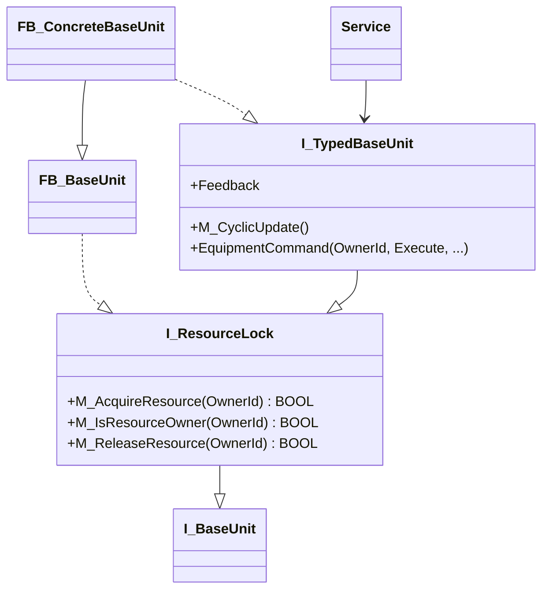

`I_TypedBaseUnit` 是圖中的泛稱，不要求建立同名 PLC object。

### 5.3 Resource Lock 契約

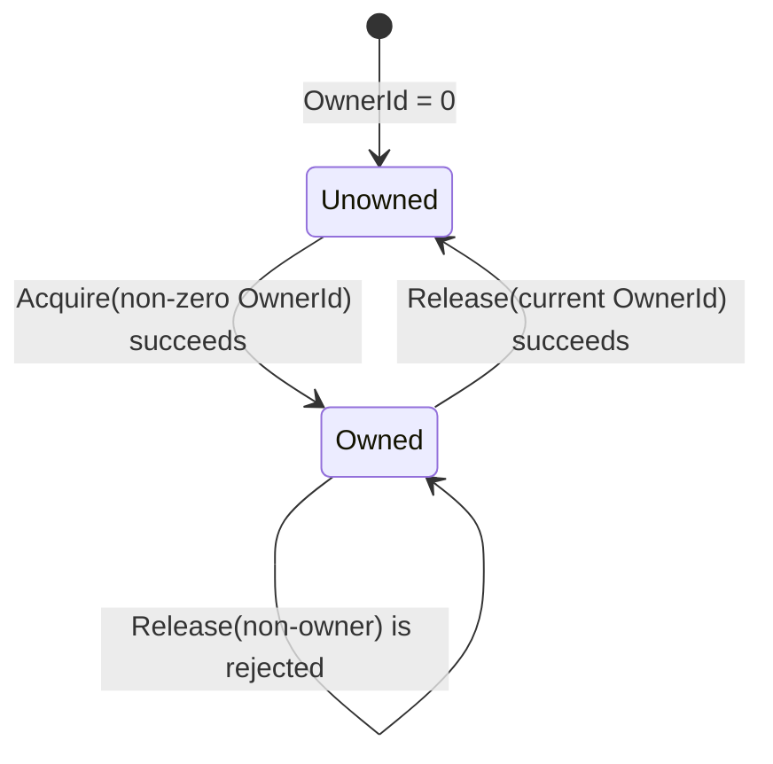

Resource Lock 必須符合：

1. `OwnerId = 0` 的 Acquire 必須失敗。
2. unowned BaseUnit 接受非零 Owner ID 後，必須將它設為 current owner。
3. current owner 使用相同 Owner ID 重複 Acquire 必須成功且不得重置設備命令狀態。
4. 其他 Owner ID 的 Acquire 必須失敗，且不得影響 current owner。
5. 只有 current owner 可以 Release。
6. Release 成功後 current Owner ID 必須回到 `0`。
7. `ResourceIsAcquired` 與 `ResourceOwnerId` 必須一致。
8. 所有具設備副作用的 command 都必須驗證 ownership。

### 5.4 Typed command Interface

每個具副作用的 BaseUnit command 應具有一致的基本形狀：

- `OwnerId`：識別合法呼叫者。
- request input：例如 `Execute`、方向或模式。
- operation parameter：例如位置、速度、加速度、減速度。
- command result：method `BOOL` 表示本次呼叫是否因 ownership 與基本 Interface 條件而被接受。
- operation status：例如 `Done`、`InVelocity`、`Error`、`ErrorId`。

method 的接受結果與設備完成結果必須分開解讀：

| 結果 | 意義 |
|---|---|
| method return `FALSE` | command 未被 BaseUnit 接受；通常表示 caller 不是 current owner 或 Interface 前置條件不成立 |
| method return `TRUE`, `Done = FALSE`, `Error = FALSE` | command 已接受，非同步操作仍在進行 |
| method return `TRUE`, `Done = TRUE` | 設備操作已完成 |
| method return `TRUE`, `Error = TRUE` | command 已接受，但設備操作失敗 |

拒絕 command 時，BaseUnit 必須將本次 call 的 output 初始化為無完成、無設備錯誤及零 Error ID，且不得修改底層命令輸入或設備狀態。

### 5.5 非同步命令與 withdrawal

對 Execute-style command：

1. Service 必須以 `Execute = TRUE` 持續呼叫，直到觀察到 Done、Error 或 timeout。
2. BaseUnit 必須把 command parameter 傳遞給底層設備 FB，並發布底層結果。
3. Done 或 Error 可以保持 latched，直到 Service 以 `Execute = FALSE` 撤銷 request。
4. Service 必須先撤銷原始 operation command，再發出 Stop／Reset 等 cleanup command。
5. cleanup command 完成或到達明訂的 terminal failure policy 後，Service 才能 Release resource。
6. BaseUnit 不得因 Release 本身而假裝設備 command 已安全停止。

### 5.6 Cyclic update

BaseUnit 的 `M_CyclicUpdate()` 負責推進底層設備 FB、讀取設備狀態及更新回授。它必須：

- 每個 PLC scan 由唯一 cyclic owner 呼叫一次。
- 不依賴 Service 是否在本 scan 發出新 command 才執行。
- 使用前一節定義的 command input 狀態推進非同步設備操作。
- 在同一個 BaseUnit 中以固定順序呼叫底層設備 FB。
- 不執行無界等待、檔案 I/O 或 runtime symbol resolution。

若 BaseUnit FB body 會委派至 `M_CyclicUpdate()`，組合者不得在同一 scan 同時呼叫 FB body 與該 method。新 BaseUnit 必須在其專屬規格中明訂「由 FB body 更新」或「由 Module hook 明確更新」的實際呼叫方式。

> 目前 `FB_Axis_BaseUnit` 的 FB body 會委派至 `M_CyclicUpdate()`，Chamber1 Module 則直接透過 Interface 呼叫該 method；現有 `MAIN` 沒有再獨立呼叫 Axis FB body。未來修改組合方式時，仍必須避免同一 instance 每 scan 被更新兩次。

### 5.7 Feedback 與可觀察狀態

BaseUnit 應只發布 Service 做決策所需的回授，例如 actual position、actual velocity、disabled state 或 job state。

- Feedback property 必須只讀。
- Invalid equipment reference 必須映射成安全且可診斷的 unavailable state。
- 不得為測試方便而把所有 private device state 暴露至 production Interface。
- 若不同 Service 需要不同層次的資訊，應先評估是否擴充既有 typed Interface，或建立真正有第二個 Adapter／caller 的新 seam。

### 5.8 ADS symbol 與 Reference registration

可由 runtime configuration 綁定的 BaseUnit 必須提供有效的 ADS symbol metadata：

- address 不得為 `0`。
- size 必須大於 `0`。
- Reference Manager 必須能由實際 address 與 size 解析 symbol name。
- 未綁定 Interface、無法取得 metadata、symbol name 空白或 registry overflow 時，registration 必須失敗並提供 Error Message。

Configuration file 只引用已註冊的 BaseUnit symbol name，不得直接寫入記憶體位址或 Interface type。

### 5.9 Error 與安全行為

- BaseUnit 必須保留底層設備 Error ID，讓 Service 可以轉換成 `SourceErrorId`。
- BaseUnit 不負責決定 Module-level Main Error ID 或 Alarm Message。
- Stop、Halt、Reset 等 cleanup command 也必須遵守 ownership。
- 非 owner 的 cleanup command 不得干擾 current owner。
- 若設備 Error 後仍需要 Reset，Service 必須在仍持有 ownership 時完成 Reset 或依明訂的 terminal policy 結束。
- BaseUnit 不得在無法確認設備已停止時自行釋放 current owner。

### 5.10 Test fake 契約

BaseUnit fake 必須實作與 production Adapter 相同的 typed Interface，並至少能控制：

- command 接受／拒絕。
- 經過指定 scan 數後 Done。
- 經過指定 scan 數後 Error 及 Error ID。
- request withdrawal 後清除結果。
- actual feedback 與設備 availability。
- command call history 及 parameter preservation。
- fake script 或 history overflow diagnostics。

Fake-specific inspection method 可以存在於 fake concrete type，但不得加入 production typed Interface。

### 5.11 BaseUnit 完成檢查表

- [ ] 定義最小且完整的 typed Interface。
- [ ] 實作 `I_ResourceLock` 契約。
- [ ] 所有具副作用的 command 都驗證 Owner ID。
- [ ] 拒絕 command 不產生設備副作用。
- [ ] 定義 Execute／Done／Error／withdrawal 時序。
- [ ] 提供必要 Error ID 與只讀 feedback。
- [ ] 明訂唯一 cyclic owner。
- [ ] 可由 Reference Manager 註冊及由 Adapter 進行 `__QUERYINTERFACE` 驗證。
- [ ] 建立符合相同 Interface 的 fake。
- [ ] 完成 ownership、成功、設備錯誤、timeout 與 withdrawal 測試。

### 5.12 待確認事項

1. `M_Halt` 與 `M_MoveVel` 目前沒有完整 `ErrorId` output，需決定 typed command 是否統一。
2. BaseUnit FB body 與 Module `H_UpdateBaseUnit()` 的 cyclic ownership 需統一為單一模式。
3. 是否允許 BaseUnit 在不同 Module 之間共享；若允許，Resource Owner ID 必須改為跨 Module 唯一。
4. cleanup timeout 後的 ownership 與設備安全狀態需要共同 policy。
5. BaseUnit availability 是否需要統一 Status struct，而不只由各 typed Interface property 表達。

## 6. Service 開發規格

### 6.1 責任與 Interface

Service 將一項操作或製程能力封裝在共同 PackML lifecycle 後。Service Interface 必須讓 Module 能提供控制、參數、執行 Context、Service ID 與 BaseUnit reference，並取得共同 Service Status 及必要的專屬 Status。

新 Service 必須繼承 `FB_ServiceBase`，並至少接受：

- `Ctrl : REFERENCE TO ST_ServiceCtrl`
- `Context : REFERENCE TO ST_ServiceContext`
- `ServiceId : T_ResourceOwnerId`
- Service-specific `Param`
- 所需的 typed BaseUnit Interface
- `Status : ST_ServiceStatus`

若 Service 有額外可觀察結果，可以新增 Service-specific Status output，但不得重複或取代共同 `ST_ServiceStatus` 的語意。

### 6.2 Cyclic body

Service FB 每 scan 必須且只能呼叫一次：

```text
M_UpdateService(CompletionBehavior := ...)
```

該共同入口負責：

- 將 `Ctrl.PackMLIn` 提供給 PackML base。
- 執行 PackML state machine 與 Service state hook。
- 發布 `Status.PackMLOut`。
- 發布 Completion Behavior 與 Service ID。
- 在 command request edge 更新 `Status.ResponseId`。

Service-specific cyclic body 可以在共同入口前後整理輸入或發布專屬 Status，但不得再次呼叫 base state machine。

### 6.3 Parameter contract

每個 Service-specific Parameter struct 必須定義：

- 欄位名稱、單位與有效範圍。
- `0`、負值或 enum `Unknown` 的語意。
- 參數之間的不變條件。
- 何時驗證。
- 何時取樣或鎖存。
- Execute 中是否允許變更。
- Stop／Abort cleanup 使用原值、鎖存值或最新值。

建議預設契約為：

1. 在 `Starting` 的 first scan 鎖存本次 operation parameter。
2. 先驗證全部參數，再取得任何 BaseUnit resource。
3. Starting、Execute、Stopping、Aborting 與 Completing 都使用同一份 latched parameter。
4. 下一次回到可接受新操作的 State 後，才重新取樣外部 Parameter。

若 Service 需要 live tuning，必須在專屬 Interface 明訂允許變更的欄位、套用時機與安全限制。

### 6.4 Starting 順序

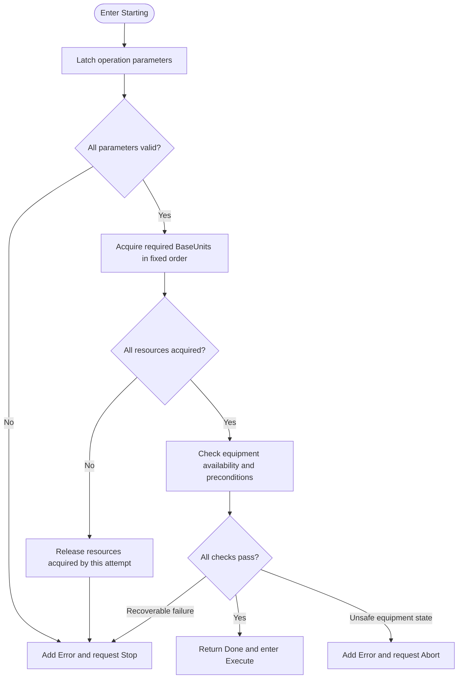

Starting 必須遵守：

1. invalid parameter 不得造成 BaseUnit Acquire 或設備 command。
2. 多個 BaseUnit 必須依固定順序 Acquire，避免不同 Service 形成循環等待。
3. 任一 Acquire 失敗時，必須釋放本次 Starting 已成功取得的其他資源。
4. 不得干擾由其他 Service 擁有的 BaseUnit。
5. 設備 availability 與 busy check 必須在成功取得 ownership 後進行，避免狀態檢查與實際使用之間發生競爭。
6. Resource contention 預設視為 Starting failure，不應無限等待；若有 queueing policy，必須由專屬規格明訂 timeout 與公平性。

### 6.5 Execute 與完成

Service 在 Execute 必須：

- 只對自己擁有的 BaseUnit 發出 command。
- 持續推進 operation，直到完成、外部中斷、設備錯誤或 timeout。
- 對 `NaturalCompletion` 在成功條件成立時回傳 `Done`。
- 對 `ExecuteUntilExternalStop` 在正常運作時維持 `Busy`。
- 設備 Error 時先記錄 Error，再要求符合 policy 的 Stop 或 Abort。
- 不得在同一 occurrence 每 scan 重複新增相同 Error entry。

複合 Service 若包含多個 stage，應使用明確 stage enum 與每個 stage 的 entry、completion、timeout 和 command-withdrawal 規則。不得用大量互相依賴的 BOOL 形成無法驗證的隱含 state machine。

### 6.6 Completing

`Completing` 用來完成自然結束所需的收尾。Service 必須：

1. 撤銷仍為 active 的 operation command。
2. 等待 Interface 要求的 withdrawal confirmation（若有）。
3. 發布完成資料或本次 cycle record。
4. 釋放不再需要的 BaseUnit。
5. 所有必要收尾完成後才回傳 `Done`。

進入 `Complete` 後應以冪等方式確認沒有遺留的資源或 active command。

### 6.7 Stopping 與 Aborting

| 比較項目 | Stopping | Aborting |
|---|---|---|
| 目的 | 受控停止目前操作 | 對 fault 或高風險狀況進行更強制的復原 |
| 原 operation command | 必須先撤銷 | 必須先撤銷 |
| 常見設備動作 | Stop／Halt | Stop 後 Reset，或設備專屬 abort sequence |
| Ownership | cleanup 完成前保持 | recovery 完成或 terminal policy 決定前保持 |
| 完成 State | `Stopped` | `Aborted` |
| Error | cleanup Error 應記錄，必要時升級 Abort | recovery Error 仍應記錄，但不得永久無限停留 |

Stopping／Aborting 必須考慮「Service 從未成功取得 resource」的路徑。這種情況不得向其他 owner 的 BaseUnit 發出 Stop 或 Reset；hook 應能安全完成。

每個非同步 cleanup phase 必須有完成、設備 Error 與 timeout 三種出口。timeout 後能否 Release resource 必須由設備安全 policy 明訂，不能只為了離開 State 而無條件釋放。

### 6.8 Clearing、Resetting 與穩態 State

- `Clearing`：清除 Abort condition 所需的 Service 狀態，完成後進入 `Stopped`。
- `Resetting`：清除可重設的 Error／operation state，準備下一次操作；不得清除應跨 cycle 保留的 diagnostics，除非專屬規格明訂。
- `Idle`：不得保留上一個 operation 不再需要的 resource。
- `Stopped`、`Aborted`、`Complete`：應執行冪等 defensive release，且不得重新觸發 operation command。
- `Held`、`Suspended`：必須明訂設備是保持命令、受控停止還是釋放 resource。

### 6.9 Error publication

Service 必須透過 `M_AddError()` 發布 Error：

- `MainErrorId` 必須非零且符合 Module-specific Error ID registry。
- `SourceErrorId` 保存 BaseUnit 或底層函式庫 Error ID；無來源時為 `0`。
- Message 必須能描述失敗動作及所在階段。
- Framework 自動加入 Module ID、Service ID、instance path、UTC time、Severity、Active 與 occurrence 初始值。
- 同一 Service Error List 中相同 Main Error ID 不得重複新增。
- Error List 滿時，新增 Error 會失敗；Service 必須決定是否需要額外 overflow diagnostics。

Service 不得自行設定 Alarm acknowledgement、occurrence count 或 lifecycle removal。

### 6.10 Data publication

Service 使用 `M_UpdateData()` 以 Data ID 新增或更新 persistent descriptor：

- Data ID `0` 必須被拒絕。
- 相同 Data ID 必須更新既有 entry，不得增加 Count。
- 新 ID 使用第一個 empty entry，並增加 Count。
- 沒有空間時設定 Service Data overflow，且不得越界寫入。
- `M_ClearData()` 只清除指定 ID；`M_ClearAllData()` 清除全部 Service Data。
- Name、DataType、Unit 與 Value 必須符合 descriptor 長度及語意。

Service 必須說明 Data 的保留週期，例如「最後一個成功 cycle」、「最近一次 operation，不論成功失敗」或「目前進行中 snapshot」。

### 6.11 禁止行為

Service 不得：

- 在參數驗證前取得不必要的 resource。
- 使用 Owner ID `0`。
- 忽略 BaseUnit method return value，只檢查 Done／Error。
- 對非 owner 的 BaseUnit 發出 cleanup command。
- 在 active Execute command 尚未撤銷時直接 Release resource。
- 直接修改 Module PackML state、Module Alarm List 或 Alarm acknowledgement。
- 在 state hook 中進行 blocking wait。
- 依賴另一個 Service 的 private state 或 concrete FB instance。
- 使用 array index 代替 Service ID、Error ID 或 Data ID。

### 6.12 Service 最低測試與完成檢查表

- [ ] 正常 Starting、Execute、Completing 與 resource release。
- [ ] invalid parameter 不 Acquire resource。
- [ ] resource contention 不干擾 current owner。
- [ ] BaseUnit command rejection、設備 Error 與 Error ID propagation。
- [ ] Stop 會撤銷 operation、完成 cleanup 並 Release。
- [ ] Abort 會執行 recovery 並進入 Aborted。
- [ ] cleanup timeout 不造成無限 transient State。
- [ ] command response latch 至 request withdrawal。
- [ ] Main Error ID 不重複，Error List overflow 有可觀察結果。
- [ ] Data update、clear、duplicate update 與 overflow。
- [ ] fake BaseUnit 與 production Interface 使用方式一致。

### 6.13 待確認事項

1. Parameter 是否統一在 Starting first scan 鎖存；目前簡單 Service 與複合 Service 的作法尚未完全一致。
2. Error List 滿時是否需要保留第一批 Error、最後一筆 Error，或另設專用 overflow Alarm。
3. Resetting 應清除哪些 Error 與 Data，需區分 operation state 與歷史 diagnostics。
4. Hold／Suspend 的 BaseUnit command 與 ownership policy 需要共通定義。
5. 多 BaseUnit Acquire 是否需要 Framework helper 來統一排序與 rollback。

## 7. Module 開發規格

### 7.1 責任與繼承

新 Module 必須繼承 `FB_ModuleBase`，讓 Heartbeat、Module PackML、Service synchronization、Alarm Lifecycle、Data aggregation 與 configured Variable publication 維持單一共同 Implementation。

Derived Module 的主要責任是：

- 宣告 Module-specific I/O、Service Control／Parameter／Status 與 Reference Port。
- 建立並持有 Service instance。
- 在固定 hook 中路由 Parameter、呼叫 Service 及更新 BaseUnit。
- 驗證 Module-specific composition prerequisite。
- 發布不屬於共同 base contract 的專屬 Status 或選配能力。

### 7.2 標準 Interface

Module 必須接受共同輸入：

- `ModuleCtrl`
- `SystemContext`
- `HeartbeatIndex`
- `RuntimeConfig`
- `VariableNodeReader`

並發布共同輸出：

- `ModuleStatus`
- `ModuleVariableList`
- `ModuleAlarmList`
- `ModuleDataList`

Module-specific Interface 可以加入：

- Hardware Input／Output struct。
- Service Control／Parameter reference。
- Service Status output。
- typed BaseUnit Interface reference。
- 選配能力的 Control／Status。

不得複製另一份 Module ID、Heartbeat、PackML、Alarm 或 Data base status 作為不同真相來源。

### 7.3 Module-specific 資料型別

每個 Module Type 應定義：

1. `ST_<Type>_Signal_In`
2. `ST_<Type>_Signal_Out`
3. `ST_<Type>_ServiceCtrl`
4. `ST_<Type>_ServiceParam`
5. `ST_<Type>_ServiceStatus`
6. `ST_<Type>_CtrlStatus`，extends `ST_Module_CtrlStatus_Base`
7. `E_<Type>ServiceId`
8. `E_<Type>ReferencePort`
9. Service Control 與 Status 的 ByName／ByIndex Union view
10. Module-specific Error ID、Data ID 與其他必要 enum／struct

每個 Service 必須在 Control、Parameter 與 Status struct 中具有一致的 named field。ByIndex view 的長度與記憶體 layout 必須涵蓋完全相同且順序一致的 Service 集合。

### 7.4 Derived Module FB body

Derived Module FB body 應保持精簡：

1. 驗證 required typed reference 已綁定。
2. 將外部 named Service Control 複製到 indexed control view。
3. 呼叫一次 `M_UpdateModule()`。
4. 將 indexed status view 發布回 named Service Status。

不得在 `M_UpdateModule()` 之外另外呼叫同一 Service 或 BaseUnit，否則會破壞第 3 章的執行次數與順序契約。

### 7.5 Module update hooks

| Hook | 責任 | 必須發生的順序 |
|---|---|---|
| `H_UpdateServiceParam` | 將 Module-specific Parameter 路由至各 Service instance | 在 Service invocation 前 |
| `H_UpdateService` | 對每個 Service instance 呼叫一次，傳入 Control、Context、Service ID 與 BaseUnit reference | Parameter routing 與 Control Source selection 後 |
| `H_UpdateBaseUnit` | 推進 Module 所負責的 BaseUnit cyclic update | 所有 Service invocation 後 |

這三個 hook 不得重新實作 Module Base 已負責的 Heartbeat、PackML、Alarm、Data 或 Variable 工作。

### 7.6 Service ID 與 indexed view

- `E_<Type>ServiceId.None = 0`。
- 每個 Service instance 必須有固定、非零且不重複的 enum value。
- 已發布或用於 Alarm Identity 的 Service ID 不得因 struct field 排序而重新編號。
- ByName struct field 順序、ByIndex array 順序與 Service ID 順序應保持一致，或提供明確 mapping；不得只靠未記錄的記憶體 layout 假設。
- Module 傳給 Service 的 Service ID 必須與該 Service Status、Alarm Identity 及 Resource Owner ID 一致。

### 7.7 Required Reference

Module 必須在任何 Service 或 BaseUnit invocation 前確認 required typed Interface 不為 `0`。

Configuration Adapter 必須：

- 宣告 Reference Port name、non-zero token 與 required flag。
- 將 `I_BaseUnit` 透過 `__QUERYINTERFACE` 驗證成正確 typed Interface。
- 將成功轉型後的 Interface 寫入對應 Slot storage。

Derived Module 的 runtime check 是最後防線，不得取代 initialization 的 Reference Port validation。

### 7.8 Module PackML 與 Service synchronization

Module 必須將 external Service Control 只保留在 `Idle`、`Starting`、`Execute`。其他 State 使用 Module Control 覆寫所有 Service，使 Module-wide lifecycle 可以同步完成。

Module transient hook 會根據全部 Service Status 判斷完成，因此：

- Service Status view 必須包含所有 Service。
- 未使用的 Service 也必須具有可參與同步的合法 State。
- Derived Module 不得隱藏某個 Service，使其不受 Stop／Abort／Clear／Reset 控制。
- Module 必須接受 Service completion 在下一 scan 才被 summary 觀察到的時序。

### 7.9 Heartbeat

Module Base 以 `HeartbeatIndex` 是否持續變化判斷 Control Source 是否存活：

- index 改變時重置 timeout 計時。
- index 在 timeout 期間保持不變時，發布 `IsControlSourceAlive = FALSE`。
- System Context 提供的 timeout 小於等於零時，使用 Framework parameter 預設值。
- heartbeat 恢復變化後，Module 必須能恢復發布 alive。

Heartbeat 目前只影響 Status，不自動觸發 Stop 或 Abort。Module-specific 程式不得自行實作另一套不一致的 heartbeat timer。

### 7.10 Alarm、Data 與 Variable

Module 不應由 derived FB 手動拼裝共同 publication：

- Service Error 由 Module Base 交給 Alarm Manager。
- Configured Alarm 使用 Runtime Configuration 與 configured snapshot。
- Service Data 由 Module Base 彙整、檢查 duplicate ID 與 overflow。
- Configured Variable 由 Module Base 依 Runtime Binding 發布。

Derived Module 若要新增其他 publication，必須確認不會使用相同 ID namespace 或繞過共同容量限制。

### 7.11 Composition 與隔離

- Service concrete FB 應為 Module private implementation detail。
- Control Source 只應透過 Module Control／Status 與 Service Control／Status struct 操作，不得取得 private Service FB reference。
- BaseUnit 透過 typed Interface 注入；Module 不得在內部建立指向特定全域 BaseUnit 的硬編碼依賴。
- Module Type 專屬的 GVL storage 應只負責 instance composition，不應包含製程邏輯。
- Module 之間若需交換資料，必須使用已聲明的 mapping 或專用 Interface。

### 7.12 Module 最低測試與完成檢查表

- [ ] required reference 缺少或型別錯誤時不執行功能邏輯。
- [ ] external Service Control 與 Parameter 路由至正確 Service。
- [ ] 每個 Service ID 正確且唯一。
- [ ] 每個 Service 每 scan 呼叫一次。
- [ ] Module Stop／Abort／Clear／Reset 覆寫全部 Service Control。
- [ ] Module 等待全部 Service 到達目標 State。
- [ ] Heartbeat timeout 與恢復。
- [ ] Service Error 使用統一 Module Alarm Lifecycle。
- [ ] Service Data duplicate 與 overflow。
- [ ] configured Variable／Alarm publication。
- [ ] Module ID、Type、Enabled 與 Response ID 正確發布。
- [ ] input/output mapping 與 Module invocation 順序正確。

### 7.13 待確認事項

1. Required reference 遺失時要發布何種 Module Status 或 Alarm。
2. 未使用 Service 的初始 State 與 Module synchronization policy。
3. 是否允許 Module-specific pre/post update hook；若新增，必須避免暴露共同 Implementation。
4. Wafer Transfer 與 Process Station 是否保留在 `ST_ModuleCtrl`／`ST_ModuleStatus` base contract。
5. Heartbeat timeout 是否應由 Framework 統一觸發安全狀態。

## 8. 新 Module Type 的組態整合規格

### 8.1 必要產物

新增 Module Type 時，至少必須提供：

1. 穩定且唯一的 Module Type name。
2. Module-specific FB 與第 7.3 節的資料型別。
3. `GVL_Module` 中對齊 Slot 的 Module、Runtime、Control／Status 與 Reference Port arrays。
4. 實作 `I_ModuleConfigurationAdapter` 的 Adapter。
5. Module I/O node declarations。
6. Reference Port enum、name、token、required flag 與 typed Interface binding。
7. `FB_ModuleTypeRegistry` registration。
8. `MAIN` 或對應 System Orchestration 中的 cyclic invocation。
9. JSON configuration 範例。
10. configuration、Module composition 與 runtime invocation 測試。

只完成 Adapter registration 並不代表 Module Type 已可執行；System Orchestration 仍必須明確加入其 type-specific cyclic loop。

### 8.2 Module Type name

Module Type name 使用 `T_ModuleTypeName`，目前最大長度為 `STRING(16)`。

- 名稱不得為空字串。
- Registry 內必須唯一。
- JSON `moduleType` 必須與 Registry name 完全相同且大小寫一致。
- 已投入使用的名稱屬於 configuration compatibility contract，不得直接重新命名。
- Adapter 的 `M_ApplyRuntimeConfig()` 必須再次驗證 Runtime Configuration 的 Module Type name 與自身相容。

目前 `E_ModuleType` 已不再是 Registry resolve 的來源；是否保留為 compatibility artifact 應在移除前完成引用與 migration 檢查。

### 8.3 Adapter Interface

`I_ModuleConfigurationAdapter` 的責任如下：

| Method | 責任 |
|---|---|
| `M_IsSlotSupported` | 驗證 Module Type 是否支援指定 Slot |
| `M_DeclareResources` | 開始 Module registration、宣告本次 config 所引用的 I/O node、宣告 Reference Port，並回傳 Module symbol |
| `M_BindReference` | 依 non-zero port token 驗證 BaseUnit typed Interface 並寫入 Slot storage |
| `M_ApplyRuntimeConfig` | 驗證 Module Type 後將 Runtime Configuration 寫入對應 Slot |
| `M_ClearAllSlots` | 清除該 Module Type 的所有 Runtime Configuration 與 bound references |

Adapter 必須回傳 `BOOL` 表示成功，並在失敗時提供可定位問題的 `ErrorMessage`。不得只設定內部 Error 而回傳成功。

### 8.4 Resource declaration

Adapter 的 `M_DeclareResources()` 必須使用通用 registration Interface，而不得要求 `FB_LinkVariableManager` 新增該 Module Type 的 concrete registration method。

宣告順序：

1. 以 Module FB address、size 與本次 `ST_ModuleFileConfig` 開始 Module registration。
2. 宣告可供 mapping、Variable 或 Alarm 使用的 relative I/O node。
3. 每個 node 指定正確的 access mode 與 primitive data type metadata。
4. 宣告 Reference Port name、token 及 required flag。
5. 結束 Module registration 並取得完整 Module symbol。
6. 檢查 Link Variable Manager 與 Reference Port Registry error。

Module Adapter 可以描述完整 I/O surface，但 Registry 只需保留本次 configuration 實際引用的 Module node，以控制 node capacity。

### 8.5 Reference Port contract

每個 Module Type 應使用 qualified enum 定義 port token，並以 enum member 的 `TO_STRING()` 作為公開 port name。

- Port name 不得為空。
- Port token 必須非零。
- name 與 token 在同一 Module Instance 的 declaration 中都必須唯一。
- 相同 port 不得重複 binding。
- unknown targetPort 必須在呼叫 Adapter 前由 Framework 拒絕。
- required port 未 binding 時，整個 configuration application 必須失敗。
- optional port 可以未 binding，但 Derived Module 必須能在未綁定時安全運作。
- Adapter 必須以 `__QUERYINTERFACE` 驗證 BaseUnit 實際型別。
- JSON 不得提供 Interface type 或內部 GVL storage path。

### 8.6 I/O node contract

每個 node declaration 必須提供 `Variable : ANY` 與 `Access : E_VariableAccess`；Manager 由實際變數解析 symbol 與型別資訊，註冊後的 node 必須具備：

- 可解析且 non-empty 的完整 ADS symbol name（由 address／size 解析，不由呼叫端手寫）。
- 有效 address 與正確 size。
- 支援的 primitive data type。
- `ReadOnly`、`WriteOnly` 或 `ReadWrite` access metadata。

目前支援的 primitive node type 為 `BOOL`、`DINT`、`UDINT`、`REAL`、`LREAL` 與 `STRING(80)` 範圍內的字串。

Mapping source 不得是 write-only，target 不得是 read-only。Configured Variable 與 Alarm source 必須可讀。

共享實體 I/O 使用 `M_RegisterInfrastructureNode`；Module instance 內的 node 由 Adapter 在 Module session 中使用 `M_RegisterModuleNode`。JSON 的 Module relative path 用於組態引用，不是這兩個逐點註冊 API 的參數。Array 必須依實際 bounds 逐元素註冊，不得將整個 array 或 terminal struct 當成一個 primitive node 傳入。

### 8.7 JSON configuration contract

目前 schema version 為 `3`。Root 必須包含：

- `schemaVersion`
- `modules`

每個 Module entry：

| 欄位 | 必要性 | 契約 |
|---|---|---|
| `enabled` | 必要 | 決定是否建立並執行該 Module Instance |
| `moduleType` | 必要 | 必須符合已註冊 Module Type name |
| `slot` | 必要 | 同一 Module Type 不得重複且必須在 Adapter 支援範圍 |
| `id` | enabled 時必要 | 非零且跨所有 enabled Module 全域唯一 |
| `inputMappings` | 選配 | 外部 source 至 Module target |
| `outputMappings` | 選配 | Module source 至外部 target |
| `referenceBindings` | 依 port 契約 | `source` 為已註冊 BaseUnit，`targetPort` 為 declared port name |
| `variableList` | 選配 | 宣告 configured Variable |
| `alarmList` | 選配 | 宣告 configured Alarm 與 condition |

schema v3 不接受 `adsPort`、舊 `axisReferences`，或 reference binding 中舊 `target` 欄位。

### 8.8 Mapping 驗證

Mapping 必須包含 source、target、source data type 與 target data type。

- 無 transform：source 與 target 的 registered type 及 size 必須完全一致，cyclic phase 使用 `MEMCPY`。
- 有 transform：source 與 target 都必須是支援的 numeric type；依 `target = source * scale + offset` 的共同規則轉換。
- 任何 node 未註冊、access 不符、type metadata 不符或 link table overflow，都必須使 configuration application 失敗。

若浮點轉整數涉及 rounding、saturation 或 overflow，必須在 Link Variable Manager 專屬 Interface 中明訂；不得依賴隱含型別轉換。

### 8.9 Variable 與 Alarm binding

Configuration Manager 必須在 initialization：

1. 將 Module relative source 與實際 Module symbol 組合成完整 node name。
2. 驗證 source 已由 Adapter 宣告且可讀。
3. 驗證 configured data type 與 registered metadata 相同。
4. 解析並保存不透明的 `NodeHandle`。
5. 將 definition 與 NodeHandle 寫入 Runtime Configuration binding。

Cyclic phase 只能透過 `I_VariableNodeReader` 與 NodeHandle 建立本機 snapshot，不得重新解析 symbol name 或建立 ADS handle。

### 8.10 Registry 與 initialization wiring

System Orchestration（目前為 `MAIN.M_HwModuleRegister()`）必須依序：

1. 呼叫 `M_BeginInfrastructureRegistration()`，且只在回傳 `TRUE` 後進入逐點宣告。
2. 對每個共享 scalar 或 array element 呼叫 `M_RegisterInfrastructureNode(Variable := ..., Access := ...)`。
3. 呼叫 `M_SealInfrastructureRegistration()` 作為整個 node session 的最終結果；即使中間 declaration 失敗，也必須呼叫 Seal 完成 rollback。
4. 只有 Seal 成功後才註冊所有可配置的 BaseUnit reference，再以 Module Type name 與 Adapter 註冊每個 Module Type；每一步都必須檢查回傳值，失敗即停止後續步驟。
5. 全部成功後才設定 `_bInfrastructureRegistered := TRUE`，並以此驅動 Configuration Manager 的 `Execute`。Node Seal 成功本身不代表整體 initialization 已完成。

相同 Module Type name 再次 registration 可以替換 Adapter reference，但不得增加重複 registry entry。Registry 滿時必須失敗並提供 diagnostics。

#### 8.10.1 Infrastructure node session 契約

| API（皆回傳 `BOOL`） | 前置條件與可觀察行為 |
|---|---|
| `M_BeginInfrastructureRegistration()` | 不得已有 active Infrastructure／Module session，且 Infrastructure 不得已 sealed。成功時清除舊錯誤、未封存 nodes 與 node counts，開啟新 session；重複 Begin 或 sealed 後 Begin 回傳 `FALSE`，不重設既有第一個錯誤。 |
| `M_RegisterInfrastructureNode(Variable : ANY, Access : E_VariableAccess)` | 必須有 active Infrastructure session 且尚未 sealed。由變數 address／size 解析完整 ADS symbol，驗證 access、primitive type、size 及容量後加入 node table。相同 symbol 重複宣告必須失敗，即使變數與 access 相同也不覆寫。 |
| `M_SealInfrastructureRegistration()` | 必須有 active Infrastructure session，且不得與 Module session 重疊。無錯誤時保存 Infrastructure node count、標記 sealed 並結束 session；有錯誤時回傳 `FALSE` 並對 active Infrastructure session 執行 rollback。空 session 也可以成功 Seal。 |

`Access` 是相對於 Link Variable Manager 的讀寫權限，由呼叫端明確指定：實體 input（例如 EL1889、EL3602 channel）使用 `ReadOnly`，實體 output（例如 EL2809 channel）使用 `WriteOnly`；確實需要雙向存取的共享變數才使用 `ReadWrite`。Manager 不依端子型號推斷 access。

**First-error-wins**：第一個失敗的 registration call 設定 `Error = TRUE` 與 `ErrorMessage`。後續逐點 Register 回傳 `FALSE`、不再新增 node，也不覆蓋首錯；Seal 保留原始錯誤。因此不得以「最後一個 Register 的 BOOL」代表整個 session 結果，必須檢查 Seal。Session 內不得插入會清除錯誤的 `M_ClearLinks()`、`M_ClearModuleNodes()`、`M_AddLink()` 或 `M_ResolveReadableNode()`；first-error-wins 是 registration 流程的契約，不是 Manager 所有 API 的全域錯誤政策。

**失敗 rollback**：Register 失敗當下，先前成功加入的 nodes 尚可能留在 table。Seal 在 active session 有錯誤時清除本次 Infrastructure nodes，將 `_NodeCount` 與 `_InfrastructureNodeCount` 歸零並關閉 session，保留 `Error`／`ErrorMessage`，且不標記 sealed。必須先保存診斷；呼叫端若明確啟動新 attempt，可在 rollback 後重新 Begin，成功的 Begin 才會清除舊錯誤。不得藉重複 Begin 跳過尚未結束的 session。

成功 Seal 後不得再 Begin 或追加 Infrastructure node。後續 Module configuration application 失敗時，外層 Configuration Manager 清除 Module nodes／links／runtime 與 references；`M_ClearModuleNodes()` 保留已 sealed 的 Infrastructure nodes。這與 Infrastructure Seal 的 rollback 範圍不同。BaseUnit reference 或 Adapter registration 在 Seal 之後失敗，也不會撤銷已 sealed nodes。

目前 `MAIN` 以 `_bInfrastructureRegistrationAttempted` 確保啟動註冊只嘗試一次，以 `_bInfrastructureRegistered` 保存所有步驟的成功結果；失敗後不會每個 scan 自動重試。Manager 可在未 sealed 且 rollback 完成後接受新 attempt，不代表現有 `MAIN` 已提供 retry／runtime reload。

#### 8.10.2 新 Module 開發者可套用的簡短範例

以下為 `MAIN.M_HwModuleRegister()` 的註冊骨架，使用現有 `MAIN` 的 manager、adapter 與 BOOL 變數；method local 宣告 `nChannel : DINT`。新增 Module Type 時，替換或追加其硬體節點、BaseUnit 與 Adapter registration，並保留每一步的成功 gating。這段初始化由 `MAIN` 的 attempted guard 呼叫一次，不應放進 Module cyclic body。

```iecst
_bRegistrationOk := _LinkVariableManager.M_BeginInfrastructureRegistration();
IF _bRegistrationOk THEN
    // Array 依實際 bounds 逐點宣告；scalar 直接傳入變數。
    FOR nChannel := LOWER_BOUND(GVL_IO.Term4_EL1889.Chl, 1)
        TO UPPER_BOUND(GVL_IO.Term4_EL1889.Chl, 1) DO
        _LinkVariableManager.M_RegisterInfrastructureNode(
            Variable := GVL_IO.Term4_EL1889.Chl[nChannel],
            Access := E_VariableAccess.ReadOnly);
    END_FOR
    _LinkVariableManager.M_RegisterInfrastructureNode(
        Variable := GVL_IO.Term2_EL3602.Chl[1],
        Access := E_VariableAccess.ReadOnly);
    _LinkVariableManager.M_RegisterInfrastructureNode(
        Variable := GVL_IO.Term3_EL2809.Chl[1],
        Access := E_VariableAccess.WriteOnly);

    // 不因單點失敗而提前 RETURN：Seal 統一判定並 rollback。
    _bRegistrationOk := _LinkVariableManager.M_SealInfrastructureRegistration();
END_IF
IF _bRegistrationOk THEN
    _bRegistrationOk := _ReferenceManager.M_RegisterReference(
        BaseUnit := GVL_IO.NC_Axis1);
END_IF
IF _bRegistrationOk THEN
    _bRegistrationOk := _ReferenceManager.M_RegisterReference(
        BaseUnit := GVL_IO.NC_Axis2);
END_IF
IF _bRegistrationOk THEN
    _bRegistrationOk := _ModuleTypeRegistry.M_Register(
        ModuleTypeName := 'Chamber1', Adapter := _Chamber1ModuleConfigurationAdapter);
END_IF
_bInfrastructureRegistered := _bRegistrationOk;
```

此精簡範例只宣告 EL3602／EL2809 的第 1 點；實際整合必須補齊 configuration 使用的 channel，可套用相同 `LOWER_BOUND`／`UPPER_BOUND` 迴圈。Configuration Manager 使用 `Execute := _bInfrastructureRegistered`；失敗診斷應讀取失敗步驟所屬 Manager 的 `ErrorMessage`（node session 為 `_LinkVariableManager.ErrorMessage`）。Module 自己的 `HwInput`／`HwOutput` 仍由 Adapter 在 `M_BeginModuleRegistration()`／`M_EndModuleRegistration()` 之間逐點 `M_RegisterModuleNode()`，不得混入上述 Infrastructure session。

#### 8.10.3 舊端子專用 API 遷移

`M_RegisterEL1889()`、`M_RegisterEL2809()`、`M_RegisterEL3602()` 已淘汰，目前 `FB_LinkVariableManager` 已無這些 method；新程式與文件範例不得再使用。EL1889／EL2809／EL3602 的硬體與 `GVL_IO` DUT 仍可使用，淘汰的是端子專用註冊方式。

遷移時，將一次 terminal registration 改為 Begin → 各 `Chl[index]` 逐點 Register（明確指定 Access）→ Seal，再依成功結果繼續 reference／adapter registration。新增端子或 Module Type 不需要為 Link Variable Manager 增加 concrete registration API。

實作依據：[FB_LinkVariableManager](../robust_solution_simple_module/Untitled1/Configuration/POUs/FB_LinkVariableManager.TcPOU)、[MAIN](../robust_solution_simple_module/Untitled1/POUs/MAIN.TcPOU)；Module session 的獨立清除流程另見 [Module Node Registration Session 說明](../docs/Module-Node-Registration-Session.md)。

### 8.11 Current Implementation Profile

以下數值描述目前版本，不是永遠不變的 Framework Contract：

| Parameter | 目前值 | 範圍 |
|---|---:|---|
| `MaxModuleTypes` | 8 | 可註冊 Module Type 數量 |
| `MaxModulePerType` | 6 | 每個 Module Type 的 Slot capacity |
| `MaxTotalConfiguredModules` | 48 | config 中 enabled 與 disabled entry 總數 |
| `MaxModuleMappings` | 256 | 每個 Module 各自的 input／output mapping capacity |
| `MaxConfigVariableNodes` | 512 | shared node 與本次 config 引用的 distinct Module node |
| `MaxModuleReferenceBindings` | 50 | 每個 Module 的 reference binding／port declaration capacity |
| `MaxConfigReferenceNodes` | 100 | BaseUnit reference registry capacity |
| `MaxModuleVariable` | 100 | 每個 Module 的 configured Variable capacity |
| `MaxConfiguredAlarmsPerModule` | 30 | 每個 Module 的 configured Alarm capacity |
| `MaxServiceAlarmsPerModule` | 70 | Module 保存 Service Alarm lifecycle 的 capacity |
| `MaxPublishedModuleAlarms` | 100 | Module Alarm publication capacity |
| `MaxServiceError` | 10 | 每個 Service Error List capacity |
| `MaxServiceData` | 30 | 每個 Service Data capacity |
| `MaxModuleData` | 50 | Module aggregated Data capacity |
| `MaxConfigValueSize` | 81 bytes | 單一 configured source snapshot capacity |

### 8.12 新 Module Type 整合檢查表

- [ ] Module Type name 已定義、註冊且與 JSON 範例一致。
- [ ] type-specific GVL arrays 使用相同 Slot bounds。
- [ ] Adapter 完整實作所有 `I_ModuleConfigurationAdapter` method。
- [ ] I/O node 透過通用 registration Interface 宣告。
- [ ] 共享 node 使用 Begin／逐點 Register／Seal，未使用已淘汰的端子專用 API；Begin 成功後即使 declaration 失敗也會執行 Seal。
- [ ] 已驗證首錯保留、重複 node／Begin 拒絕、失敗 Seal 清除 nodes，以及成功 Seal 後禁止追加；全部 Infrastructure wiring 成功前 `Execute = FALSE`。
- [ ] Reference Port name、token、required flag 唯一且可驗證。
- [ ] bound BaseUnit 使用 `__QUERYINTERFACE` 轉為 typed Interface。
- [ ] disabled Slot 及 `M_ClearAllSlots()` 會清除 runtime 與 references。
- [ ] Runtime Configuration 只在所有 enabled Module validation 成功後標記 valid。
- [ ] `MAIN` 已加入 enabled／valid filtering 與 cyclic call。
- [ ] config load、unknown type、duplicate Slot／ID、missing port、wrong Interface、bad mapping 及 overflow 都有測試。
- [ ] 範例 JSON 與部署說明已更新。

### 8.13 待確認事項

1. `E_ModuleType` 是否正式 deprecated，或仍要作為 compile-time registry。
2. Module Type 是否需要獨立 version，讓同名 Type 可以驗證 configuration compatibility。
3. numeric transform 的 rounding、range overflow 與 NaN policy。
4. 是否支援 optional Reference Port 在 runtime 被重新綁定。
5. configuration reload 的 transaction、rollback 與 output safety policy。

## 9. Alarm、Variable 與 Data 發布規格

### 9.1 三種 publication 的差異

| Publication | 來源 | 主要用途 | Lifecycle owner |
|---|---|---|---|
| Variable | Runtime Configuration 指定的 readable Module node | 發布目前量測值或狀態值 | Module Base／configured snapshot |
| Data | Service 依操作結果建立或更新的 descriptor | 發布製程結果、cycle record 或衍生資料 | Service 建立，Module Base 彙整 |
| Alarm | Configured condition 或 Service Error | 發布具 active、acknowledgement 與 occurrence 的異常生命週期 | Module Alarm Manager |

三者都使用 fixed-capacity list，但 ID scope、更新方式與保留週期不同，不得共用一套未區分語意的 publication helper。

### 9.2 Descriptor contract

Variable 與 Data 使用 `ST_ExtDescriptor`：

- `Id`：非零的 external identity。
- `Name`：供 Control Source 理解的穩定名稱。
- `DataType`：文字 Value 的實際語意型別。
- `Unit`：工程單位；無單位時應使用一致的空字串或專案約定。
- `Value`：依 DataType 格式化的文字表示。

同一 ID 的 Name、DataType 與 Unit 應保持穩定。若其語意改變，應配置新的 ID，不得只保留 ID 而靜默改變含義。

日期時間必須使用 Framework 定義的 UTC 格式 `YYYYMMDDHHMMSSUUU`。數值格式、小數位數、布林表示與 locale 必須固定，不能依 HMI 或作業系統語系變化。

### 9.3 Configured Variable

Configured Variable 必須在 JSON 中提供：

- readable relative `source`
- non-zero `id`
- `name`
- `unit`
- `dataType`

Initialization 必須解析 source、驗證 metadata 並保存 NodeHandle。Module cyclic invocation 透過 configured snapshot 讀取，將定義與文字化 Value 發布至 Module Variable List。

Variable contract：

1. Variable ID 在同一 Module 內必須唯一。
2. list ordering 依 configuration ordering，不得視為 Variable identity。
3. configured data type 必須與 registered node type 相同。
4. source read failure 不得產生越界讀取或使用未初始化資料。
5. 無效 sample 時 Value 的 stale／empty／quality policy 必須可診斷。

> 目前 Configuration Manager 會驗證 Variable ID 非零，但尚未看到 duplicate Variable ID 的集中拒絕；此項應列為規格符合性缺口並由後續測試確認。

### 9.4 Service Data

Service Data 是 persistent descriptor collection。`M_UpdateData()` 應以 Data ID 執行 upsert：

- ID 已存在時更新相同 entry。
- ID 不存在時使用第一個 empty slot 並增加 Count。
- ID 為 `0` 時拒絕。
- list full 時設定 `Overflow = TRUE` 並拒絕新 entry。

`M_ClearData()` 成功清除 entry 後應減少 Count；`M_ClearAllData()` 將整個 Service Data Status 清零。

每個 Service 必須定義各 Data ID 的：

- 語意與單位。
- 建立時機。
- 更新時機。
- 清除時機。
- operation 失敗或 Abort 時是否仍發布。
- 是否描述 current cycle 或 last completed cycle。

### 9.5 Module Data aggregation

Module Base 每 scan 重新建立 Module Data publication，來源是所有 Service 目前保存的 Data List。

Aggregation contract：

1. 依 Service Status view 及每個 Service Data List 的固定順序掃描。
2. Data ID `0` 視為 empty entry，並略過。
3. 第一筆有效 Data ID 可以發布。
4. 後續相同 Data ID 不得再次發布。
5. 發現 duplicate 時保存第一個 duplicate ID 作為 diagnostics。
6. 任一 Service overflow 或 Module publication capacity 不足時，Module Data Status 必須設定 overflow。
7. Module Data List 每 scan 清除後重建，因此 Published List Index 不具穩定性。

不同 Service 的 Data ID 必須由 Module Type 統一配置，不能各自從 `1` 開始而不協調。

### 9.6 Alarm sources

Alarm 有兩種來源：

#### Configured Alarm

由 JSON 定義 readable source、data type、condition、Main Error ID、Message 與 Severity。它固定使用 `ServiceId = 0`。

目前 condition operator：

- `gt`
- `lt`
- `eq`
- `ge`
- `le`

`eq` 使用 tolerance 判斷浮點相等；其他 operator 直接與 threshold 比較。

#### Service Alarm

由 Module Base 觀察 Service Error List 產生。有效 Service Alarm 必須具有非零 Service ID 與非零 Main Error ID。

Service Error 的 Message、Path、Source Error ID 與 initial timestamp 會成為第一次 latch 的 Alarm snapshot，但不構成 Alarm Identity。

### 9.7 Alarm lifecycle state machine

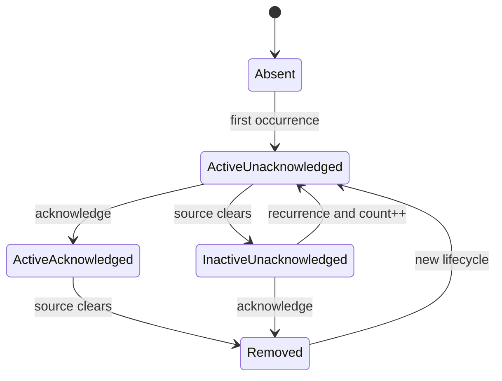

實際狀態由 `Active`、`Acknowledged`、latched storage 與 previous-active tracking 組合表示。核心規則：

1. 第一次 occurrence 建立 lifecycle，`OccurrenceCount = 1`。
2. 連續 active scan 不增加 occurrence count。
3. inactive 後尚未 acknowledged 的 lifecycle 保持 latched。
4. recurrence 將 Alarm 設為 active、清除 acknowledgement 並增加 occurrence count。
5. 只有 `Active = FALSE AND Acknowledged = TRUE` 才能移除。
6. lifecycle 移除後再次發生，建立新的 first-occurrence timestamp 與 count。

### 9.8 Alarm cycle ordering

每個 Module scan 必須依序：

1. `M_BeginCycle(ModuleId, ConfigurationRevision)`。
2. 處理 acknowledgement request。
3. 評估 configured Alarm。
4. 觀察所有 Service Error。
5. `M_EndCycle()` 將本 scan 未觀察到的 Service Alarm 設為 inactive，並移除符合條件的 lifecycle。
6. `M_Publish()` 建立 Module Alarm List。

Acknowledgement 必須在 source evaluation 前處理，避免 `AcknowledgeAll` 消耗 Control Source 尚未看到的新 occurrence。

### 9.9 Acknowledgement handshake

Alarm acknowledgement 使用 `ST_AlarmAckRequest`：

- `RequestId` 必須非零。
- `bChangeRequest` 使用 rising-edge request。
- `AckAccepted` 與 `AckError` 保持到 `bChangeRequest = FALSE`；`AckResponseId` 保存最近一次被消費的 Request ID。
- 相同 Request ID 不得重複處理。
- `AcknowledgeOne` 使用 `(ServiceId, MainErrorId)` 尋找 lifecycle。
- `AcknowledgeAll` 處理目前所有 latched configured 與 Service Alarm。

| 失敗情況 | Ack Error |
|---|---|
| Request ID 為零 | `InvalidRequestId` |
| Request ID 已處理過 | `DuplicateRequest` |
| Command 非法 | `InvalidCommand` |
| 指定 Alarm Identity 不存在 | `AlarmNotFound` |

`AckAccepted = TRUE` 只表示 request 已成功套用，不表示所有 acknowledged Alarm 已立即移除；仍 active 的 Alarm 必須繼續發布。

### 9.10 Alarm reset scope

- Module ID 改變時，configured 與 Service Alarm lifecycle，以及 acknowledgement state 都必須清除。
- Configuration revision 改變時，只清除 configured Alarm lifecycle；Service Alarm lifecycle 保留。
- 相同 Module ID 與 revision 的一般 scan 不得重置 lifecycle。
- configured Alarm sample invalid 時，目前 Implementation 保持先前 lifecycle state；是否應標記 sample quality 或轉為 inactive 屬待確認事項。

### 9.11 Publication ordering 與容量

Module Alarm List 目前先發布 Service Alarm，再發布 configured Alarm。Published ordering 是 Current Implementation Profile，不是 Alarm Identity。

- Service Alarm storage 滿時，既有 lifecycle 必須保留，新 identity 被拒絕並設定 overflow。
- Module published capacity 滿時不得越界；未發布 lifecycle 仍應計入各類 latched count，並設定 overflow。
- configured 與 Service latched count 必須分別發布。
- Control Source 必須使用 Alarm Identity，不得使用 list index 發出 AcknowledgeOne。

### 9.12 發布驗證清單

- [ ] Variable ID 非零且 Module scope 唯一。
- [ ] Data ID 非零且跨 Module 內所有 Service 唯一。
- [ ] Descriptor type、unit 與文字格式一致。
- [ ] configured source type 與 registered metadata 相同。
- [ ] Service Error 只描述 observable error，不自行維護 acknowledgement。
- [ ] Alarm recurrence 只在 inactive-to-active edge 增加 count。
- [ ] active 且 acknowledged 的 Alarm 持續發布。
- [ ] inactive 且 acknowledged 的 Alarm 被移除。
- [ ] duplicate Ack Request ID 被拒絕。
- [ ] overflow 不會覆寫既有 lifecycle 或越界。
- [ ] Module ID 與 configuration revision reset scope 正確。

### 9.13 待確認事項

1. Configured Variable duplicate ID 的 validation 與 Error Message。
2. Variable／Alarm source read failure 的 quality、stale 與 fallback 表示。
3. Service Error List overflow 是否需要專用 Module Alarm。
4. Alarm Message 或 Severity 在同一 lifecycle 期間變更時，應保留 first snapshot 或更新。
5. Module Alarm publication ordering 是否正式成為相容性契約。
6. Data descriptor 是否需要 timestamp 或 quality 欄位。

## 10. 選配能力規格

### 10.1 Capability maturity

Framework extension 必須標示成熟度：

| 等級 | 意義 |
|---|---|
| Required | 所有符合指定 Framework profile 的 Module 都必須實作 |
| Optional | Module 可以選擇支援；支援時必須符合完整 capability contract |
| Experimental | 資料型別或概念正在試驗，尚未保證行為與相容性 |

尚未具備完整狀態轉移、資料所有權、錯誤與測試規格的能力不得標示為 Required 或穩定 Optional。

### 10.2 Optional capability 的設計規則

1. 必須定義 discovery 方法，讓 Control Source 知道 Module 是否支援。
2. 必須定義 Control、Status、Identifier 與容量。
3. 必須定義每個欄位的 writer 與 reader。
4. 必須定義與 Module PackML 及 Service lifecycle 的關係。
5. 必須定義 timeout、取消、重試、重複 request 與復原行為。
6. 不支援 capability 的 Module 不得被迫建立無意義的 concrete Implementation。
7. 將欄位加入共同 base struct 前，必須評估所有 Module 的 memory、相容性與發布成本。
8. Experimental capability 不得被外部系統當作長期穩定契約。

### 10.3 Wafer Transfer 目前資料模型

目前 Wafer Transfer 相關型別已描述下列概念：

| 概念 | 目前資料 |
|---|---|
| Endpoint | `EndpointId`、Wafer Handling Type、Transfer Capability |
| Direction | `Send`、`Receive` |
| Control | Station ID、Service Control、Transfer Handshake Signal |
| Status | Station ID、Service Status、Transfer Handshake Signal |
| Passive readiness | `SendReady`、`ReceiveReady` |
| Process Station | Station ID、Material Info |
| Material | Presence、Ownership、Receive Context、Operation State、Material Context |

`ST_ModuleCtrl` 與 `ST_ModuleStatus` 已包含固定容量的 transfer request／response 與 process station list，但目前尚未看到完整 runtime coordinator 或測試，因此本文件將此能力標示為 **Experimental**。

### 10.4 Wafer Transfer 概念關係

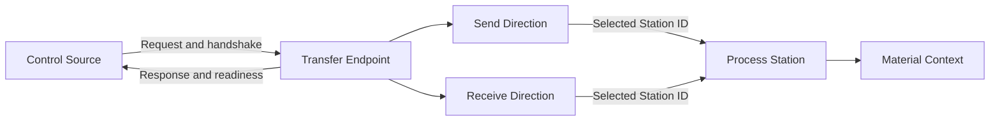

此圖只是目前資料關係，不代表 handshake sequence 已定案。

### 10.5 Wafer Transfer 成為穩定契約前的必要規格

至少必須補齊：

1. Active／Passive 的責任與訊號寫入方向。
2. SendOnly、ReceiveOnly、Bidirectional 的合法 Control。
3. Endpoint ID 與 Station ID 的配置、discovery 及 uniqueness。
4. Send 與 Receive 是否可並行。
5. `Accept`、`Ready`、`SendRequest`、`ReceiveRequest`、`SendComplete`、`ReceiveComplete` 的完整時序。
6. Request ID／Response ID 與 PackML State 的關係。
7. Station selection、reservation 與 release。
8. Material ownership 的取得、轉移與失敗 rollback。
9. timeout、cancel、retry、duplicate request 及 peer disconnect。
10. transfer 中 Module Stop／Abort／heartbeat loss 的安全行為。
11. Alarm Identity、Error ID 與 diagnostics。
12. 所有 state transition 與 race condition 測試。

### 10.6 Experimental naming issues

目前型別中存在可能成為外部契約的拼字：

- `E_TransferCapability.ReveiveOnly`
- `E_ReceiveState.Commited`
- `ST_MaterialInfo.OwnerShip`

在 capability 升為穩定前，應決定是否修正為 `ReceiveOnly`、`Committed`、`Ownership`。一旦名稱被外部 ADS client、configuration 或 persisted data 使用，重新命名就必須依第 14 章執行 migration，不得靜默更改。

### 10.7 待確認事項

1. Wafer Transfer 是否應從 Module base Control／Status 移至 optional Interface。
2. Endpoint 與 Station discovery 由 configuration、static publication 或專用 registry 提供。
3. Material Context 的最小必要欄位與版本方式。
4. Material ownership 是布林狀態、owner identity，或具有 transaction 的 lifecycle。
5. Transfer handshake 是否沿用 Service PackML，或需要獨立 state machine。

## 11. 命名、目錄與程式設計規則

### 11.1 PLC object prefix

| Prefix | 用途 | 範例 |
|---|---|---|
| `FB_` | Function Block | `FB_ModuleBase` |
| `I_` | Interface | `I_Axis_BaseUnit` |
| `ST_` | Structure | `ST_ServiceStatus` |
| `E_` | Enum | `E_PackMLState` |
| `U_` | Union／alternate view | `U_Chamber1_ServiceStatusView` |
| `T_` | Alias type | `T_ModuleTypeName` |
| `F_` | Function | `F_AlarmConditionMet` |
| `GVL_` | Global Variable List | `GVL_Module` |
| `Param_` | Parameter List | `Param_Config` |

一個 TwinCAT source file 應只保存其對應的一個主要 PLC object，檔名必須與 object name 一致。

### 11.2 Function Block naming

- Base class：`FB_<Role>Base`，例如 `FB_ServiceBase`。
- Module：`FB_<Type>_Module`。
- Service：建議 `FB_<Type><Action>Service` 使用單數 `Service`。
- BaseUnit：`FB_<Equipment>_BaseUnit`。
- Module Configuration Adapter：`FB_<Type>ModuleConfigurationAdapter`。
- Test suite：`FB_<Subject>Tests`。
- Test fake：`FB_Fake<Subject>` 或 `FB_Testable<Subject>`。

目前部分 concrete FB 使用複數 `Services`。新程式應使用單數；既有名稱是否 migration 依第 14 章處理，不在未評估引用時直接重新命名。

### 11.3 Method、hook 與 member naming

- `M_`：可由明確 caller 呼叫的方法，包括 public、protected 或 private method。
- `H_`：由 base lifecycle 呼叫、供 Derived FB 覆寫的 protected hook。
- private instance member 使用前置 `_`。
- BOOL 建議使用 `b`，index／count 使用 `n`，enum 使用 `e`，string 使用 `s`；同一檔案內必須一致。
- method 名稱應描述動作，property 與狀態欄位應描述事實。
- `FINAL` 用於保護不允許 Derived FB 改寫的共同契約。

不得使用 `H_` 命名一般 helper，也不得在 Derived FB 建立與 final base method 同名的替代流程。

### 11.4 Enum naming

- 會跨 Interface、configuration 或 publication 的 enum 應使用 `{attribute 'qualified_only'}`。
- 需要反射成公開字串的 enum 應使用 `{attribute 'to_string'}`。
- 不允許任意整數轉入的 enum 應使用 `{attribute 'strict'}`。
- `Unknown` 或 `None` 通常保留為 `0`，但每個 enum 必須明訂其語意。
- 已發布 enum 的 numeric value 不得重新編號或重用。
- configuration token 若來自 `TO_STRING(enum member)`，拼字與大小寫是外部契約。

### 11.5 Structure 與欄位 naming

- Control、Status、Parameter、Context 必須在名稱中明確區分。
- Input／Output signal struct 使用一致的 `_Signal_In`／`_Signal_Out` pattern。
- array 欄位若為 publication 應以 `List` 結尾；若只是 internal storage，不應誤稱為 external list。
- ID 欄位統一使用 `Id`；既有外部欄位名稱除非經 migration 不得只為風格改名。
- 單位不應藏在不穩定縮寫中；若欄位本身不帶單位，必須由 Parameter spec 或 descriptor Unit 定義。

### 11.6 Access 與封裝

- 呼叫端只依賴完成工作所需的最小 Interface。
- Derived FB 的 lifecycle extension 使用 protected hook。
- Framework-owned mutation method 應標示 `FINAL`。
- concrete Service instance、設備 FB 與暫存 view 應為 private。
- 不得為了測試而提高 production member 的 visibility；測試應透過 Interface 或 fake-specific inspection surface。
- 只有當至少存在 production／test 或兩種實際 Adapter 時，才建立新的 seam；單一 pass-through wrapper 通常不增加價值。

### 11.7 建議目錄

```text
POUs/
├── 00_BaseUnit/
│   ├── Interfaces/
│   ├── FB_BaseUnit.TcPOU
│   └── FB_<Equipment>_BaseUnit.TcPOU
├── 10_Module/
│   ├── FB_ModuleBase.TcPOU
│   ├── FB_ServiceBase.TcPOU
│   └── <ModuleType>/
│       ├── FB_<Type>_Module.TcPOU
│       ├── Services/
│       ├── DUTs/
│       └── GVLs/
Configuration/
├── Interfaces/
├── DUTs/
└── POUs/
Tests/
├── Fakes/
└── Suites/
    ├── BaseUnit/
    ├── Services/
    ├── Modules/
    └── Configuration/
```

### 11.8 Comment 與 Error Message

- Comment 應說明契約、原因或非直覺時序，不應逐行翻譯程式碼。
- Safety-related early return 必須說明被保護的不變條件。
- Error Message 應包含失敗對象與原因，避免只有 `Invalid configuration`。
- 可由 enum 或 ID 表達的穩定判斷不得只依賴 Message 文字。
- 公開 Error Message 的語言與 localization policy 尚未定案；在此之前應保持現有英文診斷風格一致。

### 11.9 Review checklist

- [ ] object 與檔名一致。
- [ ] prefix、單複數與 Module Type 命名一致。
- [ ] public enum qualified 且 numeric value 穩定。
- [ ] Control／Status／Parameter 沒有混用。
- [ ] private Implementation 未暴露至呼叫端。
- [ ] hook 與 ordinary method prefix 正確。
- [ ] ID、單位、字串長度與 array capacity 明確。
- [ ] 註解描述原因與契約，而不是重述語法。

## 12. 測試與驗收規格

### 12.1 測試原則

功能物件的 Interface 同時是主要測試面。測試必須驗證可觀察的輸入、輸出、State、Error、ownership 與 publication，不應依賴 private member 或特定內部 method call sequence，除非該順序本身就是 Interface 契約。

測試應能在重構 Implementation 後保持有效。若只因 private variable 改名就需要修改測試，表示測試越過了 Interface。

### 12.2 測試層級

| 層級 | 測試對象 | 使用的 Adapter／依賴 | 主要目的 |
|---|---|---|---|
| PackML base test | Base state machine | Testable derived FB | 驗證 command、mode、hook 與 latch |
| BaseUnit contract test | Typed BaseUnit Interface | Fake equipment 或 scripted BaseUnit | 驗證 ownership、command、feedback |
| Service test | Concrete Service | Fake BaseUnit | 驗證功能流程、cleanup、Error、Data |
| Module test | Concrete Module | Fake BaseUnit、直接 Control/Status | 驗證 routing、synchronization、aggregation |
| Configuration test | Manager、Registry、Adapter | Local file／registered node fixture | 驗證 parse、validation、rollback、binding |
| System cyclic test | MAIN-equivalent orchestration | 完整 local composition | 驗證 initialization gate 與 scan ordering |

### 12.3 測試時間模型

- 每次 test cycle 必須明確代表一次 PLC scan。
- 非同步 fake 應以指定 scan count 推進，不使用 wall-clock sleep。
- 測試必須明確控制 request rising edge 與 withdrawal。
- 斷言應指出是在同 scan 或下一 scan 觀察結果。
- timeout test 應使用可控制的 task cycle 或 timer abstraction；不得因執行環境速度造成不穩定。

### 12.4 PackML 必要測試

- 每個合法 command 的 State transition。
- 每個不合法 command 的 stable Error ID。
- request 維持 `TRUE` 時只消費一次。
- withdrawal 後 feedback 清除且可接受下一 request。
- Mode unsupported、already active、state not allowed、state incompatible。
- `bFirstScan` 語意。
- transient `Busy`／`Done`。
- internal command queue 與 External fault 優先權。
- disabled base FB 保持 State。

### 12.5 BaseUnit 必要測試

- Owner ID `0` 被拒絕。
- Acquire／same-owner reacquire／non-owner acquire／owner release／non-owner release。
- 所有具副作用 command 拒絕 non-owner。
- command parameter 完整傳遞。
- Done／Error／Error ID 在指定 scan 出現。
- 結果保持到 request withdrawal。
- withdrawal 清除結果但不意外釋放 ownership。
- Stop、Halt、Reset 也遵守 ownership。
- feedback 可透過 typed Interface 取得。
- fake script 與 history overflow 可診斷。

### 12.6 Service 必要測試

- 成功 operation 完成並釋放所有 resource。
- invalid parameter 在 Acquire 前失敗。
- 第一個或中途 BaseUnit Acquire 失敗時正確 rollback。
- 設備 unavailable／busy 的 Stop 或 Abort policy。
- operation command rejection、設備 Error 與 timeout。
- Stop 先 withdrawal，再 cleanup，再 Release。
- Abort recovery 的每個 phase、Error 與 timeout。
- 從未取得 resource 的 cleanup path 不干擾其他 owner。
- Error Main／Source ID、Message、Path 與 timestamp。
- Data update、persistent behavior、clear 與 overflow。
- Natural Completion 與 Execute Until External Stop。

### 12.7 Module 必要測試

- required reference missing 時保持 inert 並發布規定 diagnostics。
- Control／Parameter 路由至正確 Service。
- Service ID 與 Resource Owner ID 正確。
- external Service Control 與 Module-wide override 的 State 分界。
- Module Stop／Abort 等待所有 Service cleanup。
- Clear／Reset／Idle auto-start synchronization。
- Heartbeat timeout 與恢復。
- configured Alarm 與 Service Alarm 使用相同 Module publication。
- Alarm acknowledgement ordering 與 lifecycle。
- Data duplicate ID／overflow。
- Variable snapshot 與 same-scan timing。
- Module Response ID correlation。

### 12.8 Configuration 必要測試

- file missing、invalid UTF-8／JSON、missing root field、wrong schema version。
- module count、mapping、reference、Variable、Alarm 超過 capacity。
- unknown Module Type、unsupported Slot、duplicate type+Slot。
- enabled Module ID 為零或重複。
- Module resource declaration success／failure。
- unknown、duplicate、missing required Reference Port。
- wrong BaseUnit typed Interface。
- unregistered node、access mismatch、type mismatch、size mismatch。
- transform 對非 numeric type 被拒絕。
- Variable／Alarm source resolution 與 NodeHandle snapshot。
- 任一步驟失敗後 links、runtime config 與 references 全部 rollback。
- disabled Module application 與 cyclic filtering。

### 12.9 Alarm 必要測試

- first occurrence、continuous active、inactive、recurrence。
- Acknowledge One 使用 composite identity。
- Acknowledge All 不消耗本 scan 新 occurrence。
- active acknowledged 保留；inactive acknowledged 移除。
- invalid、duplicate 及 not-found Ack Request。
- Service Alarm capacity overflow 保留既有 lifecycle。
- configured duplicate Main Error ID 被拒絕。
- Module ID change 與 configuration revision change 的不同 reset scope。

### 12.10 測試品質要求

- 每個 test 只描述一個主要行為，名稱應呈現 given/when/then 意圖。
- 失敗訊息應包含預期與實際 State、ID 或結果。
- 不得依賴 test execution order。
- 每個 test 必須自行建立或明確 reset fixture。
- Fake 的預設行為必須安全且可預測。
- 測試不得連線實體 ADS Runtime、驅動硬體或切換 PLC Runtime state，除非另有明確的受控整合測試環境。
- XML well-formedness、TwinCAT compile 與 runtime behavior 是不同驗證層次，不能互相取代。

### 12.11 驗收證據

功能物件交付時至少應提供：

- 測試清單及結果。
- Interface 與 Parameter／Status 說明。
- ID registry 變更。
- configuration example 與 validation result。
- 已知限制與未完成的 Experimental capability。
- 若有不遵守 SHOULD 的情況，提供理由與風險說明。

## 13. 開發流程與 Definition of Done

### 13.1 建議開發流程

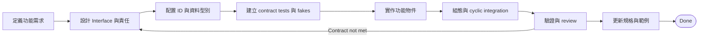

### 13.2 第一步：定義責任與 Interface

在建立 PLC object 前，先記錄：

- 功能物件屬於 Module、Service、BaseUnit 或 optional capability。
- 呼叫者是誰。
- 輸入、輸出與資料所有權。
- 前置條件與不變條件。
- 完成、拒絕、Error、timeout 與取消行為。
- 需要的 seam 與 Adapter。

若無法用一段簡短文字說明物件責任，應先重新切分，而不是立即增加更多 public method。

### 13.3 第二步：配置型別與 Identifier

- 建立 Control、Parameter、Status、Context 或 descriptor type。
- 配置 Service ID、Error ID、Data ID、Reference Port token 及其他 external identity。
- 確認 `0` 的語意與 uniqueness scope。
- 確認 enum numeric value 與 string token 是否為 external contract。
- 更新集中 registry 或 Module-specific ID 說明。

### 13.4 第三步：建立測試 seam

- BaseUnit 先定義 typed Interface 與 fake。
- Service 測試只依賴 typed Interface，不依賴 concrete hardware FB。
- Module 測試以完整 Service Control／Status view 驗證 routing 與 synchronization。
- Configuration 測試使用可控制的 node、reference 與 Adapter fixture。

測試 seam 不應被擴大成 production caller 也必須理解的 public surface。

### 13.5 第四步：實作與整合

依依賴方向進行：

1. BaseUnit Interface／Adapter 或 fake。
2. Service Parameter、Status 與 lifecycle。
3. Module composition、Service views 與 hooks。
4. Module Configuration Adapter、I/O node 與 Reference Port declaration。
5. GVL storage、Registry registration 與 System Orchestration cyclic loop。
6. JSON example、Variable、Alarm 與 mapping。

### 13.6 第五步：驗證

至少完成：

- TwinCAT XML well-formedness。
- 專案 reference 與 object inclusion 檢查。
- 能執行時的 TwinCAT compile。
- 第 12 章要求的 contract test。
- configuration negative test 與 rollback。
- cyclic call count、same-scan visibility 及 timeout 測試。
- code review：Standards 與功能 Spec 分開檢查。

### 13.7 Definition of Done

#### Interface 與設計

- [ ] 功能責任、caller 與非責任已記錄。
- [ ] Interface 足以使用及測試功能，沒有暴露 private Implementation。
- [ ] 所有前置條件、不變條件、Error 與 timeout 已定義。
- [ ] Control、Status、Parameter 與 Context 的 owner 明確。

#### Lifecycle 與安全

- [ ] PackML State hook 均有明確行為。
- [ ] 非同步 command 有 Done、Error、withdrawal 與 timeout path。
- [ ] Stop／Abort cleanup 不會干擾其他 owner。
- [ ] 所有取得的 BaseUnit 都會在每個 terminal path 被安全釋放。
- [ ] heartbeat、disable、invalid configuration 對功能的影響已定義。

#### Identifier 與 publication

- [ ] 新 ID 非零、唯一且已登錄。
- [ ] 既有 ID 沒有重新編號或改變語意。
- [ ] Alarm、Variable、Data 的來源與 lifecycle 正確。
- [ ] duplicate、overflow 與 invalid sample 可診斷。

#### Configuration 與 integration

- [ ] Module Type name、Adapter 與 Registry registration 完成。
- [ ] Slot-aligned GVL storage 完整。
- [ ] I/O node access／type／size 正確。
- [ ] Reference Port name、token、required flag 與 typed Interface 正確。
- [ ] enabled／valid filtering 與 cyclic invocation 完成。
- [ ] application failure 不留下 partially-applied state。

#### Testing 與文件

- [ ] 第 12 章必要測試全部通過。
- [ ] fake 與 production Adapter 符合相同 Interface。
- [ ] XML validation 與可用環境中的 compile 通過。
- [ ] Module-specific spec、JSON example 與使用說明已更新。
- [ ] Current Implementation Profile 與 capacity 已同步。
- [ ] 已知限制、例外與 Experimental capability 已標示。

只有全部適用項目完成，功能物件才能標示為 Done。未適用項目必須記錄原因，不得直接刪除 checklist item。

### 13.8 Review handoff template

每次交付建議附上：

```text
功能物件：
類型：Module / Service / BaseUnit / Adapter / Capability
主要 Interface：
新增或變更的 ID：
使用的 BaseUnit／Reference Port：
PackML Completion Behavior：
Stop／Abort policy：
新增的 Alarm／Variable／Data：
Configuration schema 影響：
測試結果：
已知限制與待確認事項：
```

## 14. 相容性與版本管理

### 14.1 相容性目標

Framework 演進時，應讓既有 Module configuration、Control Source、Module／Service composition、Alarm consumer 與測試可以在可預期的方式下升級。

相容性不只包含「程式可以 compile」，也包含：

- 相同 request 是否產生相同 State transition。
- 相同 ID 是否仍代表相同概念。
- 同一欄位是否保持相同 writer、unit 與 lifecycle。
- 同一 configuration 是否仍能解析及套用。
- 同一 scan 的可見性是否改變。

### 14.2 Public compatibility surface

下列項目預設屬於外部或跨模組契約：

- TwinCAT Interface method、property 與參數語意。
- Control、Status、Parameter、Context 與 publication struct layout。
- enum member name 與 numeric value。
- Module Type name。
- Reference Port name 與 token。
- Module ID、Service ID、Error ID、Variable ID、Data ID、Endpoint ID、Station ID。
- JSON schema、欄位名稱、型別與 validation rule。
- PackML command/state/mode policy 及 Error ID。
- request/response、acknowledgement 與 result latch timing。
- cyclic call order 與 same-scan visibility。
- Alarm Identity 與 lifecycle。

Private member、private method 與在 Interface 後的 Implementation 不屬於 public compatibility surface。

### 14.3 變更分類

| 類型 | 範例 | 要求 |
|---|---|---|
| Compatible | 新增 optional Module Type、增加不影響既有 caller 的 private Implementation | 更新 minor version 與測試 |
| Conditionally compatible | 增加 struct 尾端欄位、提高 capacity、增加 optional Reference Port | 評估 ADS layout、memory、consumer 與 deployment 後決定版本 |
| Breaking | 重新編號 enum／ID、改欄位型別或順序、改 command timing、重新命名 Module Type／port、移除 JSON 欄位 | 必須升 major 或 schema version，並提供 migration |
| Bug fix | 使 Implementation 回到既有明文契約 | 更新 patch version；若 caller 已依賴錯誤行為，仍需 migration notice |

### 14.4 Identifier 穩定性

- 已發布的非零 ID 不得指派給不同語意。
- 刪除功能後的 ID 應保留，不得立即重用。
- enum numeric value 必須明確指定；不得因插入 member 而使後續 value 位移。
- Alarm Main Error ID 的 Message 可以改善文字，但不得改變其失敗分類語意。
- Data／Variable 的 unit 或 data type 改變通常需要新 ID。
- Service ID 改變會影響 Alarm Identity 與 Resource Ownership，預設視為 breaking change。

### 14.5 Structure 與 ADS layout

修改會對外發布或經 ADS 存取的 struct 時，必須評估：

- 欄位順序與 alignment。
- array capacity 與整體 size。
- 上位 client 的 symbol path 與 deserialization。
- Union ByName／ByIndex 的 layout 相容性。
- retain／persistent data 是否仍可讀取。

即使只在 struct 尾端新增欄位，也不能自動視為無風險；固定 size consumer 可能仍會失敗。

### 14.6 Configuration schema version

下列變更通常需要提高 `schemaVersion`：

- 移除或重新命名欄位。
- 改變欄位型別或必要性。
- 改變同一 token 的語意。
- 改變 mapping transform 的計算方式。
- 改變 reference binding 的 addressing model。
- 舊 configuration 無法在不修改內容下正確套用。

新增完全 optional 且有安全預設值的欄位可以不升 schema，但必須有 parser、default 與 backward-compatibility tests。

Parser 不應默默接受已不支援的舊欄位；應提供明確 migration Error Message。

### 14.7 Deprecation 與 migration

Deprecated contract 應記錄：

1. 被替代的名稱或行為。
2. 替代方案。
3. 最後支援版本。
4. 移除版本或條件。
5. configuration、code 與 external client 的 migration 步驟。

若無法同時支援新舊 Interface，應提供獨立 migration release 或 Adapter，而不是在同一 token 下改變語意。

### 14.8 Capacity 變更

提高 capacity 可能增加：

- PLC static memory。
- 每 scan loop work。
- configuration parse time。
- ADS publication size。
- 上位 client buffer size。

降低 capacity 可能使既有 configuration 無法載入，預設視為 breaking change。任何 capacity 變更都必須更新 Current Implementation Profile 並執行最大容量測試。

### 14.9 版本與變更紀錄

| 文件版本 | 日期 | 文件變更 |
|---|---|---|
| 0.4 | 2026-09-10 | 對齊現有 Infrastructure Begin／逐點 Register／Seal 實作，補充 first-error-wins、失敗 rollback、一次性啟動 gating、端子專用 API 遷移與範例；本次僅更新文件。 |

至少應維護：

- 本規格文件版本。
- Framework release／library version。
- JSON schema version。
- 每次 breaking 或 conditionally compatible change 的 migration note。

若未來不同 Module Type 可以獨立部署，應增加 Module Type version，並由 Adapter 驗證其 configuration version compatibility。

### 14.10 變更審查清單

- [ ] 是否改變任何 Interface 或 same-scan visibility？
- [ ] 是否改變 struct layout 或 ADS symbol path？
- [ ] 是否重新命名或重新編號 enum、ID、Module Type、Reference Port？
- [ ] 是否改變 configuration parser 或 validation？
- [ ] 是否影響 Alarm Identity、lifecycle 或 acknowledgement？
- [ ] 是否影響 BaseUnit ownership 或 cleanup？
- [ ] 是否影響 capacity、scan time 或 memory？
- [ ] 是否需要提高 framework、Module Type 或 schema version？
- [ ] 是否提供 migration 與 backward-compatibility tests？
- [ ] 是否同步更新本規格、範例與 Current Implementation Profile？

### 14.11 待確認事項

1. Framework 採用何種正式版本格式與 release 流程。
2. Module Type 是否各自具有版本及 compatibility range。
3. ADS struct layout 是否需要產生 machine-readable manifest 供上位 client 驗證。
4. Deprecated ID 與 enum value 的集中保留清單放置位置。
5. Breaking change 是否需要同時維護前一個 schema 的離線 migration tool。
