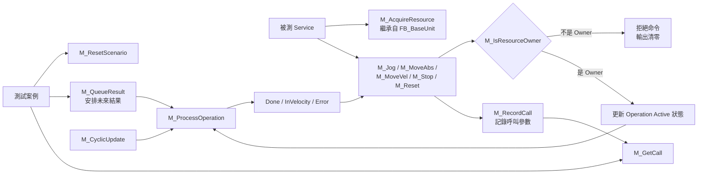

# `FB_FakeAxis_BaseUnit` 實作說明

## 1. 物件定位

`FB_FakeAxis_BaseUnit` 是軸控制物件的測試替身（Fake/Test Double），不是馬達運動學或實際位置的物理模型。

它繼承 `FB_BaseUnit`、實作 `I_Axis_BaseUnit`，目的是讓被測 Service 可以透過正式的軸介面操作它，而不必知道目前使用的是真實軸或 Fake Axis。

它主要模擬以下外部行為：

- 軸資源必須先由某個 `OwnerId` 取得，只有目前 Owner 可以下命令。
- 接收 Jog、絕對定位、速度運動、停止、復歸等命令。
- 按照測試預先排定的腳本，在指定 Active 週期後回傳 `Done`、`InVelocity` 或 `Error`。
- 將收到的命令、參數、Owner 與接受結果記錄下來，供測試驗證。
- 提供 `AxisIsDisabled`、`AxisHasJob` 等靜態狀態給上層程式判斷。



整體可以分為四個部分：

1. 資源所有權：決定誰有資格控制軸。
2. 命令介面：模擬各種軸命令。
3. 腳本引擎：決定幾個週期後產生何種結果。
4. 呼叫歷史：驗證被測程式呼叫了什麼命令。

---

## 2. 繼承自 `FB_BaseUnit` 的資源所有權功能

### `M_AcquireResource`

嘗試取得軸的控制權。

- `OwnerId = 0` 一律拒絕，因為 0 代表目前無人持有資源。
- 軸尚未被持有時，非零 Owner 可以取得。
- 目前 Owner 再次取得同一資源也會成功，具有冪等性。
- 若軸已由其他 Owner 持有，新的 Owner 會被拒絕。

### `M_IsResourceOwner`

判斷指定 `OwnerId` 是否為目前軸的持有者。五個軸命令都先執行這項檢查：

```iecst
bAccepted := M_IsResourceOwner(OwnerId := OwnerId);
```

因此資源所有權是所有運動命令共用的入口閘門。

### `M_ReleaseResource`

只有目前 Owner 可以釋放軸。釋放成功後，內部 `_ResourceOwnerId` 回到 0。

---

## 3. 測試情境初始化與靜態軸狀態

### `M_ResetScenario`

將整個 Fake Axis 恢復為全新的測試狀態，包括：

- 清除目前 Resource Owner。
- 清除 `AxisIsDisabled` 與 `AxisHasJob`。
- 將週期計數 `_nCycle` 歸零。
- 清空所有預排結果腳本。
- 清除腳本溢位與設定錯誤旗標。
- 清除所有命令呼叫歷史。
- 清除五種操作的 Active、Done、InVelocity、Error 與 ErrorId。

典型測試開頭：

```iecst
FakeAxis.M_ResetScenario();
Axis := FakeAxis;
```

第二行將 Fake 指派給 `I_Axis_BaseUnit` 介面，使被測 Service 只依賴正式介面。

### `M_SetAxisState`

直接設定兩個軸狀態：

- `Disabled` 對應 `AxisIsDisabled`。
- `HasJob` 對應 `AxisHasJob`。

這兩個狀態不會隨 `M_MoveAbs`、`M_Stop` 等命令自動改變，而是完全由測試案例控制。它們適合模擬「軸已 Disable」或「軸仍有工作」等前置條件。

---

## 4. 預排軸回應：`M_QueueResult`

`M_QueueResult` 將一筆預期結果加入 `_aScripts` 腳本陣列。

輸入內容如下：

| 參數 | 用途 |
|---|---|
| `Operation` | 指定 Jog、MoveAbs、MoveVel、Stop 或 Reset |
| `AfterActiveCycles` | 命令 Active 幾個更新週期後產生結果 |
| `Done` | 是否回傳完成 |
| `InVelocity` | 是否回傳已達設定速度 |
| `Error` | 是否回傳錯誤 |
| `ErrorId` | 模擬錯誤代碼 |

例如，安排 MoveAbs Active 兩個週期後完成：

```iecst
FakeAxis.M_QueueResult(
    Operation := E_FakeAxisOperation.MoveAbs,
    AfterActiveCycles := 2,
    Done := TRUE,
    InVelocity := FALSE,
    Error := FALSE,
    ErrorId := 0);
```

安排 Jog Active 兩個週期後發生錯誤：

```iecst
FakeAxis.M_QueueResult(
    Operation := E_FakeAxisOperation.Jog,
    AfterActiveCycles := 2,
    Done := FALSE,
    InVelocity := FALSE,
    Error := TRUE,
    ErrorId := 16#1234);
```

### 腳本設定檢查

以下設定會被拒絕，Method 回傳 `FALSE`，並將 `ScriptConfigurationError` 設為 TRUE：

- `Operation = E_FakeAxisOperation.None`
- `Done = TRUE` 且 `Error = TRUE`

腳本最多保存 32 筆。第 33 筆會被拒絕，並將 `ScriptOverflowed` 設為 TRUE。

### 腳本順序

`M_ProcessOperation` 每次從陣列第一筆開始，找出「Operation 相同且尚未 Consumed」的第一筆：

- 同一種 Operation 的結果採 FIFO 順序。
- 不同 Operation 的腳本可以交錯排入。
- Jog 只取得下一筆 Jog 腳本，MoveAbs 只取得下一筆 MoveAbs 腳本，依此類推。

---

## 5. 模擬時間推進：`M_CyclicUpdate`

`M_CyclicUpdate` 是 Fake Axis 的時間推進器。每次執行會：

1. 將 `_nCycle` 加 1。
2. 處理 Jog。
3. 處理 MoveAbs。
4. 處理 MoveVel。
5. 處理 Stop。
6. 處理 Reset。

每種 Operation 都交由 Private Method `M_ProcessOperation` 處理。

Function Block 本體也只有：

```iecst
M_CyclicUpdate();
```

因此有兩種推進方式：

- 週期性呼叫 `FakeAxis()`，由 Function Block 本體自動更新。
- 測試中直接呼叫 `FakeAxis.M_CyclicUpdate()`，精確控制模擬週期數。

目前單元測試主要使用第二種方式。

---

## 6. 腳本處理核心：`M_ProcessOperation`

`M_ProcessOperation` 每次先把該 Operation 的輸出清除：

```iecst
Done := FALSE;
InVelocity := FALSE;
Error := FALSE;
ErrorId := 0;
```

接著尋找下一筆相同 Operation、尚未 Consumed 的腳本。

### 6.1 命令尚未 Active

如果命令從未啟動，腳本不會開始計時。

如果腳本已經啟動過，而命令現在變成 inactive，則將腳本設為：

```iecst
Consumed := TRUE;
```

因此一筆腳本是在命令撤銷後才正式被消耗。

### 6.2 首次 Active

第一次偵測到命令 Active 時：

```iecst
Started := TRUE;
ActiveCycles := 0;
```

同一次更新隨即將 `ActiveCycles` 加 1。

### 6.3 到達指定週期

當 `ActiveCycles >= AfterActiveCycles` 時，將：

```iecst
ResultLatched := TRUE;
```

並輸出腳本中的 Done、InVelocity、Error 與 ErrorId。

`AfterActiveCycles = 0` 也會在第一次 Active 更新時鎖存結果；由於第一次 Active 更新會先將計數加到 1，所以實際效果與設成 1 相近。

### 6.4 結果鎖存與命令撤銷

一旦 `ResultLatched = TRUE`，只要命令保持 Active，結果就會持續輸出。

只有呼叫端撤銷命令，並再次執行 `M_CyclicUpdate()`，這筆腳本才會：

- 標記為 `Consumed`。
- 清除輸出。
- 允許下一筆同類 Operation 腳本開始作用。

這是在模擬常見 PLCopen Motion Function Block 的命令握手：

```text
Execute 上升並保持
    → 等待結果
    → Done 或 Error 鎖存
    → Execute 撤回
    → 輸出清除，準備下一次命令
```

---

## 7. 五個軸命令 Method

五個命令具有相同的基本流程：

1. 使用 `M_IsResourceOwner` 檢查 Owner。
2. 無論命令接受或拒絕，都使用 `M_RecordCall` 記錄呼叫。
3. 若不是 Owner，Method 回傳 FALSE，輸出設為中性值，且不改變原有 Active 狀態。
4. 若是 Owner，更新該 Operation 的 Active 狀態。
5. 回傳最近一次 `M_CyclicUpdate` 計算出的結果。

各 Method 本身的 BOOL 回傳值表示「命令是否因所有權而被接受」，不代表命令已經 Done。

### `M_Jog`

模擬手動寸動。Active 條件為：

```iecst
_bJogActive := JogForward OR JogBackwards;
```

只要任一方向為 TRUE，就視為 Jog 正在執行。

輸出包含：

- `Done`
- `Error`
- `ErrorId`

同時記錄 JogForward、JogBackwards、Mode、Position、Velocity、Acceleration 與 Deceleration。要撤銷 Jog，必須讓兩個方向都為 FALSE。

### `M_MoveAbs`

模擬絕對位置運動：

```iecst
_bMoveAbsActive := Execute;
```

輸出為 `Done` 與 `Error`，並記錄 Position、Velocity、Acceleration、Deceleration。

Fake Axis 不會真的更新實際位置；Position 只用於驗證 Service 是否正確傳遞參數。

### `M_MoveVel`

模擬定速運動，Active 跟隨 `Execute`，並記錄 Direction、Velocity、Acceleration 與 Deceleration。

輸出為：

- `InVelocity`
- `Error`

典型的成功腳本會設定 `InVelocity := TRUE`，表示已達設定速度。

### `M_Stop`

模擬停止命令，Active 跟隨 `Execute`，記錄停止用的 Deceleration，輸出 `Done` 與 `Error`。

Stop 有獨立的腳本與狀態，不會在 Fake 內部自動關閉 Jog、MoveAbs 或 MoveVel。上層 Service 仍需自行撤銷原本的運動命令。

### `M_Reset`

模擬軸錯誤復歸，Active 跟隨 `Execute`，輸出 `Done` 與 `Error`。

`M_Reset` 與 `M_ResetScenario` 的用途不同：

- `M_Reset`：模擬被測 Service 向軸發出 Reset 命令。
- `M_ResetScenario`：測試工具直接清空整個 Fake Axis。

### ErrorId 的介面差異

共用腳本結構能為所有 Operation 保存 ErrorId，但目前 `I_Axis_BaseUnit` 只有 `M_Jog` 將 ErrorId 暴露為輸出。MoveAbs、MoveVel、Stop 與 Reset 只公開 Error BOOL，因此這些 Operation 的腳本 ErrorId 不會直接傳回呼叫端。

---

## 8. 呼叫歷史

### `M_RecordCall`

這是由五個軸命令自動呼叫的 Private Method，每次記錄：

- 全域呼叫順序 `Sequence`
- 發生時的 Fake 週期 `Cycle`
- `Operation`
- `OwnerId`
- 是否被接受 `Accepted`
- `Execute`
- JogForward、JogBackwards 與 Mode
- MoveVel Direction
- Position、Velocity、Acceleration、Deceleration

被拒絕的命令也會記錄。因此測試可以區分：

- Service 完全沒有呼叫軸。
- Service 有呼叫，但使用錯誤的 OwnerId。
- Service 有呼叫且命令被接受。

歷史最多保存 256 筆。超過容量時：

- 不覆寫舊資料。
- `HistoryCount` 保持 256。
- `HistoryOverflowed` 設為 TRUE。
- `_nCallSequence` 仍會繼續增加。

### `M_GetCall`

依索引讀取一筆歷史，索引從 1 開始：

```iecst
FakeAxis.M_GetCall(Index := 1, CallRecord => CallRecord);
```

索引有效時回傳 TRUE。如果 `Index = 0` 或超過 `HistoryCount`，則回傳 FALSE，並將輸出 `CallRecord` 清零。

取得最後一筆呼叫的常見方式：

```iecst
FakeAxis.M_GetCall(
    Index := FakeAxis.HistoryCount,
    CallRecord => CallRecord);
```

### `M_ClearCallHistory`

只清除呼叫歷史，不影響：

- 已排定的腳本。
- Operation Active 狀態。
- 已鎖存的結果。
- Resource Owner。
- `CurrentCycle`。

它會清除 History 陣列、HistoryCount、CallSequence 與 HistoryOverflowed。若要讓整個情境重來，應使用 `M_ResetScenario`。

---

## 9. Property 一覽

| Property | 意義 |
|---|---|
| `AxisIsDisabled` | 測試設定的軸 Disabled 狀態 |
| `AxisHasJob` | 測試設定的軸工作中狀態 |
| `CurrentCycle` | 已執行的 `M_CyclicUpdate` 次數 |
| `HistoryCount` | 目前保存的命令呼叫數量 |
| `HistoryOverflowed` | 呼叫歷史是否超過 256 筆 |
| `ScriptOverflowed` | 結果腳本是否超過 32 筆 |
| `ScriptConfigurationError` | 是否曾嘗試排入不合法腳本 |

前兩個屬於正式 `I_Axis_BaseUnit` 契約，其餘主要供測試觀察與診斷。

---

## 10. 完整使用範例

以下範例模擬 MoveAbs Active 兩個週期後完成：

```iecst
// 1. 清空 Fake Axis
FakeAxis.M_ResetScenario();

// 2. 透過正式介面交給被測 Service
Axis := FakeAxis;

// 3. 預排軸回應
FakeAxis.M_QueueResult(
    Operation := E_FakeAxisOperation.MoveAbs,
    AfterActiveCycles := 2,
    Done := TRUE,
    InVelocity := FALSE,
    Error := FALSE,
    ErrorId := 0);

// 4. Service 取得軸
Axis.M_AcquireResource(OwnerId := 21);

// 5. Service 發出 MoveAbs
Axis.M_MoveAbs(
    OwnerId := 21,
    Execute := TRUE,
    Position := 125.25,
    Velocity := 15,
    Acceleration := 25,
    Deceleration := 35);

// 6. 第一個 Active 週期：Done 仍為 FALSE
FakeAxis.M_CyclicUpdate();

// 7. 第二個 Active 週期：Done 變成 TRUE
FakeAxis.M_CyclicUpdate();

// 8. Service 讀到 Done 後撤銷 Execute
Axis.M_MoveAbs(
    OwnerId := 21,
    Execute := FALSE,
    Position := 125.25,
    Velocity := 15,
    Acceleration := 25,
    Deceleration := 35);

// 9. 下一次更新消耗腳本並清除 Done
FakeAxis.M_CyclicUpdate();

// 10. 檢查 Service 最後傳給軸的命令
FakeAxis.M_GetCall(
    Index := FakeAxis.HistoryCount,
    CallRecord => CallRecord);
```

### 重要時序觀念

命令 Method 只負責設定 Active，並讀取「最近一次 `M_CyclicUpdate` 已計算完成的結果」。真正增加 ActiveCycles、產生 Done 或 Error 的是 `M_CyclicUpdate`。

常見的測試掃描順序為：

```text
FakeAxis.M_CyclicUpdate()
    → 執行被測 Service
    → Service 呼叫軸命令並讀取 Fake Axis 輸出
```

如果命令是在本週期執行 Service 時才首次設為 Active，它通常會從下一次 `M_CyclicUpdate` 才開始累計 Active 週期。

另外，非 Owner 的命令雖然會留下歷史紀錄，卻不會改變目前 Owner 已建立的 Active 狀態。因此競爭者送出的 `Execute := FALSE` 不會取消真正 Owner 的命令。

---

## 11. 模擬範圍與限制

### 已模擬的行為

- 軸控制介面相容性。
- Resource Owner 競爭與命令接受／拒絕。
- 非同步完成與錯誤。
- 經過指定 PLC 週期才產生結果。
- Done/Error 保持到命令撤銷的握手行為。
- Service 傳遞給軸的完整命令參數。
- 多階段錯誤流程，例如 MoveAbs Error、Stop Error、Reset Error。

### 未模擬的行為

- 實際位置。
- 實際速度與加減速曲線。
- 運動學。
- 軟硬體限位。
- Following Error。
- 真實 TwinCAT NC Axis 狀態。
- 不同運動命令間的物理互斥或自動連動。

因此，這個 Fake Axis 適合驗證 Service 的控制流程、狀態機、錯誤處理、資源鎖定與命令參數；它不適合驗證運動學或 TwinCAT NC Runtime 的實際行為。

---

## 12. 快速複習

```text
M_ResetScenario
    清空整個測試情境

M_QueueResult
    預先安排某種軸命令幾個 Active 週期後的結果

M_AcquireResource / M_ReleaseResource
    控制誰有資格操作軸

M_Jog / M_MoveAbs / M_MoveVel / M_Stop / M_Reset
    接收被測 Service 的命令、更新 Active 狀態並回傳模擬結果

M_CyclicUpdate
    推進一個模擬週期

M_ProcessOperation
    計算腳本是否到期、鎖存結果，以及在命令撤銷後消耗腳本

M_RecordCall
    自動記錄每次命令呼叫

M_GetCall
    讓測試讀取呼叫紀錄並驗證參數
```
