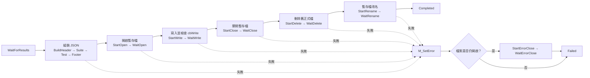

# FB_TcUnitJsonReporter 狀態機與方法說明

## 1. 概述

[`FB_TcUnitJsonReporter.TcPOU`](../robust_solution_simple_module/Untitled1/TcUnitReporter/POUs/FB_TcUnitJsonReporter.TcPOU) 負責等待 TcUnit 測試完成、將單次測試結果序列化為 JSON，並透過 TwinCAT 非阻塞檔案 Function Blocks 發布報表。

最小使用方式：

```iecst
VAR
    Reporter : FB_TcUnitJsonReporter;
END_VAR

TcUnit.RUN();
Reporter();
```

Reporter 是由 PLC scan 逐步推進的狀態機，不會在一次呼叫中完成所有 JSON 組裝與檔案操作。因此，即使測試數量較多或檔案操作需要數個 scan，也不會以同步等待的方式阻塞 PLC task。

狀態 enum 定義於 [`E_TcUnitReporterState.TcDUT`](../robust_solution_simple_module/Untitled1/TcUnitReporter/DUTs/E_TcUnitReporterState.TcDUT)。

## 2. 整體流程



Reporter 採用暫存檔發布流程：

1. 在記憶體內完成全部 JSON。
2. 寫入 `<ReportFilePath>.tmp`。
3. 檢查實際寫入長度。
4. 關閉暫存檔。
5. 刪除舊的正式報表。
6. 將暫存檔改名為正式報表。

正式檔案不會在 JSON 尚未完成時被 Viewer 讀取。

## 3. 公開輸出

| 輸出 | 型別 | 說明 |
|---|---|---|
| `Busy` | `BOOL` | Reporter 正在組裝或發布報表。 |
| `Done` | `BOOL` | 報表已成功發布。此訊號會鎖存。 |
| `Error` | `BOOL` | Reporter 發生錯誤。錯誤會鎖存，且不會改變 TcUnit 測試本身的 pass/fail。 |
| `ErrorCode` | `E_TcUnitReporterError` | Reporter 層級的錯誤分類。 |
| `NativeErrorId` | `UDINT` | TwinCAT 檔案 Function Block 的原生錯誤碼，或其他補充診斷值。 |

`Completed` 與 `Failed` 都是終止鎖存狀態。v1 沒有 Reset 或重跑介面；若要重新產生報表，需要重新初始化 Reporter instance，例如重新啟動 PLC application。

## 4. 狀態機說明

### 4.1 等待測試結果

#### `WaitForResults`

初始狀態，負責：

1. 將 TcUnit 的結果提供者指派給 `_ResultsProvider : TcUnit.I_TestResults`。
2. 呼叫 `GetAreTestResultsAvailable()`，確認測試結果是否已完成。
3. 將 `ReportFilePath` 複製到 `_EffectiveFilePath`，鎖定本次執行使用的路徑。
4. 呼叫 `F_TcUnitReporterValidatePath()` 驗證路徑並決定 `PATH_BOOTPATH` 或 `PATH_GENERIC`。
5. 建立 `<正式檔名>.tmp` 暫存檔名。
6. 取得 `ST_TestSuiteResults` reference。
7. 清空 JSON buffer，初始化 suite/test index，並設定 `Busy := TRUE`。

結果尚未完成時，Reporter 保持在此狀態，不會建立檔案。

若路徑無效，會設定 `InvalidPath` 並進入錯誤流程。

### 4.2 JSON 組裝

#### `BuildHeader`

呼叫 `M_BuildHeader()`，建立 JSON 根物件開頭，包括：

- `schemaVersion`
- `generator`
- `generatedAtUtc`
- `durationSeconds`
- `suites` array 開頭

若 TcUnit 沒有 suite，直接前往 `BuildFooter`；否則進入 `BuildSuite`。

#### `BuildSuite`

呼叫 `M_BuildSuite()`，輸出目前 suite 的：

- `id`
- `name`
- `durationSeconds`
- `tests` array 開頭

接著將 `_TestIndex` 設為 1。若該 suite 沒有 test，直接前往 `BuildSuiteFooter`。

#### `BuildTest`

呼叫 `M_BuildTest()`，每個 PLC scan 序列化一個 test case。

若還有下一個 test，增加 `_TestIndex` 並維持在 `BuildTest`；若目前是最後一個 test，轉往 `BuildSuiteFooter`。

#### `BuildSuiteFooter`

寫入 `]}`，關閉目前 suite 的 `tests` array 與 suite object。

若還有下一個 suite，增加 `_SuiteIndex` 並回到 `BuildSuite`；否則進入 `BuildFooter`。

#### `BuildFooter`

寫入 `]}`，關閉根層級的 `suites` array 與 JSON object。完成後進入 `StartOpen`。

任何 JSON append 失敗都會呼叫 `M_SetJsonError()`。若 buffer 曾發生轉碼錯誤，回報 `EncodingFailed`；否則回報 `BufferOverflow`。失敗的 buffer 不會被發布成正式報表。

### 4.3 開啟暫存檔

#### `StartOpen`

先以 `bExecute := FALSE` 重設 `FB_FileOpen`，再產生新的 rising edge，使用下列模式開啟暫存檔：

```iecst
FOPEN_MODEWRITE OR FOPEN_MODEBINARY
```

`FOPEN_MODEWRITE` 會清除上一次中斷後可能留下的暫存檔內容。

#### `WaitOpen`

非阻塞等待 `FB_FileOpen.bBusy = FALSE`。

- 成功：保存 `hFile`，進入 `StartWrite`。
- 失敗：設定 `FileOpenFailed`，並將 `FB_FileOpen.nErrId` 保存到 `NativeErrorId`。

### 4.4 寫入 JSON

#### `StartWrite`

呼叫 `FB_FileWrite`，傳入：

- 暫存檔 handle
- JSON buffer 位址
- JSON buffer 實際 byte 長度

#### `WaitWrite`

等待 `FB_FileWrite` 完成，並執行兩層驗證：

1. `bError = TRUE`：回報 `FileWriteFailed`。
2. `cbWrite <> JSON length`：回報 `ShortWrite`。

Short write 不一定會讓 `FB_FileWrite.bError` 變成 `TRUE`，因此必須額外比較 `cbWrite`：

```iecst
ELSIF _FileWrite.cbWrite <> _Json.GetLength() THEN
    M_SetError(
        E_TcUnitReporterError.ShortWrite,
        _FileWrite.cbWrite);
```

`ShortWrite` 發生時，`NativeErrorId` 保存實際寫入 byte 數，而不是 TwinCAT error code。

### 4.5 關閉暫存檔

#### `StartClose`

啟動 `FB_FileClose`，關閉暫存檔 handle。

#### `WaitClose`

等待關閉完成並清除 `_FileHandle`。

- 成功：進入 `StartDelete`。
- 失敗：設定 `FileCloseFailed`。

只有暫存檔成功關閉後，才開始變更正式報表。

### 4.6 移除舊正式檔

#### `StartDelete`

呼叫 `FB_FileDelete`，刪除 `_EffectiveFilePath` 指向的舊正式報表。

#### `WaitDelete`

等待刪除完成。

- 成功：進入 `StartRename`。
- `nErrId = 16#70C`：代表檔案不存在，視為第一次發布的正常情況，仍進入 `StartRename`。
- 其他錯誤：設定 `FileDeleteFailed`。

### 4.7 發布正式檔

#### `StartRename`

呼叫 `FB_FileRename`，將 `<ReportFilePath>.tmp` 改名為正式 `ReportFilePath`。

#### `WaitRename`

等待改名完成。

- 成功：進入 `Completed`。
- 失敗：設定 `FileRenameFailed`。

### 4.8 錯誤清理

#### `StartErrorClose`

若錯誤發生時 `_FileHandle` 仍有效，執行 best-effort `FB_FileClose`，避免檔案 handle 洩漏。

#### `WaitErrorClose`

等待 cleanup close 結束、清除 `_FileHandle`，然後進入 `Failed`。

Cleanup close 的結果不會覆蓋最早發生的錯誤，以保留真正的根因。

### 4.9 終止狀態

#### `Completed`

```iecst
Busy := FALSE;
Done := TRUE;
```

代表正式報表已經成功發布。

#### `Failed`

```iecst
Busy := FALSE;
Error := TRUE;
```

第一次進入此狀態時會輸出一則 ADS error message，提示使用者查看 `ErrorCode` 與 `NativeErrorId`。`_ErrorLogged` 確保訊息只輸出一次。

Reporter 的錯誤不會修改 TcUnit 測試結果。

## 5. Methods 說明

### 5.1 `M_BuildHeader() : BOOL`

建立 JSON 根物件開頭，例如：

```json
{
  "schemaVersion": "1.0.0",
  "generator": {
    "name": "TcUnitJsonReporter",
    "version": "0.1.0"
  },
  "generatedAtUtc": "2026-08-18T02:58:51.000Z",
  "durationSeconds": 2.851,
  "suites": [
```

每次 append 以 `AND_THEN` 串接。任一步驟失敗後，後續 append 不再執行，Method 回傳 `FALSE`。

### 5.2 `M_BuildSuite() : BOOL`

輸出目前 `_SuiteIndex` 指向的 suite：

```json
{
  "id": 1,
  "name": "FB_GC_ModuleTests",
  "durationSeconds": 0.42,
  "tests": [
```

若不是第一個 suite，會先寫入分隔逗號。

### 5.3 `M_BuildTest() : BOOL`

取得目前 test result：

```iecst
TestResult REF=
    _Results.TestSuiteResults[_SuiteIndex]
        .TestCaseResults[_TestIndex];
```

狀態映射順序：

```text
TestIsFailed  → failed
TestIsSkipped → skipped
其他          → passed
```

`failed` 的判斷優先於 `skipped`。

共同輸出欄位包括：

- `name`
- `className`
- `status`
- `durationSeconds`
- `assertionCount`
- `failure`

失敗案例使用 `TcUnit.F_AssertionTypeToString()` 將 assertion enum 轉為文字，並輸出 TcUnit 保存的第一筆 failure type 與 message：

```json
"failure": {
  "type": "BOOL",
  "message": "Expected TRUE but received FALSE."
}
```

通過或 skipped 案例則輸出：

```json
"failure": null
```

### 5.4 `M_GetUtcTimestamp() : T_MaxString`

轉換流程：

```text
F_GetSystemTime()
→ FILETIME64_TO_SYSTEMTIME()
→ SYSTEMTIME_TO_STRING()
```

TwinCAT 原始格式：

```text
YYYY-MM-DD-hh:mm:ss.xxx
```

Method 將其轉成 ISO 8601 UTC 格式：

```text
YYYY-MM-DDThh:mm:ss.xxxZ
```

### 5.5 `M_SetError(Code, NativeId)`

統一處理 Reporter 錯誤：

1. 只保存第一個錯誤。
2. 設定 `Error := TRUE`。
3. 保存 `ErrorCode` 與 `NativeErrorId`。
4. 若檔案仍開啟，進入 `StartErrorClose`。
5. 若沒有開啟中的檔案，直接進入 `Failed`。

只保存第一個錯誤，可以避免 cleanup error 覆蓋原始根因。

### 5.6 `M_SetJsonError()`

將 JSON buffer 錯誤轉成 Reporter error：

```text
_Json.HasEncodingError() = TRUE
    → EncodingFailed

其他 append 失敗
    → BufferOverflow
```

Buffer overflow 時，`NativeErrorId` 保存 JSON buffer 當下的 byte 長度。

## 6. `ReportFilePath` Property

Getter 回傳 `_ReportFilePath`，Setter 更新使用者設定：

```iecst
Reporter.ReportFilePath := 'D:\TcUnitReports\gc-test-report.json';
```

預設值為：

```text
test-report.json
```

相對路徑使用 `PATH_BOOTPATH`，通常解析為目標 PLC Runtime 主機上的：

```text
C:\TwinCAT\3.1\Boot\test-report.json
```

絕對本機磁碟路徑使用 `PATH_GENERIC`。

Reporter 在 `WaitForResults` 中將 property 複製到 `_EffectiveFilePath`。一旦本次產檔開始，之後修改 property 不會改變正在使用的路徑。

由於 v1 的 `Completed`／`Failed` 是終止鎖存狀態，產檔完成後再修改 property 不會觸發第二次輸出；新的設定要在 Reporter instance 重新初始化後才會使用。

## 7. 錯誤流程範例

### 寫入失敗且檔案仍開啟

```text
WaitWrite
→ M_SetError(FileWriteFailed)
→ StartErrorClose
→ WaitErrorClose
→ Failed
```

### 路徑無效

```text
WaitForResults
→ M_SetError(InvalidPath)
→ Failed
```

### 成功發布

```text
WaitForResults
→ BuildHeader
→ BuildSuite / BuildTest / BuildSuiteFooter
→ BuildFooter
→ StartOpen / WaitOpen
→ StartWrite / WaitWrite
→ StartClose / WaitClose
→ StartDelete / WaitDelete
→ StartRename / WaitRename
→ Completed
```

## 8. 設計重點

- 非阻塞：檔案 Function Blocks 以 Start/Wait 狀態配對執行。
- 路徑快照：產檔開始後不受 property 變更影響。
- 完整發布：先完成記憶體 JSON，再寫入暫存檔。
- Short-write 防護：實際寫入長度必須完全相符。
- 不靜默截斷：UTF-8 或 buffer 失敗時停止發布。
- 保留根因：錯誤處理只鎖存第一個錯誤。
- 測試結果隔離：Reporter 失敗不會改變 TcUnit pass/fail。
- 安全終止：成功與失敗狀態皆鎖存，不會重複產檔或重複輸出 ADS 錯誤。
