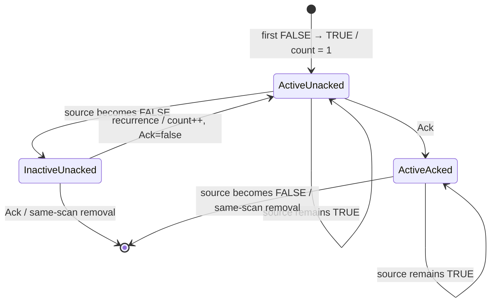
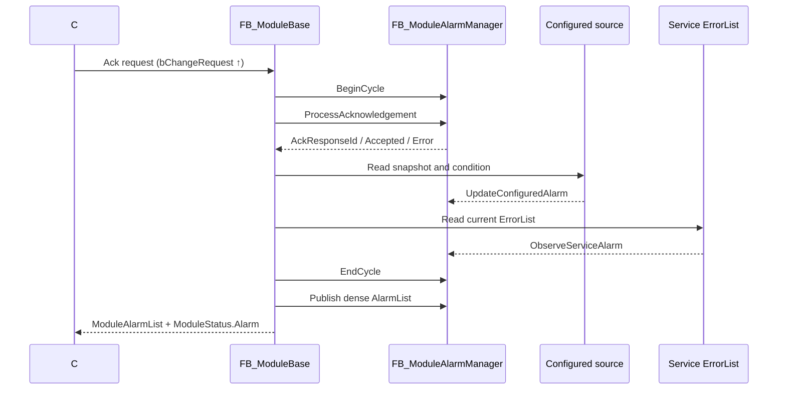

# Module Alarm 規格與行為說明

## 1. 文件目的與適用範圍

本文定義 Module 對上位系統發布 Alarm 的共同契約，適用於：

- 由 JSON `alarmList` 建立的 ConfiguredAlarm。
- 由各 Service `ST_ServiceStatus.ErrorList` 產生的 Service alarm。
- PLC 與 C# 之間的 acknowledge request／response handshake。

兩種來源都由 [`FB_ModuleAlarmManager`](../robust_solution_simple_module/Untitled1/POUs/10_Module/FB_ModuleAlarmManager.TcPOU) 管理 latch、Active、Acknowledged、OccurrenceCount、移除、容量與發布。Chamber1 Module 不再直接把 Service ErrorList 複製到 ModuleAlarmList。

本規格中的「同 scan」指同一次 PLC cyclic execution；不代表 C# 一定能觀察到該 scan 中的中間狀態。

## 2. Alarm 來源

| 類型 | 來源 | `ServiceId` | Active 判定 |
|---|---|---:|---|
| ConfiguredAlarm | RuntimeConfig 的 alarm binding 與 configured value snapshot | 固定為 `0` | 有效 sample 依 operator、threshold、tolerance 判斷為 true |
| Service alarm | Service 的 `ST_ServiceStatus.ErrorList` | 具體 Service ID，必須非 `0` | 本 Module scan 再次觀測到相同 identity |

ConfiguredAlarm 的 snapshot 無效時，本 scan 不改變該 alarm 的 Active/lifecycle 狀態。Service alarm 未在本 scan 再次出現在任何 Service ErrorList 時，manager 會在 finalize 階段將它設為 inactive。

Service ErrorList 是來源觀測，不是上位 AlarmList 本身；只有 Module Alarm Manager 可以清空或寫入公開的 `ModuleAlarmList`。

## 3. Alarm identity

在單一 Module 內，Alarm identity 為：

```text
(ServiceId, MainErrorId)
```

跨 Module 儲存或查找時，上位應使用完整 identity：

```text
(ModuleId, ServiceId, MainErrorId)
```

規則如下：

- ConfiguredAlarm 一律使用 `ServiceId = 0`。
- Service alarm 的 `ServiceId` 必須是實際 Service ID。
- 相同 `MainErrorId` 可同時存在於不同 Service，且可被個別 acknowledge。
- `SourceErrorId`、`Message`、`Path`、陣列索引都不是 identity。
- `ModuleAlarmList` 是 dense snapshot；Alarm 移除後，後續項目會前移，因此上位不得用列表索引送出 Ack。

## 4. 公開資料結構

### 4.1 `ST_ExtAlarm`

[`ST_ExtAlarm`](../robust_solution_simple_module/Untitled1/DUTs/ST_ExtAlarm.TcDUT) 的重要欄位：

| 欄位 | 契約 |
|---|---|
| `ModuleId` | manager 以目前 Module identity 正規化。 |
| `ServiceId` | ConfiguredAlarm 為 `0`；Service alarm 為來源 Service ID。 |
| `MainErrorId` | identity 的 error 部分。不可為 `0`。 |
| `SourceErrorId` | 首次 occurrence 的底層錯誤資訊。 |
| `Message` | 首次 occurrence 的人類可讀描述。 |
| `Path` | 首次 occurrence 的來源路徑。 |
| `Severity` | 首次 occurrence 的嚴重度。 |
| `DateTime` | 目前 lifecycle 首次 occurrence 的 UTC 時間。 |
| `Active` | 來源目前是否仍存在。 |
| `Acknowledged` | 上位是否已 acknowledge 目前 occurrence。 |
| `OccurrenceCount` | 目前 lifecycle 內的 Active 上緣次數。 |

同一 lifecycle 發生 recurrence 時，保留第一次的 `DateTime`、`SourceErrorId`、`Message`、`Path`、`Severity`，只增加 `OccurrenceCount`、設回 `Active = TRUE` 並清除 `Acknowledged`。

### 4.2 Ack request

[`ST_AlarmAckRequest`](../robust_solution_simple_module/Untitled1/DUTs/Alarm/ST_AlarmAckRequest.TcDUT) 欄位如下：

| 欄位 | 用途 |
|---|---|
| `RequestId` | 非零且不可重複使用的 request correlation ID。 |
| `Command` | `AcknowledgeOne` 或 `AcknowledgeAll`。 |
| `MainErrorId` | `AcknowledgeOne` 的 identity 欄位。 |
| `bChangeRequest` | request handshake；manager 只在 FALSE → TRUE 上緣處理。 |
| `ServiceId` | `AcknowledgeOne` 的 identity 欄位；ConfiguredAlarm 傳 `0`。 |

`ServiceId` 追加在結構最後，以保留既有欄位在單筆 request 內的 offset。

### 4.3 Module alarm status

[`ST_ModuleAlarmStatus`](../robust_solution_simple_module/Untitled1/DUTs/Alarm/ST_ModuleAlarmStatus.TcDUT) 提供：

| 欄位 | 用途 |
|---|---|
| `AckResponseId` | 已處理 request 的 `RequestId`。 |
| `AckAccepted` | request 是否成功套用。 |
| `AckError` | `None`、invalid request/command、duplicate 或 alarm not found。 |
| `ConfiguredLatchedCount` | manager 內目前保留的 ConfiguredAlarm lifecycle 數。 |
| `Overflow` | 本 scan 有新 Alarm 因容量不足而被拒絕，或發布容量不足。 |
| `ServiceLatchedCount` | manager 內目前保留的 Service alarm lifecycle 數。 |

`ServiceLatchedCount` 追加在結構最後；`ConfiguredLatchedCount` 的既有語意不變。

## 5. 正式生命週期定義

### 5.1 Active

`Active = TRUE` 表示來源目前存在，不表示已 acknowledge，也不表示 lifecycle 是新建立的。

- ConfiguredAlarm：目前有效 sample 的 condition 為 true。
- Service alarm：目前 scan 有提交相同 `(ServiceId, MainErrorId)`。

### 5.2 Acknowledged

`Acknowledged = TRUE` 表示上位已對目前 lifecycle 的最新 occurrence 完成 Ack。若 alarm 在尚未移除前再次發生 Active 上緣，manager 會將它清回 `FALSE`，要求上位重新 Ack。

### 5.3 Latched

Latched alarm 是 manager 已保存且仍發布的 lifecycle。來源 reset 後即使 `Active = FALSE`，只要尚未 Ack，alarm 仍保留在 ModuleAlarmList。

### 5.4 OccurrenceCount

`OccurrenceCount` 只在 Active 的 `FALSE → TRUE` 上緣增加：

1. 新 lifecycle 第一次上緣設為 `1`。
2. 來源持續為 TRUE 的每個 PLC scan都不增加。
3. 尚未移除前先變 FALSE、再變 TRUE，增加 `1`。
4. lifecycle 已移除後重新發生，建立新 lifecycle，重新從 `1` 開始。

它是事件 recurrence 次數，不是 PLC cycle counter。

## 6. Active／Acknowledged 狀態與移除

| Active | Acknowledged | 意義 | Manager 行為 |
|:---:|:---:|---|---|
| TRUE | FALSE | 來源存在、尚未 Ack | 保留並發布 |
| TRUE | TRUE | 來源存在、已 Ack | 保留並發布；等待來源 reset |
| FALSE | FALSE | 來源已 reset、尚未 Ack | 保留並發布；等待上位 Ack |
| FALSE | TRUE | 來源已 reset、且已 Ack | 同 scan 移除 |

唯一移除條件為：

```text
Active = FALSE AND Acknowledged = TRUE
```

因此 `FALSE/TRUE` 通常不是上位可穩定觀察的發布狀態。manager 在 Ack 或來源 finalize 使條件成立時，會於同 scan 清除 lifecycle；C# 應以 Ack response 確認 request 結果，再從後續 ModuleAlarmList snapshot 確認項目已消失。



## 7. PLC scan 順序與 Ack 時序

每次 Module scan 的 alarm 順序固定為：

1. `BeginCycle`：處理 ModuleId/config revision scope，清除 Service 的 seen markers。
2. Ack：只處理本 scan 開始前已 latch 的 lifecycle。
3. Configured sampling：更新 configured condition。
4. Service observation：Chamber1 Module 提交目前非零的 Service ErrorList entries。
5. Finalize：未觀測到的 Service identity 轉為 inactive；符合移除條件者刪除。
6. Dense publish：Service alarms 在前，ConfiguredAlarms 在後。



Ack 位於新來源 sampling 之前。故 `AcknowledgeAll` 不會 acknowledge 同一 scan 才首次出現、且上位尚未看過的 alarm。

## 8. 行為範例

| 情境 | Scan 序列 | 結果 |
|---|---|---|
| 首次發生 | FALSE → TRUE | 建立 lifecycle；Active=TRUE、Ack=FALSE、Count=1，鎖存首次 metadata。 |
| 持續 active | TRUE → TRUE → TRUE | Count 維持不變。 |
| reset-before-Ack | TRUE → FALSE；之後 Ack | 先以 Active=FALSE、Ack=FALSE 保留；Ack scan 同步移除。 |
| Ack-before-reset | Active 時 Ack；之後 FALSE | 先以 Active=TRUE、Ack=TRUE 保留；reset scan 同步移除。 |
| lifecycle 內 recurrence | TRUE → FALSE → TRUE | Count 加 1，Active=TRUE，Ack 清回 FALSE；首次 metadata 不變。 |
| 移除後重發 | FALSE+Ack 已移除；之後 TRUE | 建立全新 lifecycle；Count=1，重新鎖存 metadata/DateTime。 |
| AckAll 與新 alarm 同 scan | 先 AckAll，後首次 sample TRUE | 新 alarm 不被 Ack，正常以 Ack=FALSE 發布。 |

## 9. C# Ack 使用契約

### 9.1 AcknowledgeOne

1. 從 alarm snapshot 保存 `ModuleId`、`ServiceId`、`MainErrorId`；不要保存列表 index 作為 identity。
2. 產生新的非零 `RequestId`。
3. 寫入 `Command=AcknowledgeOne`、精確的 `ServiceId`、`MainErrorId`。
4. 最後將 `bChangeRequest` 設為 TRUE。
5. 等待 `AckResponseId == RequestId`，再判讀 `AckAccepted` 與 `AckError`。
6. 將 `bChangeRequest` 設回 FALSE，完成 handshake release。

ConfiguredAlarm 必須傳 `ServiceId=0`；Service alarm 必須傳其實際 ServiceId。只提供相同 MainErrorId、不匹配 ServiceId 時，回覆 `AlarmNotFound`。

### 9.2 AcknowledgeAll

`AcknowledgeAll` 不使用列表 index，也不依賴個別 identity；它只處理 Ack 掃描開始前已 latch 的全部 Configured/Service alarms。同 scan 後續新建的 lifecycle 保持 unacknowledged。

### 9.3 Response 與錯誤

- `RequestId=0`：`InvalidRequestId`。
- 未知 Command：`InvalidCommand`。
- 重複使用已處理的 RequestId：`DuplicateRequest`。
- AcknowledgeOne 找不到精確 identity：`AlarmNotFound`。
- 成功：`AckAccepted=TRUE`、`AckError=None`。

`AckAccepted`／`AckError` 在 `bChangeRequest` release 後清回 idle；`AckResponseId` 保留最後處理的 correlation ID。上位應在 request 維持 TRUE 時完成 response 判讀，再 release。

## 10. 容量、Overflow 與發布順序

manager 使用固定容量：

| Scope | 容量 |
|---|---:|
| Configured lifecycle | 30 |
| Service lifecycle | 70 |
| 公開 ModuleAlarmList | 100 |

容量滿時：

- 保留所有既有 lifecycle。
- 拒絕新 identity，不淘汰未 Ack 或仍 active 的舊 Alarm。
- 該 scan 設定 `Overflow=TRUE`。
- 若被拒絕的 Service source 持續存在，後續 scan 會再次嘗試 latch；有空槽時即可進入 lifecycle。

公開列表每 scan 重新 dense publish，順序固定為 Service alarm 在前、ConfiguredAlarm 在後；各 scope 內依 manager 槽位順序發布。此順序只供顯示，不是穩定 identity 或排序承諾。

Configuration revision 改變只清除 ConfiguredAlarm lifecycle；Service lifecycle 與 Ack request 去重狀態維持。ModuleId 改變會清除兩種 lifecycle 與 Ack protocol 狀態，避免不同 Module identity 共享舊資料。

## 11. SingleProcess 行為

[`FB_Chamber1SingleProcessService`](../robust_solution_simple_module/Untitled1/POUs/10_Module/11_Chamber1/Services/FB_Chamber1SingleProcessService.TcPOU) 第一次呼叫 `M_SetFailure` 時會同步：

- 設定 `Status.ServiceErrorId`。
- 透過 `M_AddError` 建立 Service ErrorList entry。
- Message 包含簡短錯誤描述、`Axis=<FailedAxis>` 與 `Stage=<CurrentStage>`。
- 保留第一個 failure，後續 cleanup failure 不覆寫該 lifecycle 的主要資訊。

Service 進入 Resetting 時會同時清除 `ServiceErrorId` 與 `ErrorList`。Chamber1 Module 在同 scan 不再觀測到該 identity，manager 將其設為 inactive；若先前已 Ack，alarm 同 scan 移除，否則以 inactive/unacknowledged 狀態繼續發布。

## 12. 上位 metadata 與相容性

本次公開型別變更：

- `ST_AlarmAckRequest` 最後新增 `ServiceId`。
- `ST_ModuleAlarmStatus` 最後新增 `ServiceLatchedCount`。

追加欄位保留原成員在單筆結構內的 offset，但會增加結構總大小，可能改變陣列 stride，以及外層結構後續欄位 offset。C#／GUI 必須重新載入 TwinCAT symbol/type metadata；不得沿用硬編碼的結構大小、array stride 或記憶體 offset。

## 13. 驗證清單

- 相同 MainErrorId、不同 ServiceId 可獨立 Ack。
- ConfiguredAlarm 的 ServiceId 永遠為 0。
- OccurrenceCount 只在 Active 上緣增加。
- recurrence 清除 Ack，但保留第一次 metadata/DateTime。
- reset-before-Ack 與 Ack-before-reset 最終都只在兩條件同時成立時移除。
- AckAll 不處理同 scan 新 alarm。
- duplicate RequestId 有明確 response。
- 70 個 Service 槽滿時不覆寫舊 lifecycle並設定 Overflow。
- configuration revision 只清 Configured；ModuleId 改變清除全部。
- Service 在前、Configured 在後且列表 dense。
- SingleProcess failure 進入 ErrorList，Resetting 同時清除 ServiceErrorId/ErrorList。

TwinCAT XML 可使用唯讀驗證檢查；Structured Text compile 與 TcUnit runtime suite 必須在 TwinCAT XAE 環境另行執行。
