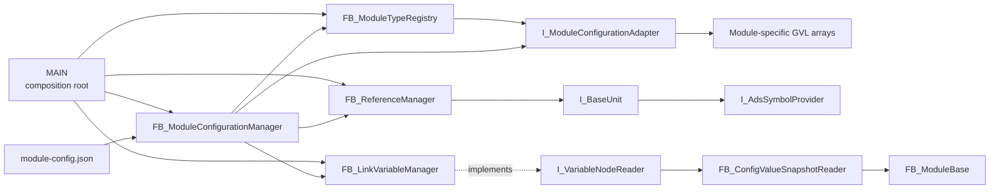
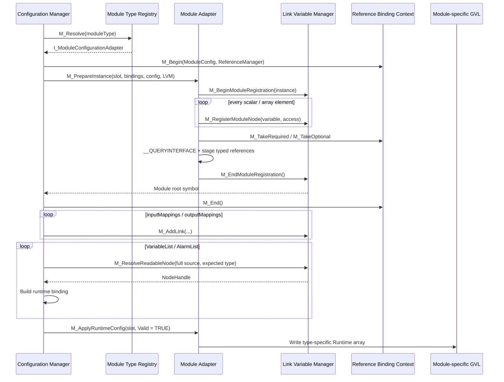

# Module Configuration 初始化流程與擴充指南

## 1. 文件目的

本文件以目前 `schemaVersion = 4` 的實作為準，說明：

1. PLC 啟動時，Configuration 如何從 JSON 轉換成可執行的 I/O mapping、BaseUnit reference、configured value bindings 與 Module runtime config。
2. VariableList／AlarmList 如何透過已註冊節點建立本機 snapshot，不再使用 ADS Sum Command。
3. 新增一種 Module type 時，需要新增或修改哪些程式環節。
4. 哪些通用 Module 已經由 interface 隔離，正常情況下不需要跟著修改。

目前設定只在 PLC 啟動時套用。修改 JSON 後必須重新啟動 PLC；現階段不支援 runtime reload、unregister 或 registry 壓縮。

## 2. 架構角色

| Module | 目前實作 | 責任 |
|---|---|---|
| Composition root | [`MAIN`](../robust_solution_simple_module/Untitled1/POUs/MAIN.TcPOU) | 建立 manager 與 adapter、註冊共享實體 I/O、BaseUnit reference、Module type，並安排 cyclic execution 順序。 |
| Configuration orchestrator | [`FB_ModuleConfigurationManager`](../robust_solution_simple_module/Untitled1/Configuration/POUs/FB_ModuleConfigurationManager.TcPOU) | 載入與解析 JSON、執行共用驗證、解析 Module adapter，並建立 mapping、reference 與 runtime bindings。它不知道各 Module type 專屬的 GVL array 與 reference 型別。 |
| Module type registry | [`FB_ModuleTypeRegistry`](../robust_solution_simple_module/Untitled1/Configuration/POUs/FB_ModuleTypeRegistry.TcPOU) | 保存 `T_ModuleTypeName -> I_ModuleConfigurationAdapter` 對應，並依 config 的 `moduleType` 解析 adapter。 |
| Module configuration seam | [`I_ModuleConfigurationAdapter`](../robust_solution_simple_module/Untitled1/Configuration/Interfaces/I_ModuleConfigurationAdapter.TcIO) | 定義不同 Module type 必須提供的 slot、instance preparation、runtime config 與清除行為。 |
| GC adapter | [`FB_GCModuleConfigurationAdapter`](../robust_solution_simple_module/Untitled1/Configuration/POUs/FB_GCModuleConfigurationAdapter.TcPOU) | 將通用設定轉接到 `GVL_Module.GC_*`，宣告 GC nodes，並拉取、驗證 GC 所需的 typed references。 |
| Variable node registry／link manager | [`FB_LinkVariableManager`](../robust_solution_simple_module/Untitled1/Configuration/POUs/FB_LinkVariableManager.TcPOU) | 註冊具 Symbol Name、位址、型別、大小與 access metadata 的節點；建立 mapping；初始化時解析 readable node handle；cyclic 時執行 link copy 與 node read。 |
| Variable node reader seam | [`I_VariableNodeReader`](../robust_solution_simple_module/Untitled1/Configuration/Interfaces/I_VariableNodeReader.TcIO) | 只公開 `NodeHandle -> raw value` 的讀取能力，讓 Module 不接觸 node registry、Symbol Name lookup 或裸 `PVOID`。 |
| Reference manager | [`FB_ReferenceManager`](../robust_solution_simple_module/Untitled1/Configuration/POUs/FB_ReferenceManager.TcPOU) | 以完整 ADS symbol name 註冊並解析通用 `I_BaseUnit` reference；不知道 Module target port 與實際 specialized interface。 |
| Reference binding context | [`FB_ModuleReferenceBindingContext`](../robust_solution_simple_module/Untitled1/Configuration/POUs/FB_ModuleReferenceBindingContext.TcPOU) | 將 schema v4 的語意 reference map 包裝成 `M_TakeRequired`／`M_TakeOptional`，統一處理 lookup、resolve、duplicate take 與 unknown key。 |
| ADS symbol provider | [`I_AdsSymbolProvider`](../robust_solution_simple_module/Untitled1/Configuration/Interfaces/I_AdsSymbolProvider.TcIO)、[`FB_BaseUnit`](../robust_solution_simple_module/Untitled1/POUs/00_BaseUnit/FB_BaseUnit.TcPOU) | 提供 BaseUnit 實體位址與大小，讓 Reference Manager 自動取得全域 ADS symbol name。ADS symbol 在此用於初始化識別，不代表 configured values 仍透過 ADS 讀取。 |
| Configured value snapshot | [`FB_ConfigValueSnapshotReader`](../robust_solution_simple_module/Untitled1/Configuration/POUs/FB_ConfigValueSnapshotReader.TcPOU) | 依 Runtime Binding 的 NodeHandle 建立本機 raw-value snapshot，並轉換為數值或字串。 |
| Module runtime base | [`FB_ModuleBase`](../robust_solution_simple_module/Untitled1/POUs/10_Module/FB_ModuleBase.TcPOU) | 注入 `I_VariableNodeReader`，更新共用 VariableList、configured AlarmList 與 configuration status。 |
| Module-specific storage | [`GVL_Module`](../robust_solution_simple_module/Untitled1/GVLs/GVL_Module.TcGVL) | 每種 Module type 擁有自己的 FB、Runtime、Control 與 reference arrays；目前 GC 使用 `GC`、`GC_Runtime`、`GC_Control`、`GC_SpinAxis`、`GC_LiftPinAxis`。 |

主要 interface 與資料流如下：



## 3. Configuration Flow

### 3.1 Phase 0：註冊共享基礎設施

[`MAIN.M_HwModuleRegister()`](../robust_solution_simple_module/Untitled1/POUs/MAIN.TcPOU) 由 `_bInfrastructureRegistrationAttempted` 保證啟動時只嘗試一次；`_bInfrastructureRegistered` 保存所有註冊步驟的成功結果，失敗不會在後續 scan 自動重試：

1. 呼叫 `FB_LinkVariableManager.M_BeginInfrastructureRegistration()`，成功後逐點呼叫 `M_RegisterInfrastructureNode(Variable := ..., Access := ...)`。Array 依 `LOWER_BOUND`／`UPPER_BOUND` 逐元素傳入，完整 ADS symbol name 由變數 address／size 解析。
   - EL1889／EL3602 實體 input channel：呼叫端指定 `ReadOnly`。
   - EL2809 實體 output channel：呼叫端指定 `WriteOnly`。
   - 共享變數確實需要雙向存取時可指定 `ReadWrite`；Manager 不依端子型號推斷 access。
2. 呼叫 `M_SealInfrastructureRegistration()` 判定整個 node session。即使逐點宣告失敗，也必須執行 Seal：first-error-wins 保留第一個 `ErrorMessage`，後續 Register 不再新增 node；失敗的 Seal 清除 active session 的 Infrastructure nodes、將 node counts 歸零並結束 session，保留錯誤且不標記 sealed。
3. 只有 Seal 成功後才將共享 BaseUnit 註冊到 `FB_ReferenceManager`，每次檢查回傳值。
   - 呼叫端只傳入 `I_BaseUnit`。
   - Reference Manager 透過 `__QUERYINTERFACE` 取得 `I_AdsSymbolProvider`。
   - `GetSymbolNameByAddress()` 將位址解析成例如 `GVL_IO.NC_Axis1` 的完整 Symbol Name。
4. 前面步驟都成功後，將 Module type 與 adapter 註冊到 `FB_ModuleTypeRegistry`。

```iecst
IF _bRegistrationOk THEN
    _bRegistrationOk := _ModuleTypeRegistry.M_Register(
        ModuleTypeName := 'GC',
        Adapter := _GCModuleConfigurationAdapter);
END_IF
_bInfrastructureRegistered := _bRegistrationOk;
```

`T_ModuleTypeName` 是固定長度的字串 key。新增 Module type 只需在 composition root 註冊新名稱，不必修改 framework enum；JSON `moduleType` 與註冊名稱採大小寫完全一致的比較。

若任一步驟失敗，Configuration Manager 的 `Execute := _bInfrastructureRegistered` 保持 `FALSE`。成功 Seal 後不得再 Begin 或追加 Infrastructure node；後續 Module configuration 失敗只清除 Module nodes 等套用結果，保留已 sealed Infrastructure nodes。未 sealed 的失敗 session 必須先由 Seal rollback，Manager 才能接受新的 Begin；現有 `MAIN` 不會自動啟動此 retry。

舊 `M_RegisterEL1889()`／`M_RegisterEL2809()`／`M_RegisterEL3602()` 已淘汰並自 Manager 移除。硬體型號與 DUT 並未淘汰；請改用通用逐點 API。完整 session 契約與可套用的短範例見[功能物件開發規格 8.10](../Spec/Robust_Solution_Function_Object_Development_Spec.md#810-registry-與-initialization-wiring)。

### 3.2 Phase 1：載入、解析與 schema 驗證

`FB_ModuleConfigurationManager` 在 `Execute = TRUE` 時進入一次性狀態機：

1. 從 `Param_Config.ModuleConfigFilePath` 載入 UTF-8 JSON。
2. 要求 `schemaVersion = Param_Config.ConfigSchemaVersion = 4`。
3. 明確拒絕 `adsPort`；configured values 只允許使用已註冊本機節點。
4. 將 JSON 解析到 `ST_SystemFileConfig` 與 `ST_ModuleFileConfig`。
5. 驗證 enabled Module 的 mapping、reference map、VariableList 與 AlarmList 必要欄位。

schema v4 拒絕舊的 `axisReferences` 與 `referenceBindings`，必須改用語意 `references` object：

```json
"references": {
  "SpinAxis_BaseUnit": "GVL_IO.NC_Axis1",
  "LiftPinAxis_BaseUnit": "GVL_IO.NC_Axis2"
}
```

完整欄位規則請參考 [`config/README.md`](../robust_solution_simple_module/config/README.md) 與 [`module-config.json`](../robust_solution_simple_module/config/module-config.json)。

### 3.3 Phase 2：套用前的全域驗證

`M_ApplyConfiguration()` 先完整掃描所有 entries：

1. `slot` 必須位於共用上限 `1..Param_Config.MaxModulePerType`。
2. `moduleType` 必須能由 Registry 解析到 adapter。
3. Adapter 必須支援該 type 的 slot。
4. enabled Module 的 `id` 不可為 `0`。
5. 相同 `moduleType + slot` 不得重複，包括 disabled entries。
6. enabled Module 的 `id` 必須跨 Module type 全域唯一。

`slot` 是 Module type 自己 array 的 index，因此不同 Module type 可以使用相同 slot。即使 entry 為 disabled，其 type 與 slot 仍必須合法。

### 3.4 Phase 3：清除舊的套用狀態

全域驗證成功後：

1. `LinkVariableManager.M_ClearLinks()` 清除既有 link table。
2. `ModuleTypeRegistry.M_ClearAll()` 對每個已註冊 adapter 呼叫一次 `M_ClearAllSlots()`。
3. Adapter 在內部以自己的 type capacity 清除 Runtime arrays 與 typed reference arrays。

`M_ClearModuleNodes()` 會移除先前套用產生的 Module nodes，但保留已 sealed 的 Beckhoff infrastructure nodes；BaseUnit source registry 維持不變。正常啟動只套用一次；disabled Module 不呼叫 `M_PrepareInstance()`，因此不建立該 Module 的 nodes。

### 3.5 Phase 4：逐一套用 Module 設定

Configuration Manager 為每個 entry 建立 `ST_ModuleRuntimeConfig` scratch，填入：

- `Enabled`
- `ModuleId`
- `ModuleType`
- 本次套用的 `Revision`

disabled 與 enabled Module 的行為如下：

| 狀態 | 行為 |
|---|---|
| `enabled = false` | 不準備 Module instance、不建立 mapping、不綁 reference、不解析 NodeHandle；將 `Valid = TRUE`、`Enabled = FALSE` 的 RuntimeConfig 交給 adapter。 |
| `enabled = true` | 建立 reference binding context，呼叫一次 `M_PrepareInstance()` 宣告 nodes 並取得 typed references，再建立 mapping、configured value binding 與 runtime config。所有步驟成功後才設 `Valid = TRUE`。 |

enabled Module 的順序如下：



各步驟的重點：

1. **Adapter 解析**：Configuration Manager 只取得 `I_ModuleConfigurationAdapter`，不知道 GC 或其他 Module type。
2. **Module instance preparation**：adapter 選擇 `GVL_Module.<Type>[slot]`，在 Begin／End session 之間，以 `M_RegisterModuleNode(variable, access)` 宣告每個 scalar 或 array element。Manager 從變數本身取得完整 ADS symbol，並驗證它屬於目前 Module root。
3. **Mapping**：無 transform 時要求型別與大小相同並使用 `MEMCPY`；有 transform 時要求支援的數值型別，執行 `target = source * scale + offset`。
4. **Reference binding**：adapter 依自身固定契約，以語意名稱 pull required／optional reference；binding context 查找 JSON、透過 Reference Manager resolve `I_BaseUnit`，adapter 只需以 `__QUERYINTERFACE` 驗證 specialized interface。所有項目成功後才提交到 type-specific reference array；未取用的 JSON key 由 context 的 `M_End()` 視為 unknown port 拒絕。
5. **Configured value binding**：VariableList／AlarmList 的相對 `source` 會加上 Module root symbol，再解析為 opaque `NodeHandle`。
6. **Runtime config**：adapter 是唯一知道 `<ModuleType>_Runtime[slot]` 實際儲存位置的 implementation。

### 3.6 Runtime Binding Model

檔案設定與執行期 binding 分開保存：

```iecst
TYPE ST_RuntimeVariableBinding :
STRUCT
    Definition : ST_ConfigVariableInfo;
    NodeHandle : UINT;
END_STRUCT
END_TYPE
```

```iecst
TYPE ST_RuntimeAlarmBinding :
STRUCT
    Definition : ST_ConfigAlarmInfo;
    NodeHandle : UINT;
END_STRUCT
END_TYPE
```

| 資料 | 生命週期 | 用途 |
|---|---|---|
| `Definition.Source` | Config 與 Runtime | 初始化查找鍵、Alarm Path 與診斷資訊。 |
| `Definition.DataType` | Config 與 Runtime | 客戶宣告的預期型別；初始化時必須與 node metadata 相同。 |
| `NodeHandle` | Runtime only | Registry 內的不透明節點識別；重新啟動後不得持久化或重用。 |
| `ST_LinkVariableNode.Address` | Registry private | 實際 `PVOID`；不進入 RuntimeConfig，也不公開給 Module。 |

`M_ResolveReadableNode()` 只在 Configuration 初始化時呼叫。它查找 Symbol Name、拒絕 `WriteOnly` node、驗證型別／大小／位址，成功後回傳 handle。Cyclic path 不再比較 Symbol Name。

### 3.7 Phase 5：Ready 與 cyclic execution

全部 entries 套用成功後，`FB_ModuleConfigurationManager.Ready` 才會成立。MAIN 的 cyclic 順序是：

1. `LinkVariableManager.M_CyclicInput()`：實體 input 更新至 Module `HwInput`。
2. 逐一執行 enabled 且 valid 的 Module FB，並注入 `_LinkVariableManager` 所實作的 `I_VariableNodeReader`。
3. `FB_ConfigValueSnapshotReader` 使用 Runtime Binding 的 handles，直接將已註冊節點複製到本機 `ST_ConfigRawValue` buffers。
4. `FB_ModuleBase` 以同一份 snapshot 更新 VariableList 與 configured alarms。
5. `LinkVariableManager.M_CyclicOutput()`：Module `HwOutput` 更新至實體 output。

Node reader interface 不會複製 manager 或 registry；Module 只能呼叫 `M_ReadNode()`，不能建立 mapping、註冊節點或取得裸 pointer。

若任一 node read 失敗：

- `ModuleStatus.Configuration.Ready = FALSE`
- `ModuleStatus.Configuration.Error = TRUE`
- `ModuleStatus.Configuration.ErrorCode` 保存第一個 `E_ConfigValueError`
- `ModuleStatus.Configuration.ErrorMessage` 保存固定、可讀的錯誤原因
- `ModuleStatus.Configuration.ErrorSource` 保存失敗來源的完整 Symbol Name；snapshot 層級錯誤則為空字串
- 本周期不重新判斷 configured alarm，已鎖存警報維持原狀
- 不發布失敗 snapshot 的舊值
- 下一次完整 snapshot 成功後自動恢復

`E_ConfigValueError` 是 configured value acquisition 的錯誤契約。既有數值範圍保留，讓外部系統升級欄位型別後仍可沿用原本的數值診斷：

| Enum member | Value | 發生位置 | 意義 |
| --- | ---: | --- | --- |
| `ReaderUnavailable` | `16#7100` | `FB_ConfigValueSnapshotReader` | 未注入 `I_VariableNodeReader`。 |
| `SourceCapacityExceeded` | `16#7101` | `FB_ConfigValueSnapshotReader` | VariableList 與 AlarmList 的來源總數超過 snapshot 容量。 |
| `InvalidNodeHandle` | `16#7201` | `FB_LinkVariableManager.M_ReadNode()` | Handle 不在目前 registry 範圍內。 |
| `NodeReadNotAllowed` | `16#7202` | `FB_LinkVariableManager.M_ReadNode()` | Node 為 `WriteOnly`，不可作為資料來源。 |
| `InvalidNodeAddress` | `16#7203` | `FB_LinkVariableManager.M_ReadNode()` | Node address 無效。 |
| `NodeDataTypeMismatch` | `16#7204` | `FB_LinkVariableManager.M_ReadNode()` | Config 預期型別與註冊 metadata 不一致。 |
| `InvalidNodeSize` | `16#7205` | `FB_LinkVariableManager.M_ReadNode()` | Node size 為零或超過 raw-value buffer。 |

`F_ConfigValueErrorMessage()` 集中管理固定訊息；`FB_ConfigValueSnapshotReader` 另以 `ErrorSource` 保存失敗來源的 Symbol Name，避免將 machine-readable path 拼入訊息後發生截斷或要求上位解析文字。這樣底層 reader seam 維持精簡的 typed error，而對外的 Module Status 仍具有足夠的排錯脈絡。

Beckhoff Motion FB 的 `ErrorId` 與 JSON library 的 `HRESULT` 不納入此 enum。它們是外部 library 的 source error contract，應保留原始型別與數值，並由上層 domain error／message 補充操作情境。

### 3.8 失敗處理

JSON 載入、解析或套用失敗時：

- Configuration Manager `Ready = FALSE`
- `Error = TRUE`
- `ErrorMessage` 保存第一個失敗原因
- link table 與各 Module adapter 的 runtime/reference state 被清除
- MAIN 不執行 Module cyclic 與 I/O copy

Node metadata 與 BaseUnit reference metadata 在 PLC 啟動生命週期內保留，但因 Configuration Manager 未 Ready，不會進入 cyclic mapping。

## 4. 新增 Module type 的修改清單

以下以假想的 `XYZ` Module 為例。

### 4.1 建立 Module 本體與 type-specific storage

至少新增：

1. `FB_XYZ_Module`，通常繼承 `FB_ModuleBase`。
2. XYZ 專屬的 HwInput、HwOutput、Control、Status、Service 等 DUT。
3. 在 `GVL_Module` 建立 XYZ 自己的 FB、Runtime、Control 與 reference arrays。

```iecst
XYZ : ARRAY[1..Param_Config.MaxModulePerType] OF FB_XYZ_Module;
XYZ_Runtime : ARRAY[1..Param_Config.MaxModulePerType] OF ST_ModuleRuntimeConfig;
XYZ_Control : ARRAY[1..Param_Config.MaxModulePerType] OF ST_XYZ_CtrlStatus;
XYZ_ProcessUnit : ARRAY[1..Param_Config.MaxModulePerType] OF I_Process_BaseUnit;
```

不同 Module type 擁有自己的 arrays，因此可使用相同 slot。Adapter 應是唯一知道這些 type-specific array 名稱的 Configuration module。

### 4.2 定義 Module type 與 Reference 契約

為 adapter 選擇一個不超過 `T_ModuleTypeName` 長度的穩定名稱，例如 `XYZ`。稍後在 MAIN 將此名稱與 adapter instance 註冊；不需修改 framework 的 enum 或 manager。

若 XYZ 有 configurable references：

1. 為每個 port 選擇具語意且穩定的 JSON key，例如 `ProcessUnit_BaseUnit`。
2. required／optional 屬於 adapter 的固定契約，不由 JSON 指定。
3. 非 Axis reference 建立直接或間接繼承 `I_BaseUnit` 的 specialized interface。
4. Adapter 呼叫 `ReferenceBindings.M_TakeRequired()`／`M_TakeOptional()`，再以 `__QUERYINTERFACE` 驗證 BaseUnit 型別。
5. 先將所有 typed interfaces 暫存在 local variables；nodes、references 與 End 驗證全部成功後，再寫入 `GVL_Module` storage。

不可使用 `ANY`、pointer 或 `MEMCPY` 儲存 interface reference。

### 4.3 在 Adapter 宣告 Module nodes

不要在 `FB_LinkVariableManager` 新增 XYZ 專屬方法。Adapter 在自己的 `M_PrepareInstance()` 中開啟 registration session，並直接傳入實際變數：

```iecst
bDeclared := LinkVariableManager.M_BeginModuleRegistration(
    Address := ADR(GVL_Module.XYZ[Slot]),
    Size := SIZEOF(GVL_Module.XYZ[Slot]),
    ModuleConfig := ModuleConfig);

bDeclared := LinkVariableManager.M_RegisterModuleNode(
    Variable := GVL_Module.XYZ[Slot].HwInput.bReady,
    Access := E_VariableAccess.ReadWrite);

FOR nIndex := LOWER_BOUND(GVL_Module.XYZ[Slot].HwInput.Values, 1)
    TO UPPER_BOUND(GVL_Module.XYZ[Slot].HwInput.Values, 1) DO
    bDeclared := LinkVariableManager.M_RegisterModuleNode(
        Variable := GVL_Module.XYZ[Slot].HwInput.Values[nIndex],
        Access := E_VariableAccess.ReadWrite);
END_FOR

IF NOT LinkVariableManager.M_EndModuleRegistration(
    ModuleSymbol => ModuleSymbol) THEN
    ErrorMessage := LinkVariableManager.ErrorMessage;
    RETURN;
END_IF
```

通用 manager 會：

1. Begin 從 Module instance 位址取得 root symbol。
2. 每次 declaration 從該變數位址與大小取得完整 symbol，不接受硬編碼 node path。
3. 驗證完整 symbol 位於目前 root 之下，並註冊位址、型別、大小與 access。
4. 拒絕 duplicate、unsupported primitive type、錯誤 access 與容量超限，並保存第一個錯誤。
5. End 確認 config 引用的 relative paths 都已有 declaration，回傳 Module root symbol並關閉 session。

Adapter 應宣告完整 I/O surface。未被 config 引用的 declarations 仍占 `_Nodes` 容量，但不建立 link、NodeHandle read 或 cyclic 工作；config 引用不存在的 relative path 會在 End 被拒絕。

建議 access 規則：

| 節點 | Access |
|---|---|
| 實體 input | `ReadOnly` |
| 實體 output | `WriteOnly` |
| Module `HwInput` | `ReadWrite` |
| Module `HwOutput` | `ReadOnly` |

目前支援 `BOOL`、`DINT`、`UDINT`、`REAL`、`LREAL`、`STRING(80)`。新增 primitive type 時必須同步擴充 enum、size/descriptor conversion、JSON parsing、mapping transform 與 snapshot formatting。

### 4.4 實作 XYZ Configuration Adapter

新增 `FB_XYZModuleConfigurationAdapter IMPLEMENTS I_ModuleConfigurationAdapter`：

| Method | XYZ adapter 的責任 |
|---|---|
| `M_IsSlotSupported` | 驗證 XYZ slot。 |
| `M_PrepareInstance` | 選擇 `GVL_Module.XYZ[slot]`；以通用 Begin／Register／End 宣告 nodes；pull required／optional references、驗證 typed interfaces，最後提交 references 並回傳 root symbol。 |
| `M_ApplyRuntimeConfig` | 驗證 Module type 後寫入 `XYZ_Runtime[slot]`。 |
| `M_ClearAllSlots` | 以 XYZ 自己的 capacity 清除所有 Runtime 與 typed references；必須可重複呼叫。 |

不要在 `FB_ModuleConfigurationManager` 新增 `IF ModuleType = 'XYZ'` 分支。

### 4.5 在 MAIN 註冊並執行 XYZ

1. 宣告 adapter instance。
2. 以 `ModuleTypeName := 'XYZ'` 註冊 adapter。
3. 註冊 XYZ 使用且可由 config 引用的共享實體 I/O／BaseUnit sources。
4. 在 `M_CyclicInput()` 與 `M_CyclicOutput()` 之間新增 XYZ loop。
5. 呼叫 `FB_XYZ_Module` 時傳入 `VariableNodeReader := _LinkVariableManager`。

Configuration 已透過 adapter 泛化，但 runtime execution 仍由 MAIN 明確呼叫各 Module type。若漏掉 cyclic loop，config 可能成功且 RuntimeConfig valid，但 Module FB 不會執行。

### 4.6 更新容量與 config 文件

目前所有 Module type 使用相同的 `MaxModulePerType`；新增 type 時，`MaxTotalConfiguredModules` 的總容量公式已透過 `MaxModuleTypes * MaxModulePerType` 預留。

仍需確認：

- `MaxModuleTypes` 足以註冊新增 adapter。
- `MaxConfigVariableNodes` 足以容納 Beckhoff infrastructure nodes 與 enabled adapters 宣告的所有 nodes。
- `MaxConfigReferenceNodes` 與 `MaxModuleReferences` 足夠。
- JSON 範例中的 `moduleType`、`references` 語意 keys 與 relative member paths 正確。

新增 Module type 本身不需要提升 schemaVersion；只有 JSON 結構或欄位語意改變才需升版與 migration。

## 5. 正常情況下不需修改的部分

新 Module 若使用 schema v4 的共用模型，以下 implementation 不應修改：

- `FB_ModuleConfigurationManager.M_ApplyConfiguration()`
- `FB_ModuleTypeRegistry`
- `FB_ReferenceManager`
- `I_VariableNodeReader`
- `FB_ConfigValueSnapshotReader`
- `I_ModuleReferenceBindings`／`FB_ModuleReferenceBindingContext`
- `references`、`variableList`、`alarmList` 的 JSON 結構

需要新增的是 type-specific storage、adapter 內的 node/reference preparation、composition-root registration 與 cyclic execution。

## 6. 目前容量與限制

| Parameter | 目前值 | 影響 |
|---|---:|---|
| `MaxModuleTypes` | 8 | 可註冊的 Module type 數量。 |
| `MaxModulePerType` | 6 | 每種 Module type 的 slot 與 array 容量。 |
| `MaxTotalConfiguredModules` | 48 | JSON `modules[]` 總 entry 容量，包含 enabled 與 disabled。 |
| `MaxModuleMappings` | 256 | 每個 Module input/output mapping 容量。 |
| `MaxConfigVariableNodes` | 512 | Beckhoff infrastructure nodes 與 enabled Module adapters 宣告 nodes 的總容量；現有最大配置為 436。 |
| `MaxModuleReferences` | 50 | 每個 Module 的 `references` members 容量。 |
| `MaxConfigReferenceNodes` | 100 | BaseUnit source registry 容量。 |
| `MaxModuleVariable` | 100 | 每個 Module configured VariableList 容量。 |
| `MaxConfiguredAlarmsPerModule` | 30 | 每個 Module configured AlarmList 容量。 |
| `MaxConfiguredValueSources` | 130 | 每個 Module 的本機 snapshot source 總容量。 |
| `MaxConfigValueSize` | 81 bytes | 單筆 raw value 上限，可容納 `STRING(80)`。 |

## 7. 驗證清單

### 初始化

- schema v4 可載入；schema v3、更早版本與 `adsPort` 被拒絕。
- 沒有某 type 的 config 時，不註冊該 type Module I/O。
- disabled Module 只寫入 disabled RuntimeConfig，不解析 NodeHandle。
- 相同 type 的 duplicate slot 被拒絕；不同 type 可使用相同 slot。
- enabled Module ID 跨 type 全域唯一。
- unknown／duplicate／missing required／type-incompatible reference 使設定失敗；省略 optional reference 則成功。
- Module node 的完整 symbol 由變數位址解析；非目前 root、duplicate、unsupported type、錯誤 access 或 config path 拼字錯誤會使設定失敗。
- VariableList／AlarmList source 未註冊、`WriteOnly` 或 dataType 不相容時，整份 configuration 套用失敗。

### Runtime

- input mapping 在 Module 前執行，output mapping 在 Module 後執行。
- cyclic path 不執行 Symbol Name lookup、ADS handle lookup 或 ADS Sum Command。
- Module 只透過 `I_VariableNodeReader` 與 opaque NodeHandle 讀取資料。
- Variable 與 Alarm 可共用同一個 node。
- snapshot 失敗時 configured alarms 不會被錯誤清除，下一次完整成功後自動恢復。
- BOOL、DINT、UDINT、REAL、LREAL、STRING80 可正確輸出；BOOL 可依 0/1 進行 alarm condition 判斷。

### 靜態與編譯

- 新增的 DUT、FB、interface、adapter 已加入 PLC project。
- Module type 由 string-keyed registry 解析；reference keys 是 adapter 的穩定語意契約。
- TwinCAT XML、`git diff --check`、`CheckAllObjects`、完整 PLC Build 與 TcUnit 通過。

## 8. 擴充工作摘要

新增一種 Module type 的最小修改面：

1. 新增 Module FB 與專屬 DUT。
2. 在 `GVL_Module` 新增 type-specific FB、Runtime、Control、reference arrays。
3. 視需要新增 specialized BaseUnit interface，並決定 required／optional reference 語意名稱。
4. 實作新的 `I_ModuleConfigurationAdapter`；在 `M_PrepareInstance()` 宣告 nodes 並取得 typed references。
5. 在 MAIN 以新的字串 key 註冊 adapter 與 BaseUnit sources。
6. 在 MAIN 新增 cyclic loop，並注入 `I_VariableNodeReader`。
7. 更新 config 範例、容量檢查與客戶文件。

只要需求仍落在 schema v4 的共用設定模型內，Link／Configuration／Reference Manager、Module Type Registry、Variable Node Reader 與 Config Value Snapshot 的核心 implementation 都不需要知道新 Module 的存在。
