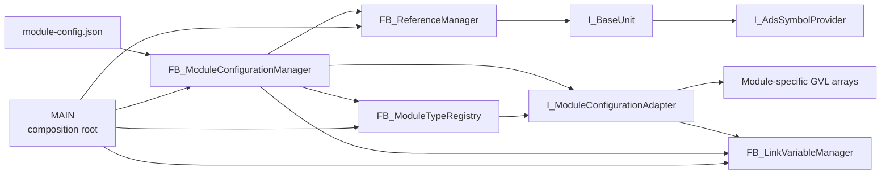
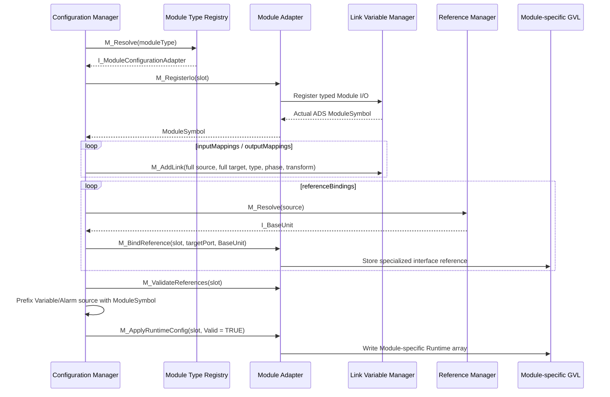

# Module Configuration 初始化流程與擴充指南

## 1. 文件目的

本文件以目前 `schemaVersion = 2` 的實作為準，說明：

1. PLC 啟動時，Configuration 如何從 JSON 轉換為可執行的 I/O mapping、BaseUnit reference 與 Module runtime config。
2. 新增一種 Module type 時，需要新增或修改哪些程式環節。
3. 哪些部分已經由通用 Module interface 隔離，正常情況下不需要跟著修改。

目前設定只在 PLC 啟動時套用。修改 JSON 後必須重新啟動 PLC，現階段不支援 runtime reload、unregister 或 registry 壓縮。

## 2. 架構角色

| Module | 目前實作 | 責任 |
|---|---|---|
| Composition root | [`MAIN`](../Untitled1/POUs/MAIN.TcPOU) | 建立 manager 與 adapter、註冊共享實體 I/O、BaseUnit reference、Module type，並安排 cyclic execution 順序。 |
| Configuration orchestrator | [`FB_ModuleConfigurationManager`](../Untitled1/Configuration/POUs/FB_ModuleConfigurationManager.TcPOU) | 載入與解析 JSON、執行共用驗證、依 Module type 取得 adapter、建立 mapping/reference/runtime config。它不應知道各 Module 專屬的 GVL 名稱與 reference 型別。 |
| Module type registry | [`FB_ModuleTypeRegistry`](../Untitled1/Configuration/POUs/FB_ModuleTypeRegistry.TcPOU) | 保存 `E_ModuleType -> I_ModuleConfigurationAdapter` 對應，並依 config 中的 `moduleType` 文字解析 adapter。 |
| Module configuration seam | [`I_ModuleConfigurationAdapter`](../Untitled1/Configuration/Interfaces/I_ModuleConfigurationAdapter.TcIO) | 定義不同 Module type 必須提供的 slot、I/O、reference、runtime config 與清除行為。 |
| GC adapter | [`FB_GCModuleConfigurationAdapter`](../Untitled1/Configuration/POUs/FB_GCModuleConfigurationAdapter.TcPOU) | 將通用設定轉接到 `GVL_Module.GC_*`，並處理 GC 專屬 reference port 與型別驗證。 |
| Variable link manager | [`FB_LinkVariableManager`](../Untitled1/Configuration/POUs/FB_LinkVariableManager.TcPOU) | 註冊具位址、型別、大小與 access metadata 的節點；驗證 link；在 cyclic 階段執行 `MEMCPY` 或數值 transform。 |
| Reference manager | [`FB_ReferenceManager`](../Untitled1/Configuration/POUs/FB_ReferenceManager.TcPOU) | 以完整 ADS symbol name 註冊並解析通用 `I_BaseUnit` reference。它不知道 reference 的實際專用型別與 Module target port。 |
| ADS symbol provider | [`I_AdsSymbolProvider`](../Untitled1/Configuration/Interfaces/I_AdsSymbolProvider.TcIO)、[`FB_BaseUnit`](../Untitled1/POUs/00_BaseUnit/FB_BaseUnit.TcPOU) | 提供 BaseUnit 實體位址與大小，讓 Reference Manager 自動取得全域 ADS symbol name。 |
| Module runtime base | [`FB_ModuleBase`](../Untitled1/POUs/10_Module/FB_ModuleBase.TcPOU) | 使用 runtime config 啟動 ADS Sum snapshot，更新共用 VariableList 與 AlarmList。 |
| Module-specific storage | [`GVL_Module`](../Untitled1/GVLs/GVL_Module.TcGVL) | 每種 Module type 擁有自己的 FB、Runtime、Control 與 reference arrays；目前 GC 使用 `GC`、`GC_Runtime`、`GC_Control`、`GC_SpinAxis`、`GC_LiftPinAxis`。 |

主要 seam 如下：



## 3. Configuration Flow

### 3.1 Phase 0：註冊共享基礎設施

[`MAIN`](../Untitled1/POUs/MAIN.TcPOU) 使用 `_bInfrastructureRegistered` 確保初始化註冊只成功執行一次，並以 `_bRegistrationOk` 逐步 short-circuit：

1. 將共享實體端子註冊到 `FB_LinkVariableManager`：
   - `M_RegisterEL1889()`：實體 input，節點固定為 `ReadOnly`。
   - `M_RegisterEL3602()`：實體 input，節點固定為 `ReadOnly`。
   - `M_RegisterEL2809()`：實體 output，節點固定為 `WriteOnly`。
2. 將共享 BaseUnit 註冊到 `FB_ReferenceManager`。
   - 呼叫端只傳入 `I_BaseUnit`。
   - `FB_ReferenceManager` 透過 `__QUERYINTERFACE` 取得 `I_AdsSymbolProvider`。
   - `FB_BaseUnit.M_GetAdsSymbolMetadata()` 提供實體位址與大小。
   - `GetSymbolNameByAddress()` 將它解析成例如 `GVL_IO.NC_Axis1` 的完整 ADS symbol name。
3. 將 Module type 與 adapter 註冊到 `FB_ModuleTypeRegistry`：

   ```iecst
   _ModuleTypeRegistry.M_Register(
       ModuleType := E_ModuleType.GC,
       Adapter := _GCModuleConfigurationAdapter);
   ```

`E_ModuleType` 具有 `{attribute 'to_string'}`；Registry 以 `TO_STRING(enum member)` 和 JSON 的 `moduleType` 做大小寫完全一致的比較，因此 config 不依賴另一份手寫字串常數。

若任一步驟失敗，`_bInfrastructureRegistered` 不會成立，Configuration Manager 不會開始載入設定。

### 3.2 Phase 1：載入與解析 JSON

`FB_ModuleConfigurationManager` 在 `Execute = TRUE` 時進入一次性的狀態機：

1. 從 `Param_Config.ModuleConfigFilePath` 載入 UTF-8 JSON。
2. 檢查 `schemaVersion` 是否等於 `Param_Config.ConfigSchemaVersion`。
3. 將 JSON 解析到 `ST_SystemFileConfig` 與 `ST_ModuleFileConfig`。
4. 驗證 enabled Module 的 mapping、reference binding、VariableList 與 AlarmList 必要欄位。

目前 parser 明確拒絕 schema v1 的：

- `axisReferences`：必須改用 `referenceBindings`。
- reference binding 中的 `target`：必須改用 `targetPort`。

Config 欄位與資料型別的完整規則可參考 [`config/README.md`](../config/README.md) 與 [`config/module-config.json`](../config/module-config.json)。

### 3.3 Phase 2：套用前的全域驗證

在寫入任何 Module runtime state 前，`M_ApplyConfiguration()` 會先完整掃描所有設定：

1. `slot` 必須在 `1..Param_Config.MaxConfiguredModules`。
2. 每一筆設定的 `moduleType` 都必須能由 Registry 解析到 adapter。
3. Adapter 必須支援該 slot。
4. enabled Module 的 `id` 不可為 `0`。
5. 所有 Module 的 `slot` 在不同 Module type 之間仍是全域唯一。
6. enabled Module 的 `id` 必須全域唯一。

注意：即使 Module 為 disabled，其 `moduleType` 與 `slot` 仍必須合法，而且 adapter 仍必須已註冊。

先驗證再異動的目的，是避免因後段才發現無效 slot、未知 Module type 或重複 ID，而留下只套用一半的 runtime state。

### 3.4 Phase 3：清除舊的套用狀態

全域驗證成功後，Configuration Manager 會：

1. 呼叫 `LinkVariableManager.M_ClearLinks()` 清除既有 link table。
2. 呼叫 `ModuleTypeRegistry.M_ClearAll()`。
3. Registry 對每一個已註冊 adapter 與支援的 slot 呼叫 `M_ClearSlot()`。
4. Adapter 清除自己管理的 Module-specific runtime config、reference arrays 與 duplicate-binding flags。

目前清除的是 link 與 Module-specific runtime/reference state；已註冊的 variable node registry 與 BaseUnit reference registry 不會被 unregister。正常的啟動流程只套用一次，因此 disabled Module 不會呼叫 `M_RegisterIo()`，也不會建立該 Module 的 I/O 節點。

### 3.5 Phase 4：逐一套用 Module 設定

Configuration Manager 會為每個設定建立共用的 `ST_ModuleRuntimeConfig` scratch，填入：

- `Enabled`
- `ModuleId`
- `ModuleType`
- `AdsPort`
- 本次套用的 `Revision`

disabled 與 enabled Module 的處理不同：

| 狀態 | 行為 |
|---|---|
| `enabled = false` | 不註冊 Module I/O、不建立 mapping、不綁定 reference；將 `Valid = TRUE`、`Enabled = FALSE` 的 runtime config 交給 adapter 寫入該 Module type 自己的 Runtime array。 |
| `enabled = true` | 依序執行 I/O 註冊、mapping、reference binding、reference 完整性驗證、Variable/Alarm source 建立與 runtime config 寫入。所有步驟成功後才設 `Valid = TRUE`。 |

enabled Module 的詳細順序如下：



各步驟的責任如下：

1. **解析 adapter**：Configuration Manager 只拿到通用 `I_ModuleConfigurationAdapter`，不知道它是 GC 或其他 Module type。
2. **註冊 Module I/O**：adapter 選擇 `GVL_Module.<Type>[slot]`，再呼叫 Link Variable Manager 的型別安全註冊 method。Manager 自動解析實際 Module ADS root symbol 並回傳給 Configuration Manager。
3. **建立 mapping**：
   - `inputMappings.target` 是相對於 Module root 的 member path。
   - `outputMappings.source` 是相對於 Module root 的 member path。
   - 實體端的名稱必須是 Phase 0 已註冊的完整 ADS symbol。
   - 無 transform 時必須型別與大小完全相同，cyclic 只執行 `MEMCPY`。
   - 有 transform 時，來源與目標都必須是支援的數值型別，執行 `target = source * scale + offset`。
4. **綁定 reference**：Reference Manager 只負責以 `source` 找到 `I_BaseUnit`；adapter 負責解析 `targetPort`、使用 `__QUERYINTERFACE` 驗證實際專用 interface，並寫入 Module-specific reference array。
5. **驗證必要 reference**：哪些 port 必填由該 Module adapter 決定。
6. **建立 VariableList/AlarmList source**：config 中使用 Module-relative path；Configuration Manager 加上實際 Module ADS root symbol 後寫入 runtime config。
7. **套用 runtime config**：adapter 負責寫入自己管理的 `<ModuleType>_Runtime[slot]`。Configuration Manager 不直接存取 `GVL_Module`。

### 3.6 Phase 5：Ready 與 cyclic execution

全部 Module 都成功套用後，`FB_ModuleConfigurationManager.Ready` 才會設為 `TRUE`。MAIN 的 cyclic 順序是：

1. `LinkVariableManager.M_CyclicInput()`：實體 input 更新至 Module `HwInput`。
2. 逐一執行 enabled 且 valid 的 Module FB。
3. `FB_ModuleBase` 依 `RuntimeConfig.Revision` 建立 VariableList 與 AlarmList 的 ADS handles，之後以一筆 ADS Sum Command 週期讀取所有 configured sources。
4. `LinkVariableManager.M_CyclicOutput()`：Module `HwOutput` 更新至實體 output。

`FB_ModuleConfigurationManager.Ready` 代表 JSON 已成功套用；Module 的 `ModuleStatus.ConfigurationReady` 仍可能稍晚成立，因為 `FB_AdsSumSnapshotReader` 需要先解析 symbolic handles，才會開始週期性 Sum Read。

### 3.7 失敗處理

發生載入、解析或套用錯誤時：

- `Ready = FALSE`
- `Error = TRUE`
- `ErrorMessage` 保存失敗原因
- Configuration Manager 清除 link table
- Registry 要求各 adapter 清除所有支援 slot 的 runtime/reference state
- MAIN 不會執行 Module cyclic 與 I/O copy

目前已註冊的 variable nodes 與 BaseUnit references 不會被移除；這些 metadata 在 PLC 啟動生命週期內保留，但因 `Ready = FALSE` 不會進入 cyclic mapping。

## 4. 新增 Module type 的修改清單

以下以假想的 `XYZ` Module 為例。名稱只是示意，實際專案應使用明確的 domain 名稱。

### 4.1 建立 Module 本體與資料型別

至少需要：

1. `FB_XYZ_Module`，通常繼承 `FB_ModuleBase`，以便重用 PackML、RuntimeConfig、VariableList、AlarmList 與 ADS Sum snapshot。
2. XYZ 專屬的 `HwInput`、`HwOutput`、Control、Status、Service 等 DUT。
3. 定義哪些 FB input 是可由 config 綁定的 reference port。

如果 XYZ 的 lifecycle 或輸出資料和 `FB_ModuleBase` 不相容，應先評估是否擴充共用 base 的 hook，避免把 XYZ 判斷寫進 Configuration Manager。

### 4.2 擴充 Module type 公開契約

在 [`E_ModuleType`](../Untitled1/Configuration/DUTs/E_ModuleType.TcDUT) 新增 enum member：

```iecst
TYPE E_ModuleType :
(
    Unknown := 0,
    GC := 1,
    XYZ := 2
);
END_TYPE
```

JSON 必須使用完全相同且大小寫一致的文字：

```json
{
  "moduleType": "XYZ"
}
```

不要另外建立 `'XYZ'` 字串常數，也不要在 Registry 中加入手寫 literal；正式 config 值應由 `TO_STRING(E_ModuleType.XYZ)` 產生。

### 4.3 為 XYZ 建立 Module-specific GVL arrays

依目前設計，每種 Module type 都在 [`GVL_Module`](../Untitled1/GVLs/GVL_Module.TcGVL) 管理自己的一組資料，而不是共用一個泛化 Runtime array。例如：

```iecst
XYZ : ARRAY[1..Param_Config.MaxConfiguredModules] OF FB_XYZ_Module;
XYZ_Runtime : ARRAY[1..Param_Config.MaxConfiguredModules] OF ST_ModuleRuntimeConfig;
XYZ_Control : ARRAY[1..Param_Config.MaxConfiguredModules] OF ST_XYZ_CtrlStatus;
XYZ_ProcessUnit : ARRAY[1..Param_Config.MaxConfiguredModules] OF I_Process_BaseUnit;
```

實際 arrays 依 XYZ 的輸入與輸出需求決定。Adapter 應是唯一知道並操作這些 XYZ-specific arrays 的 Configuration module。

### 4.4 定義 Reference Port enum 與 BaseUnit interface

若 XYZ 有 configurable references：

1. 建立專屬 `E_XYZReferencePort`。
2. 使用 `{attribute 'qualified_only'}`、`{attribute 'strict'}`、`{attribute 'to_string'}`。
3. enum member 使用客戶應寫入 config 的穩定名稱，並和 Module FB input pin 保持一致。
4. 為每個 member 註解預期的 specialized BaseUnit interface 與用途。

```iecst
{attribute 'qualified_only'}
{attribute 'strict'}
{attribute 'to_string'}
TYPE E_XYZReferencePort :
(
    Unknown := 0,
    // I_Process_BaseUnit used by the XYZ process.
    ProcessUnit_BaseUnit := 1
);
END_TYPE
```

如果 reference 不是 Axis：

1. 建立例如 `I_Process_BaseUnit EXTENDS I_BaseUnit`，或間接繼承 `I_BaseUnit`。
2. 實作 FB 優先繼承 `FB_BaseUnit`，即可自動取得 `I_AdsSymbolProvider` 能力。
3. 若實作 FB 不繼承 `FB_BaseUnit`，它仍必須自行實作 `I_AdsSymbolProvider`，否則 `FB_ReferenceManager.M_RegisterReference()` 會拒絕註冊。
4. 在 MAIN 將可作為 config `source` 的全域 BaseUnit 實體註冊至 `FB_ReferenceManager`。

Adapter 中只使用 `TO_STRING(E_XYZReferencePort.*)` 解析 `targetPort`，再以 `__QUERYINTERFACE` 將通用 `I_BaseUnit` 安全轉成該 port 需要的 specialized interface。不可使用 `ANY`、pointer、`MEMCPY` 儲存 interface reference。

### 4.5 在 Link Variable Manager 新增型別安全的 Module I/O 註冊

新增：

```iecst
M_RegisterXYZModule(
    Module : FB_XYZ_Module,
    ModuleSymbol => ...)
```

此 method 必須：

1. 透過 Module 位址取得實際 ADS root symbol。
2. 由 manager 組合所有允許公開給 config 的 member path。
3. 註冊每個節點的實際位址、大小、資料型別與 access。
4. 任一節點失敗時立即停止並保存第一個 `ErrorMessage`。
5. 成功時回傳 Module root symbol，讓 Configuration Manager 建立 relative paths。

建議沿用目前 access 規則：

| 節點 | Access | 理由 |
|---|---|---|
| 實體 input | `ReadOnly` | 只能作為 mapping source。 |
| 實體 output | `WriteOnly` | 只能作為 mapping target。 |
| Module `HwInput` | `ReadWrite` | 是 input mapping target，也可能是 VariableList/AlarmList source。 |
| Module `HwOutput` | `ReadOnly` | 只能作為 output mapping source。 |

若 XYZ 使用新的實體端子型別，還需要新增相對應的 `M_Register<Terminal>()`，並在 MAIN Phase 0 註冊該端子。若只是重用既有已註冊端子，則不需修改實體 I/O 註冊。

目前可註冊的 primitive type 是 `BOOL`、`DINT`、`UDINT`、`REAL`、`LREAL`、`STRING(80)`。若 XYZ 需要其他型別，不能只修改 `M_RegisterXYZModule()`；還必須同步擴充 `E_ConfigDataType`、型別大小/descriptor 轉換、JSON parser、link copy/transform 與 ADS snapshot unpack/format 流程。

### 4.6 實作 XYZ Configuration Adapter

新增 `FB_XYZModuleConfigurationAdapter IMPLEMENTS I_ModuleConfigurationAdapter`，完整實作以下 interface：

| Method | XYZ adapter 的責任 |
|---|---|
| `M_IsSlotSupported` | 宣告 XYZ 可使用的 slot 範圍。 |
| `M_RegisterIo` | 選擇 `GVL_Module.XYZ[slot]`，呼叫 `M_RegisterXYZModule()` 並回傳實際 Module symbol。 |
| `M_BindReference` | 以 `TO_STRING(E_XYZReferencePort.*)` 解析 target、拒絕 unknown/duplicate port、以 `__QUERYINTERFACE` 驗證型別、寫入 `GVL_Module.XYZ_<Reference>[slot]`。 |
| `M_ValidateReferences` | 驗證所有 XYZ 必要 port 都已綁定；optional port 不應在此強制。若 XYZ 沒有必要 reference，可直接在合法 slot 回傳 `TRUE`。 |
| `M_ApplyRuntimeConfig` | 先驗證 `RuntimeConfig.ModuleType = TO_STRING(E_ModuleType.XYZ)`，再寫入 `GVL_Module.XYZ_Runtime[slot]`。disabled Module 也會走此 method。 |
| `M_ClearSlot` | 清除 XYZ reference arrays、`XYZ_Runtime[slot]` 與 adapter 內部 duplicate-binding flags。必須可重複呼叫。 |

所有 Module-specific knowledge 都應留在 XYZ adapter：

- XYZ 的 GVL array 名稱
- XYZ 支援的 slot
- XYZ reference port 名稱與必要性
- 每個 reference port 的 specialized interface type
- XYZ runtime config 的儲存位置

不要在 `FB_ModuleConfigurationManager` 新增 `IF ModuleType = 'XYZ'` 分支。

### 4.7 在 MAIN 註冊 adapter

在 MAIN 宣告 adapter instance，並加入基礎設施註冊鏈：

```iecst
_XYZModuleConfigurationAdapter : FB_XYZModuleConfigurationAdapter;

// Phase 0
_bRegistrationOk := _ModuleTypeRegistry.M_Register(
    ModuleType := E_ModuleType.XYZ,
    Adapter := _XYZModuleConfigurationAdapter);
```

Registry 的 implementation 不需修改。若 Module type 數量超過 `Param_Config.MaxModuleTypes`，才需要調整容量。

### 4.8 在 MAIN 新增 XYZ cyclic execution

目前 Configuration Flow 已經透過 adapter 泛化，但 runtime execution 尚未做動態 dispatch。MAIN 仍必須明確呼叫每種 Module FB。

在 `M_CyclicInput()` 與 `M_CyclicOutput()` 之間加入 XYZ loop：

```iecst
FOR _nModule := 1 TO Param_Config.MaxConfiguredModules DO
    IF GVL_Module.XYZ_Runtime[_nModule].Enabled
        AND GVL_Module.XYZ_Runtime[_nModule].Valid THEN
        GVL_Module.XYZ[_nModule](
            // Control、SystemContext、RuntimeConfig、references 與 outputs
        );
    END_IF
END_FOR
```

這一步不屬於 Configuration Manager 的責任，但若遺漏，config 會成功套用且 Runtime 會 valid，XYZ Module FB 卻永遠不會被 cyclic 呼叫。

### 4.9 新增 config 範例與客戶文件

新增至少一筆可部署範例，確認：

- `moduleType` 等於 `TO_STRING(E_ModuleType.XYZ)` 的結果。
- `targetPort` 等於 `TO_STRING(E_XYZReferencePort.*)` 的結果。
- input target、output source、VariableList source 與 AlarmList source 都是 `FB_XYZ_Module` 內的相對 member path。
- reference source 是 MAIN 已註冊 BaseUnit 的完整 ADS symbol。
- 同一個 `slot` 不會和其他 Module type 重複。

新增 Module type 本身通常不需要提升 `schemaVersion`，因為 schema v2 的共用欄位已由 adapter 解讀。只有 JSON 結構或欄位語意改變，例如新增 Module-specific config object，才需要同步修改：

- `Param_Config.ConfigSchemaVersion`
- `ST_ModuleFileConfig`／`ST_ModuleRuntimeConfig` 或新的 config DUT
- `M_ParseDocument()` 與 validation
- config migration 與範例文件

## 5. 正常情況下不需修改的部分

如果新 Module 可完全使用 schema v2 的共用欄位，以下 implementation 不應因新增 Module type 而修改：

- `FB_ModuleConfigurationManager.M_ApplyConfiguration()`
- `FB_ModuleTypeRegistry.M_Resolve()` 與 `M_ClearAll()`
- `FB_ReferenceManager`
- `ST_ReferenceBindingFileConfig`
- `referenceBindings` 的 JSON 結構
- `FB_AdsSumSnapshotReader`

需要做的只有新增 enum member、實作 adapter、註冊 adapter，以及補上 Module-specific storage、I/O registration 與 cyclic execution。

## 6. 容量與限制檢查

新增 Module 或新 I/O 節點後，必須重新核對 [`Param_Config`](../Untitled1/GVLs/Param_Config.TcGVL)：

| 參數 | 目前值 | 影響 |
|---|---:|---|
| `MaxConfiguredModules` | 6 | JSON Module 筆數、全域 slot 範圍、各 Module-specific arrays 大小。 |
| `MaxModuleTypes` | 8 | 可註冊 adapter 數量。 |
| `MaxModuleMappings` | 64 | 每個 Module 的 input/output mapping 上限。 |
| `MaxModuleReferenceBindings` | 4 | 每個 Module 的 reference port 上限。 |
| `MaxConfigVariableNodes` | 512 | 實體 I/O 與 enabled Module I/O 的總註冊節點容量。 |
| `MaxConfigReferenceNodes` | 16 | 可註冊 BaseUnit source 數量。 |

若調整 `MaxConfiguredModules`，除了 arrays 外，也應更新目前 error message 中寫死的 `1..6` 與 `more than six modules` 文字。

## 7. 新 Module 驗證清單

### 編譯與靜態檢查

- 新 DUT、FB、GVL、interface、adapter 已加入 PLC project。
- `TO_STRING(E_ModuleType.XYZ)` 等於 config 的 `moduleType`。
- `TO_STRING(E_XYZReferencePort.*)` 等於 config 的 `targetPort`。
- 程式中沒有 Module type 或 reference port 的手寫 literal 比較。
- TwinCAT XML、`git diff --check` 與完整 PLC Build 通過。

### 初始化行為

- 沒有 XYZ config 時，不會註冊 XYZ Module I/O。
- disabled XYZ 只寫入 disabled runtime config，不註冊 I/O、不綁 reference、不執行 cyclic。
- enabled XYZ 只註冊指定 slot 的 I/O。
- 未知 Module type、slot 越界、duplicate slot 或 duplicate enabled ID 會在套用前失敗。
- 未知、重複、缺少或型別不相容的 reference port 會讓 Module 保持 invalid。
- 套用失敗後所有 Module-specific runtime/reference state 被清除，MAIN 不執行 cyclic mapping。

### Runtime 行為

- input mapping 在 Module 執行前更新。
- output mapping 在 Module 執行後更新。
- 無 transform mapping 的型別與大小完全一致。
- transform mapping 只使用支援的數值型別。
- VariableList 與 AlarmList source 可成功建立 ADS handles，並由 Sum Command 更新。
- `ModuleStatus.ConfigurationReady` 與 ADS error 狀態符合預期。

## 8. 擴充工作摘要

新增一種 Module type 的最小修改面如下：

1. 新增 Module FB 與專屬 DUT。
2. 在 `E_ModuleType` 新增 enum member。
3. 在 `GVL_Module` 新增該類型自己的 FB、Runtime、Control、reference arrays。
4. 視需要新增 specialized BaseUnit interface 與 reference port enum。
5. 在 `FB_LinkVariableManager` 新增型別安全的 Module I/O 註冊 method。
6. 實作新的 `I_ModuleConfigurationAdapter`。
7. 在 MAIN 註冊 adapter 與新 BaseUnit sources。
8. 在 MAIN 新增該 Module type 的 cyclic execution。
9. 更新 config 範例、容量參數與驗證項目。

只要新需求仍落在 schema v2 的共用設定模型內，Configuration Manager、Reference Manager 與 Module Type Registry 的核心 implementation 都不需要知道新 Module 的存在。
