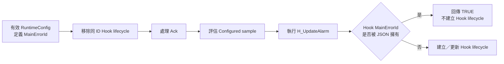
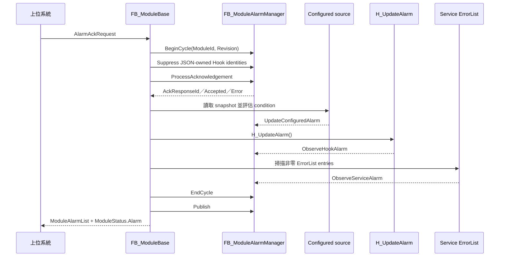
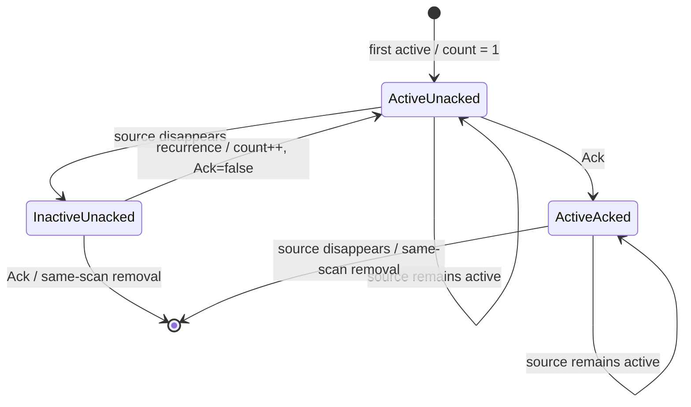

# Module Alarm 規格與行為說明

## 1. 文件目的與適用範圍

本文依目前 Robust Solution Framework 實作，定義 Module 對上位系統發布 Alarm 的共同契約，涵蓋：

- JSON `alarmList` 建立的 Configured alarm。
- Service `ST_ServiceStatus.ErrorList` 產生的 Service alarm。
- Module `H_UpdateAlarm()` 提交的 Hook alarm。
- Alarm identity、lifecycle、recurrence 與發布順序。
- PLC 與上位系統之間的 acknowledge request／response handshake。
- ModuleId、configuration revision、JSON ownership 與容量重設規則。

三種來源都由 [`FB_ModuleAlarmManager`](../RobustSolutionFramework/POUs/10_Module/FB_ModuleAlarmManager.TcPOU) 管理 lifecycle。Application Module 不應直接修改公開的 `ModuleAlarmList`。

本文中的「同 scan」指同一次 PLC cyclic execution，不代表上位系統一定能觀察到該 scan 的中間狀態。

## 2. 核心術語

### 2.1 Alarm Identity

單一 Module 內的穩定 identity 為：

```text
(ServiceId, MainErrorId)
```

跨 Module 保存或查找時，上位系統應使用：

```text
(ModuleId, ServiceId, MainErrorId)
```

規則如下：

- Configured alarm 與 Hook alarm 固定使用 `ServiceId = 0`。
- Service alarm 必須使用非零的實際 Service ID。
- Configured 與 Hook 因此共用 `(0, MainErrorId)` identity 空間。
- 相同 `MainErrorId` 可存在於不同非零 ServiceId，且可個別 acknowledge。
- `SourceErrorId`、`Message`、`Path`、Severity 與列表索引都不是 identity。
- `ModuleAlarmList` 是每 scan 重新建立的 dense snapshot；列表索引不是穩定 identity。

### 2.2 Alarm Lifecycle

Alarm lifecycle 從某個 identity 第一次變成 Active 開始，直到正常移除或 scope 被強制重設為止。

在 ModuleId 與 configuration scope 穩定、且沒有 JSON ownership 強制接管時，正常移除條件為：

```text
Active = FALSE AND Acknowledged = TRUE
```

ModuleId 改變、configuration revision 重設 Configured scope，以及 JSON 接管 Hook identity，屬於強制 scope／ownership 清理，不受上述一般移除條件限制。

### 2.3 Active、Acknowledged 與 Latched

- `Active`：目前來源條件存在。
- `Acknowledged`：上位系統已確認目前 lifecycle 的最新 occurrence。
- `Latched`：Alarm Manager 仍保存並發布該 lifecycle。

`Active = FALSE` 不代表 alarm 已從 `ModuleAlarmList` 移除。若尚未 acknowledge，它仍會以 inactive lifecycle 繼續發布。

### 2.4 Occurrence

Occurrence 是同一 identity 在目前 lifecycle 中的一次 `FALSE → TRUE` Active 上緣：

- 第一次 occurrence 設定 `OccurrenceCount = 1`。
- 來源持續 Active 的每個 scan 不增加 count。
- inactive 但尚未移除時再次 Active，count 加一並清除 Acknowledged。
- lifecycle 移除後重新發生，建立新 lifecycle，count 從一重新開始。

## 3. Alarm 來源與優先權

| 類型 | 來源 | `ServiceId` | Active 判定 | 保留容量 |
|---|---|---:|---|---:|
| Configured alarm | `RuntimeConfig.AlarmBindings` 與 configured snapshot | `0` | 最新有效 sample 符合 operator／threshold／tolerance | 30 |
| Service alarm | 各 Service 的 `Status.ErrorList` | 非零 | 本 scan 仍觀察到相同非零 ErrorList entry | 40 |
| Hook alarm | `H_UpdateAlarm()` 內呼叫 `M_AddAlarm()` | `0` | 本 scan 再次提交相同 MainErrorId | 30 |

公開容量為：

```text
30 Configured + 40 Service + 30 Hook = 100 Module alarms
```

三個分區容量互相獨立，不互相借用空槽。

### 3.1 Configured 對 Hook 的 ownership

有效 `RuntimeConfig` 中只要存在某個 configured `MainErrorId`，JSON 就擁有完整的 `(0, MainErrorId)` identity：

- Configured metadata、source value 與 condition 完整取代 Hook 定義。
- ownership 不取決於 configured condition 是否為 TRUE。
- ownership 不取決於 configured sample 是否有效。
- 同 identity 的既有 Hook lifecycle 會在 Ack 處理前被移除。
- `M_AddAlarm()` 遇到 JSON-owned identity 時回傳 `TRUE`，但不建立 Hook lifecycle，也不消耗 Hook 容量。
- 無效 configured sample 不會 fallback 到同 identity 的 Hook condition。
- 非零 ServiceId 的 Service alarm 不受此 ownership 規則影響。

JSON ownership 流程如下：



## 4. 公開資料結構

### 4.1 `ST_ExtAlarm`

[`ST_ExtAlarm`](../RobustSolutionFramework/DUTs/Contracts/Alarm/ST_ExtAlarm.TcDUT) 欄位契約：

| 欄位 | 契約 |
|---|---|
| `ModuleId` | Alarm Manager 以目前 Module identity 正規化。 |
| `ServiceId` | Configured／Hook 為 `0`；Service alarm 為實際 Service ID。 |
| `MainErrorId` | identity 的 error 部分，必須非零。 |
| `SourceErrorId` | lifecycle 第一次 occurrence 的底層錯誤資訊。 |
| `Message` | lifecycle 第一次 occurrence 的人類可讀描述。 |
| `Path` | lifecycle 第一次 occurrence 的來源路徑。 |
| `Severity` | lifecycle 第一次 occurrence 的嚴重度。 |
| `DateTime` | lifecycle 第一次 occurrence 的 UTC 時間，格式由 SystemContext 提供。 |
| `Active` | 來源目前是否存在。 |
| `Acknowledged` | 上位是否已 acknowledge 最新 occurrence。 |
| `OccurrenceCount` | 目前 lifecycle 內的 Active 上緣次數。 |

同一 lifecycle recurrence 時，manager 保留第一次的 `DateTime`、`SourceErrorId`、`Message`、`Path` 與 `Severity`，只更新：

```text
Active = TRUE
Acknowledged = FALSE
OccurrenceCount = OccurrenceCount + 1
```

### 4.2 `ST_AlarmAckRequest`

[`ST_AlarmAckRequest`](../RobustSolutionFramework/DUTs/Module/Alarm/ST_AlarmAckRequest.TcDUT) 目前欄位順序與用途：

| 順序 | 欄位 | 用途 |
|---:|---|---|
| 1 | `RequestId` | 非零 request correlation ID。 |
| 2 | `Command` | `AcknowledgeOne` 或 `AcknowledgeAll`。 |
| 3 | `MainErrorId` | `AcknowledgeOne` 的 identity 欄位。 |
| 4 | `ServiceId` | `AcknowledgeOne` 的 identity 欄位。 |
| 5 | `bChangeRequest` | 上升沿 request handshake。 |

Request 沒有 ModuleId 欄位；它是經由特定 Module 的 `ST_ModuleCtrl` 路由，因此 Module 本身就是 request scope。

### 4.3 `ST_ModuleAlarmStatus`

[`ST_ModuleAlarmStatus`](../RobustSolutionFramework/DUTs/Module/Alarm/ST_ModuleAlarmStatus.TcDUT) 欄位：

| 欄位 | 用途 |
|---|---|
| `AckResponseId` | 最近一次被處理 request 的 correlation ID。 |
| `AckAccepted` | request 是否成功套用。 |
| `AckError` | `None`、invalid request/command、duplicate 或 alarm not found。 |
| `ConfiguredLatchedCount` | Configured scope 目前保留的 lifecycle 數。 |
| `ServiceLatchedCount` | Service scope 目前保留的 lifecycle 數。 |
| `Overflow` | 本 scan 發生容量拒絕或發布防護溢位。 |
| `HookLatchedCount` | Hook scope 目前保留的 lifecycle 數。 |
| `DuplicateId` | 本 scan 第一個重複提交的 Hook MainErrorId；沒有則為零。 |

`Overflow` 與 `DuplicateId` 在每次 `M_BeginCycle()` 重設，是 scan-level diagnostics。三個 LatchedCount 在每次 publish 重新計算。

## 5. Module scan 順序

在 [`FB_ModuleBase.M_UpdateModule()`](../RobustSolutionFramework/POUs/10_Module/FB_ModuleBase.TcPOU) 中，alarm 更新發生在：

1. Module PackML 更新。
2. Service 更新。
3. BaseUnit cyclic update。
4. ServiceCoordinator 擷取本 scan Service status。
5. Alarm lifecycle 更新。
6. `ModuleAlarmList` dense publish。

`M_UpdateAlarmState()` 內部順序固定為：

1. `M_BeginCycle()`：套用 ModuleId／revision scope，重設 seen marker 與 scan diagnostics。
2. 依有效 JSON definition 執行 `M_SuppressHookAlarm()`。
3. `M_ProcessAcknowledgement()`。
4. 讀取並評估 Configured alarm。
5. 執行 `H_UpdateAlarm()`，接受 Hook submissions。
6. 掃描所有已註冊 Service 的 ErrorList。
7. `M_EndCycle()`：將本 scan 未出現的 Service／Hook identity 設為 inactive，並移除已 Ack 的 inactive lifecycle。
8. `M_Publish()`：建立公開 dense list 與 LatchedCount。



Ack 位於本 scan 新來源 sampling 之前，因此 `AcknowledgeAll` 不會 acknowledge 同一 scan 才首次出現、且上位尚未看過的新 alarm。

## 6. 正常 lifecycle 與移除

| Active | Acknowledged | 意義 | Manager 行為 |
|:---:|:---:|---|---|
| TRUE | FALSE | 來源存在、尚未 Ack | 保留並發布 |
| TRUE | TRUE | 來源存在、已 Ack | 保留並發布，等待來源解除 |
| FALSE | FALSE | 來源已解除、尚未 Ack | 保留並發布，等待 Ack |
| FALSE | TRUE | 來源已解除、且已 Ack | 同 scan 移除 |



`FALSE/TRUE` 通常不是上位可穩定觀察的發布狀態；manager 在 Ack 或 source update 使兩個條件同時成立時立即清除 lifecycle。

### 6.1 強制清除例外

下列行為會直接清除 lifecycle，不等待一般移除條件：

- ModuleId 改變：清除 Configured、Service、Hook 與 Ack protocol 狀態。
- Configuration revision 改變：清除全部 Configured lifecycle。
- JSON 接管 Hook identity：清除相同 MainErrorId 的 Hook lifecycle。

這些行為代表 scope 或 ownership 改變，不是一般 alarm source reset。

## 7. Configured alarm 行為

### 7.1 Configuration 約束

[`FB_ModuleConfigurationManager`](../RobustSolutionFramework/Configuration/POUs/FB_ModuleConfigurationManager.TcPOU) 對每個 configured alarm 要求：

- `source` 非空。
- `dataType` 可解析。
- `operator` 不是 `Invalid`。
- `mainErrorId` 非零。
- 同一 Module 的 configured `mainErrorId` 不可重複。
- 數量不可超過 30。

Configured definition 包含：

```text
Source, DataType, Operator, Threshold, Tolerance,
MainErrorId, SourceErrorId, Message, Severity
```

### 7.2 Condition operator

[`F_AlarmConditionMet`](../RobustSolutionFramework/Configuration/POUs/F_AlarmConditionMet.TcPOU) 的行為：

| JSON operator | Enum | 判定 |
|---|---|---|
| `gt` | `GreaterThan` | `Value > Threshold` |
| `lt` | `LessThan` | `Value < Threshold` |
| `eq` | `Equal` | `ABS(Value - Threshold) <= ABS(Tolerance)` |
| `ge` | `GreaterOrEqual` | `Value >= Threshold` |
| `le` | `LessOrEqual` | `Value <= Threshold` |

目前只有 `Equal` 使用 tolerance；其他 operator 沒有 hysteresis 或 tolerance band。

### 7.3 Sample validity

Configured alarm 只有在下列條件成立時才更新：

- `RuntimeConfig` reference 有效。
- `RuntimeConfig.Valid = TRUE`。
- Configured snapshot reader `Ready = TRUE`。
- 該 source sample `Valid = TRUE`。

若 reader 尚未 Ready 或 sample 無效：

- 不建立新 lifecycle。
- 不將既有 Active lifecycle 改成 inactive。
- 不改變 `PreviousActive`。
- JSON ownership 仍存在；同 identity Hook 不會接管。

有效 sample condition 為 FALSE 時，既有 lifecycle 變 inactive；若它已 acknowledged，會在同 scan 移除。

## 8. Hook alarm 行為

### 8.1 提交窗口

Application Module 只能在 `H_UpdateAlarm()` 內呼叫：

```iecst
M_AddAlarm(
    MainErrorId := ...,
    SourceErrorId := ...,
    Message := ...,
    Path := ...,
    Severity := ...);
```

`M_AddAlarm()` 在下列情況回傳 `FALSE`：

- 呼叫不在 `H_UpdateAlarm()` execution window。
- `MainErrorId = 0`。
- Hook 分區已滿。
- 同一 MainErrorId 在同 scan 重複提交。

JSON 已擁有相同 identity 時是例外：`M_AddAlarm()` 回傳 `TRUE`，但不建立 Hook lifecycle。

### 8.2 每 scan submission 語意

- 本 scan 提交：identity Active。
- 下一 scan 省略：`M_EndCycle()` 將它設為 inactive。
- 之後重新提交且 lifecycle 尚未移除：OccurrenceCount 加一，Acknowledged 清回 FALSE。
- 同 scan 第二次提交同 identity：保留第一次 metadata、回傳 FALSE，並將 `ModuleStatus.Alarm.DuplicateId` 設為第一個重複 ID。

`DuplicateId` 不用來報告 Service ErrorList 重複或 configured duplicate；configured duplicate 在 configuration validation 階段直接拒絕。

## 9. Service alarm 行為

### 9.1 Service ErrorList 是 source，不是公開 lifecycle

[`FB_ServiceBase.M_AddError()`](../RobustSolutionFramework/POUs/20_Service/FB_ServiceBase.TcPOU) 將錯誤加入 Service 自己的 `Status.ErrorList`：

- 每個 Service 最多保存 10 筆。
- 同一 Service 內以 `MainErrorId` 防止重複 entry。
- 容量滿時拒絕新 entry，不覆寫舊錯誤。
- metadata 使用該 Service 的 ModuleId、ServiceId、Path 與 UTC 時間。

Module 在每個 scan 掃描所有已註冊 Service。只要 ErrorList entry 的 `MainErrorId <> 0`，就視為該 identity 本 scan Active；Module aggregation 不使用 entry 中原有的 `Active` BOOL 作為觀測 gate。

Service 呼叫 `M_ClearAllError()` 或清空 ErrorList 後，Module 在同一個 alarm update 階段不再觀察到該 identity，因此 manager 將 lifecycle 設為 inactive。這不會自動 acknowledge，也不保證它立刻從 `ModuleAlarmList` 消失。

### 9.2 Composite Service 目前的清除時點

[`FB_CompositeServiceBase`](../RobustSolutionFramework/POUs/20_Service/FB_CompositeServiceBase.TcPOU) 目前有兩個 ErrorList 清除時點：

1. `H_OnClearing()`：只有 `_OwnershipHeld = TRUE`，且所有 dependencies 都已是 `Idle` 或 `Stopped` 時，呼叫 `M_ClearAllError()`，再完成 Clearing。
2. `H_OnResetting()`：第一個 scan 直接清空 Composite `Status.ErrorList`，之後才檢查 ownership 與 dependency Idle 狀態。

若 Composite 進入 Clearing 時沒有 ownership，`H_OnClearing()` 會提前 Done，不會執行 Clearing 尾端的 `M_ClearAllError()`；後續 Resetting first scan 仍會清除 ErrorList。

對上位發布結果如下：

```text
Composite ErrorList 被清空
        ↓
Module 不再觀察到 Service alarm
        ↓
Published alarm Active = FALSE
        ↓
若 Acknowledged = FALSE，仍留在 ModuleAlarmList
        ↓
收到 Ack 後移除
```

因此 PackML Clear／Reset 與 Alarm Acknowledge 是不同操作：

- Clear／Reset 處理設備或 Service state 與 source error。
- Acknowledge 表示上位已確認該 alarm lifecycle。

## 10. Acknowledge protocol

### 10.1 Handshake

Manager 只在 `bChangeRequest` 的 `FALSE → TRUE` 上緣處理 request：

```text
準備欄位與新的 RequestId
        ↓
bChangeRequest = TRUE
        ↓
等待 AckResponseId == RequestId
        ↓
讀取 AckAccepted／AckError
        ↓
bChangeRequest = FALSE
```

Request 維持 TRUE 時不會重複處理。回到 FALSE 後：

- `AckAccepted` 清為 FALSE。
- `AckError` 清為 `None`。
- `AckResponseId` 保留最近一次被處理的 ID。

### 10.2 RequestId 規則

實作只保存 `_LastAckRequestId`，因此明確拒絕的是「與上一筆已進入驗證流程的非零 RequestId 相同」；它不是全歷史去重集合。

建議上位仍使用單調遞增且非零的 RequestId，不要重用舊 ID。

其他細節：

- `RequestId = 0` 回覆 `InvalidRequestId`，不更新 `_LastAckRequestId`。
- 非零且不同於上一筆的 ID，會在 command／identity 驗證前成為新的 `_LastAckRequestId`。
- 因此 `InvalidCommand` 或 `AlarmNotFound` 也會消耗該非零 RequestId；用相同 ID 重送會得到 `DuplicateRequest`。

### 10.3 AcknowledgeOne

上位必須提供精確 identity：

```text
Service alarm    : ServiceId = 實際 Service ID, MainErrorId = error ID
Configured／Hook : ServiceId = 0, MainErrorId = error ID
```

搜尋規則：

- `ServiceId <> 0`：只搜尋 Service scope 的完整 `(ServiceId, MainErrorId)`。
- `ServiceId = 0`：先搜尋 Configured scope，再搜尋 Hook scope。
- 找不到時回覆 `AlarmNotFound`。
- `MainErrorId = 0` 也回覆 `AlarmNotFound`。

Configured ownership suppression 已在 Ack 之前執行，因此正常情況下同一 `(0, MainErrorId)` 不會同時存在 Configured 與 Hook lifecycle。

### 10.4 AcknowledgeAll

`AcknowledgeAll` 對 request scan 開始時已 latched 的 Configured、Service、Hook lifecycle 全部執行 Ack：

- Active lifecycle 變為 acknowledged 並繼續發布。
- Inactive lifecycle 立即移除。
- 即使當時沒有 alarm，request 仍回覆成功。
- 同 scan 後續才新建的 Configured／Hook／Service lifecycle 不會被這次 AckAll 消耗。

### 10.5 Error response

| 情況 | `AckError` |
|---|---|
| 成功 | `None`，且 `AckAccepted = TRUE` |
| `RequestId = 0` | `InvalidRequestId` |
| 與上一筆相同的非零 RequestId | `DuplicateRequest` |
| Command 不是 AckOne／AckAll | `InvalidCommand` |
| AckOne 找不到精確 identity | `AlarmNotFound` |

## 11. Publish、容量與 diagnostics

### 11.1 Dense publish 順序

`M_Publish()` 每 scan 先清空 `ModuleAlarmList`，再依固定順序寫入：

1. Service lifecycle。
2. Configured lifecycle。
3. Hook lifecycle。

每個 scope 內依 manager slot 順序發布。Alarm 移除後，後續項目會前移，所以順序只供顯示，不是 identity 或穩定排序承諾。

### 11.2 容量行為

| Scope | 容量 | 滿載行為 |
|---|---:|---|
| Configured | 30 | Configuration validation 拒絕超量定義。 |
| Service | 40 | 保留既有 lifecycle，拒絕新 identity，設定 `Overflow`。 |
| Hook | 30 | 保留既有 lifecycle，拒絕新 identity，設定 `Overflow`。 |
| Published total | 100 | 具有額外防護檢查；目前分區總和正好為 100。 |

若被拒絕的 Service 或 Hook source 持續存在，後續 scan 會再次嘗試建立 lifecycle；有空槽時即可進入。

Overflow 不會淘汰 active、inactive-unacknowledged 或 acknowledged-active lifecycle。

## 12. ModuleId 與 configuration revision

### 12.1 ModuleId 改變

`M_BeginCycle()` 偵測到 ModuleId 改變時會：

- 清除全部 Configured lifecycle。
- 清除全部 Service lifecycle。
- 清除全部 Hook lifecycle。
- 清除 Ack response、error、last RequestId 與 request edge 狀態。
- 保存新的 ModuleId 與 configuration revision。

這可避免不同 Module identity 共用舊 alarm 與 Ack protocol 狀態。

### 12.2 Configuration revision 改變

revision 改變時只會直接清除 Configured lifecycle：

- Service lifecycle 保留。
- Hook lifecycle 原則上保留。
- Ack protocol 去重與 response 狀態保留。
- 新 revision 定義所擁有的 Hook identity，會在同 scan 的 suppression 階段被移除。
- 與新 JSON definition 無關的 Hook lifecycle 保留其 occurrence 與 metadata。
- JSON definition 被移除後，Hook 可在該 scan 重新建立新的 lifecycle。

## 13. 行為範例

| 情境 | Scan 序列 | 結果 |
|---|---|---|
| 首次發生 | inactive → active | 建立 lifecycle；Active=TRUE、Ack=FALSE、Count=1。 |
| 持續 active | TRUE → TRUE → TRUE | Count 維持不變。 |
| reset-before-Ack | TRUE → FALSE；之後 Ack | 先以 inactive/unacknowledged 保留；Ack scan 移除。 |
| Ack-before-reset | Active 時 Ack；之後 source FALSE | 先以 active/acknowledged 保留；source reset scan 移除。 |
| lifecycle 內 recurrence | TRUE → FALSE → TRUE | Count 加一，Active=TRUE，Ack 清回 FALSE，首次 metadata 保留。 |
| 移除後重發 | lifecycle 移除；之後 TRUE | 建立新 lifecycle；Count=1，重新鎖存 metadata。 |
| AckAll 與新 alarm 同 scan | 先 AckAll，後 source 首次出現 | 新 alarm 維持 unacknowledged。 |
| Hook 本 scan 省略 | 上 scan 提交，本 scan 省略 | Hook lifecycle 變 inactive；未 Ack 時仍發布。 |
| JSON condition FALSE 覆蓋 Hook TRUE | definition 存在，sample valid false condition | Hook 被抑制；Configured 不建立 active lifecycle。 |
| JSON sample 無效且 Hook TRUE | definition 存在，sample invalid | Configured 狀態保持；Hook 不接管。 |
| Composite Clear 清空 ErrorList | ErrorList entry 消失 | Service alarm 變 inactive；未 Ack 時仍留在公開列表。 |

## 14. 上位系統使用契約

### 14.1 讀取 Alarm

- 每 scan 將 `ModuleAlarmList` 視為 dense snapshot。
- 以 `(ModuleId, ServiceId, MainErrorId)` 保存 identity。
- 不要以列表 index 保存、選取或 acknowledge alarm。
- `Active = FALSE` 的項目仍有意義，代表來源解除但尚未完成 lifecycle。
- 使用 `ConfiguredLatchedCount`、`ServiceLatchedCount`、`HookLatchedCount` 顯示各 scope 使用量。
- 監看 `Overflow` 與 `DuplicateId`，但記得它們是 scan-level diagnostics。

### 14.2 送出 AcknowledgeOne

1. 從 snapshot 保存 `ServiceId` 與 `MainErrorId`。
2. 產生新的非零 RequestId。
3. 寫入 `Command = AcknowledgeOne`。
4. 寫入精確 `ServiceId` 與 `MainErrorId`。
5. 最後將 `bChangeRequest` 設為 TRUE。
6. 等待 `AckResponseId = RequestId`。
7. 判讀 `AckAccepted` 與 `AckError`。
8. 將 `bChangeRequest` 設回 FALSE，完成 release。

### 14.3 送出 AcknowledgeAll

1. 使用新的非零 RequestId。
2. 寫入 `Command = AcknowledgeAll`。
3. 將 `bChangeRequest` 設為 TRUE。
4. 等待並判讀 response。
5. 將 request 拉回 FALSE。

AckAll 不依賴列表 index，也不需要填入個別 identity。

### 14.4 型別 metadata

PLC／C#／GUI 整合應從目前 TwinCAT symbol metadata 取得結構 layout，不得沿用舊版硬編碼的大小、array stride 或欄位 offset。

目前特別需要確認：

- `ST_AlarmAckRequest` 的欄位順序為 `RequestId, Command, MainErrorId, ServiceId, bChangeRequest`。
- `ST_ModuleAlarmStatus` 包含 HookLatchedCount 與 DuplicateId。
- `ModuleAlarmList` 固定為 100 筆 `ST_ExtAlarm`。

## 15. 驗證清單

- Configured、Service、Hook 三種來源都遵守 Active／Acknowledged lifecycle。
- Configured 與 Hook 使用 `ServiceId = 0`；Service 使用非零 ServiceId。
- 相同 MainErrorId、不同 ServiceId 可獨立 Ack。
- JSON definition 完整接管相同 Hook identity，包括 false 與 invalid sample。
- Hook 同 scan duplicate 保留第一筆 metadata，回報 DuplicateId。
- OccurrenceCount 只在 Active 上緣增加。
- Recurrence 清除 Ack，但保留 lifecycle 第一次 metadata／DateTime。
- reset-before-Ack 與 Ack-before-reset 都只在兩條件同時成立時正常移除。
- AckAll 不處理同 scan 後續新建的 alarm。
- Request 必須 low 後才能處理下一個上升沿。
- 上一筆相同 RequestId 回覆 DuplicateRequest。
- InvalidCommand／AlarmNotFound 使用的非零 RequestId 不可直接重送。
- Service／Configured／Hook 發布順序固定，且列表 dense。
- 容量固定為 Configured 30、Service 40、Hook 30、Published 100。
- Configuration revision 只直接重設 Configured scope；ModuleId 改變重設全部 scope 與 Ack protocol。
- Service ErrorList 清空只使 Module lifecycle inactive，不等於 acknowledge。
- Composite successful Clearing 與 Resetting 的 ErrorList 清除時點符合目前實作。

## 16. 對應實作與測試

主要實作：

- [`FB_ModuleAlarmManager.TcPOU`](../RobustSolutionFramework/POUs/10_Module/FB_ModuleAlarmManager.TcPOU)
- [`FB_ModuleBase.TcPOU`](../RobustSolutionFramework/POUs/10_Module/FB_ModuleBase.TcPOU)
- [`FB_ServiceBase.TcPOU`](../RobustSolutionFramework/POUs/20_Service/FB_ServiceBase.TcPOU)
- [`FB_CompositeServiceBase.TcPOU`](../RobustSolutionFramework/POUs/20_Service/FB_CompositeServiceBase.TcPOU)
- [`FB_ModuleConfigurationManager.TcPOU`](../RobustSolutionFramework/Configuration/POUs/FB_ModuleConfigurationManager.TcPOU)
- [`Param_Config.TcGVL`](../RobustSolutionFramework/GVLs/Param_Config.TcGVL)

對應測試：

- [`FB_ModuleAlarmManagerTests.TcPOU`](../FrameworkUnitTest/POUs/Test%20Suites/Module/FB_ModuleAlarmManagerTests.TcPOU)
- [`FB_ModuleBaseTests.TcPOU`](../FrameworkUnitTest/POUs/Test%20Suites/Module/FB_ModuleBaseTests.TcPOU)
- [`FB_ServiceBaseTests.TcPOU`](../FrameworkUnitTest/POUs/Test%20Suites/Service/FB_ServiceBaseTests.TcPOU)

本文件描述的是目前程式行為。TwinCAT XML 靜態解析、Structured Text compile 與 TcUnit runtime 是不同層級的驗證，不得互相替代。
