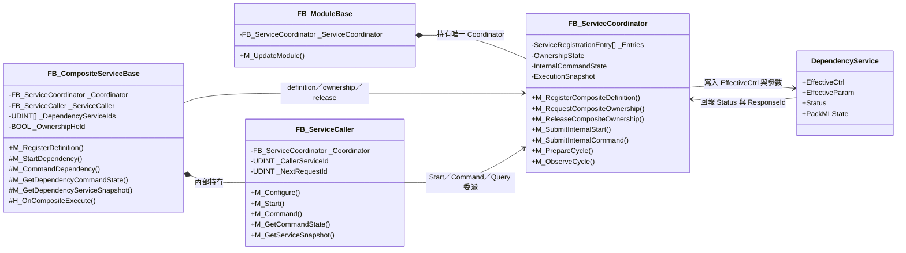
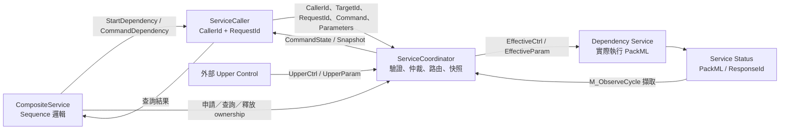
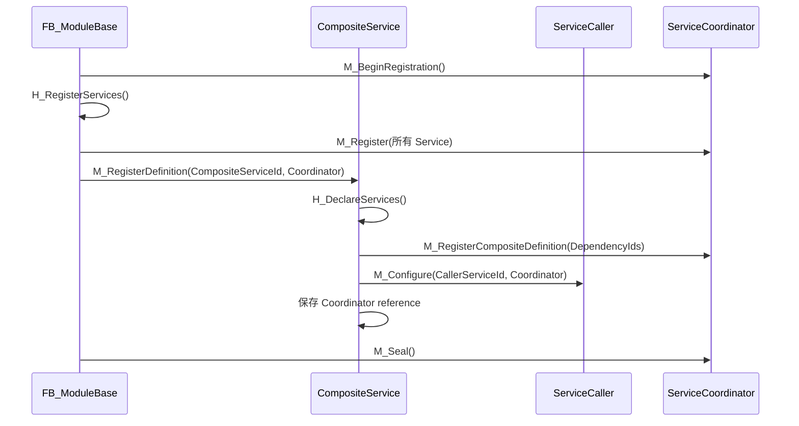
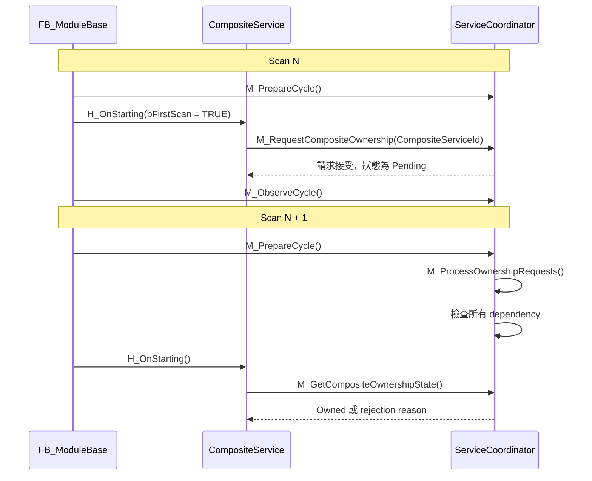
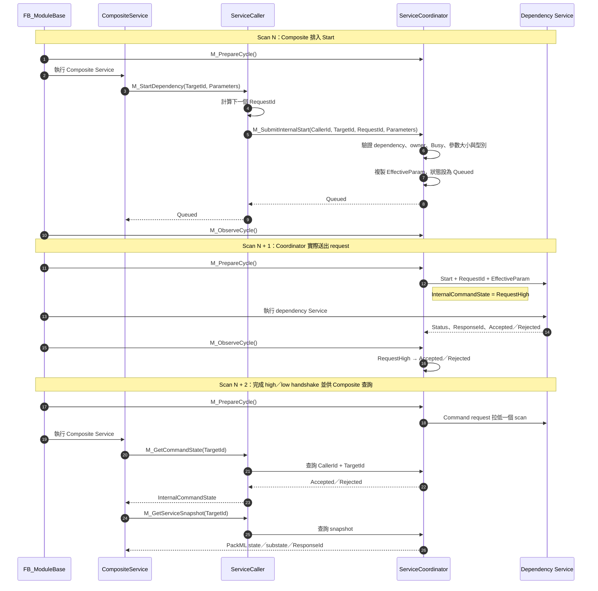
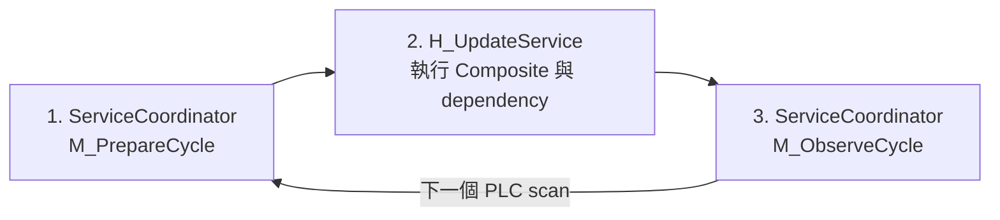
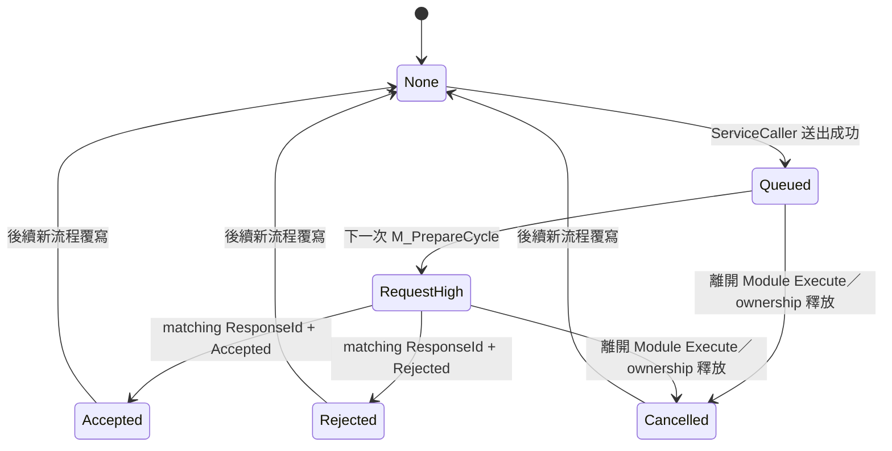

# ServiceCoordinator、ServiceCaller 與 CompositeService 關係說明

## 1. 文件目的

本文說明 Robust Solution Framework 中下列三個元件的責任、持有關係、資料流與跨 PLC scan 的呼叫時序：

- `FB_ServiceCoordinator`
- `FB_ServiceCaller`
- `FB_CompositeServiceBase`，以及由它衍生的 Composite Service

最簡單的理解方式是：

> `CompositeService` 決定「要做什麼」；`ServiceCaller` 負責「用誰的身分提出請求」；`ServiceCoordinator` 決定「能不能做、何時送出，並追蹤結果」。

Dependency Service 是實際執行工作的 Service。它不需要直接知道命令來自哪一個 Composite Service。

## 2. 三者的核心責任

| 元件 | 主要責任 | 持有的主要資料 | 不負責的事情 |
|---|---|---|---|
| `FB_CompositeServiceBase` | 定義 dependency、編排執行順序、處理 dependency 異常與 lifecycle | dependency ID 清單、sequence 狀態、ownership 使用狀態 | 不直接寫入 dependency 的 `EffectiveCtrl` |
| `FB_ServiceCaller` | 以固定 Caller 身分送出 Start／Command，並查詢命令及 Service 狀態 | `CallerServiceId`、下一個 `RequestId`、Coordinator reference | 不決定 ownership，不保存 Service 的實際執行狀態 |
| `FB_ServiceCoordinator` | 登錄 Service、驗證 dependency、仲裁 ownership、路由命令、建立 snapshot | registration entries、owner ID、internal command state、參數位址、execution snapshot | 不決定 Composite 的製程執行順序 |
| Dependency Service | 執行實際 PackML 流程並產生狀態 | PackML state、Status、ResponseId、alarm/data | 不需要知道是哪個 Composite 在呼叫 |

## 3. 類別與持有關係



重要關係如下：

1. `FB_ModuleBase` 持有一個 `FB_ServiceCoordinator`。
2. Composite Service 內部持有一個 `FB_ServiceCaller`。
3. Composite Service 與其 `FB_ServiceCaller` 都 reference 到同一個 Coordinator。
4. `FB_ServiceCaller` 不直接 reference 到 dependency Service。
5. Coordinator 透過註冊時保存的控制、參數及狀態位址與 dependency Service 交換資料。

## 4. Composite Service 的兩條呼叫路徑

Composite Service 會以兩種不同方式使用 Coordinator。

### 4.1 直接呼叫 Coordinator：管理關係與 ownership

Composite Service 直接呼叫 Coordinator 來執行：

- `M_RegisterCompositeDefinition()`：登錄 dependency 清單。
- `M_RequestCompositeOwnership()`：申請 dependency ownership。
- `M_GetCompositeOwnershipState()`：查詢申請結果。
- `M_ReleaseCompositeOwnership()`：釋放 dependency ownership。

這條路徑處理的是「誰可以控制 dependency」，而不是實際的 PackML 命令。

### 4.2 經由 ServiceCaller：操作及查詢 dependency

Composite Service 經由內部的 `FB_ServiceCaller` 執行：

- `M_StartDependency()` → `FB_ServiceCaller.M_Start()`
- `M_CommandDependency()` → `FB_ServiceCaller.M_Command()`
- `M_GetDependencyCommandState()` → `FB_ServiceCaller.M_GetCommandState()`
- `M_GetDependencyServiceSnapshot()` → `FB_ServiceCaller.M_GetServiceSnapshot()`

`FB_ServiceCaller` 會自動附加：

- Composite 的 `CallerServiceId`
- 本次請求的 `RequestId`
- Target dependency 的 `ServiceId`

Coordinator 才是最後執行 dependency、ownership、Busy 與參數型別驗證的元件。

## 5. 整體資料流



### 5.1 沒有 Composite owner 時

Coordinator 讓 Service 接受正常的 upper control：

```text
UpperCtrl / UpperParam
          │
          ▼
 ServiceCoordinator
          │
          ▼
EffectiveCtrl / EffectiveParam
          │
          ▼
  Dependency Service
```

Start 的參數只會在新 Start request 的上升沿複製到 `EffectiveParam`，使該次執行期間使用的參數保持穩定。

### 5.2 Dependency 被 Composite 擁有時

```text
CompositeService
       │
       ▼
 ServiceCaller
       │
       ▼
 ServiceCoordinator ──→ Dependency Service

外部 UpperCtrl ──X──→ 被 Coordinator 抑制
```

ownership 存續期間：

- dependency 只接受 owner Composite 經由 ServiceCaller 提出的內部命令。
- dependency 的 direct upper command 會被抑制。
- upper mode change 也會被抑制。
- Coordinator 會維護內部命令的 `Queued → RequestHigh → Accepted/Rejected` 狀態。

## 6. 註冊階段

註冊只會在 Module 初始化時執行一次。



註冊順序需要符合下列要求：

1. 先登錄所有 dependency Service。
2. 再登錄 Composite definition，因為 Coordinator 必須能解析每個 dependency ID。
3. 最後才呼叫 `M_Seal()`。

`M_RegisterDefinition()` 成功後，Composite 與內部 ServiceCaller 才會被標記為 configured。

## 7. Ownership 取得流程

Composite Service 進入 Starting 時不會直接控制 dependency，而是先申請所有 dependency 的 ownership。



Coordinator 只有在以下條件全部成立時才會授予 ownership：

- Module 位於 Execute。
- 所有 dependency 都已有有效 snapshot。
- 所有 dependency 都位於 Idle。
- 所有 dependency 都使用 `NaturalCompletion`。
- 所有 dependency 都沒有被其他 Composite 擁有。

這個取得動作對單一 Composite 是原子的：全部 dependency 一起取得，或完全不取得。

當同一個 scan 有多個 Pending Composite 時，Coordinator 依 `CompositeServiceId` 由小到大處理，使結果具有 deterministic order。

## 8. Start dependency 的跨 scan 時序

請求不會在 Composite 呼叫 `M_StartDependency()` 的同一個 scan 立即送到 dependency。



### 8.1 RequestId 規則

`FB_ServiceCaller` 會先計算下一個非零 RequestId，但只有 Coordinator 回傳 `Queued` 時才會提交遞增結果。

因此：

- 驗證失敗不會消耗 RequestId。
- Busy 不會消耗 RequestId。
- `ResponseId` 可以和成功送出的 RequestId 穩定對應。

### 8.2 Start 參數規則

Coordinator 在接受 `M_SubmitInternalStart()` 時會：

1. 驗證 `ANY` 的位址與大小。
2. 驗證參數大小與登錄時的 DUT 大小一致。
3. 解析並比對真實 DUT 型別名稱。
4. 將參數複製到 dependency 的 `EffectiveParam`。
5. 最後才把 Start request 設為 `Queued`。

這可以避免 dependency 看到型別錯誤、大小錯誤或只更新一部分的參數。

## 9. 每個 PLC scan 的框架順序

`FB_ModuleBase.M_UpdateModule()` 中和 Service 有關的主要順序如下：



三個階段的責任為：

1. `M_PrepareCycle()`
   - 處理 Pending ownership。
   - 將 queued internal request 轉為 request high。
   - 建立每個 Service 本 scan 使用的 `EffectiveCtrl`。
   - 在必要時複製 `EffectiveParam`。

2. `H_UpdateService()`
   - 執行 Composite Service 與一般 dependency Service。
   - Service 讀取 effective input 並更新自己的 Status。
   - Composite 在這個階段提出的新命令只能先進入 queue。

3. `M_ObserveCycle()`
   - 擷取本 scan 所有 Service 的 Status。
   - 產生下一個 scan 可讀取的 execution snapshot。
   - 依 `RequestId` 判斷內部命令 Accepted／Rejected。
   - 更新 `AllIdle`、`AllStopped` 與 `AllAborted`。

這個固定順序讓行為不依賴 derived Module 在 `H_UpdateService()` 內呼叫各 Service 的先後順序。

## 10. Command handshake

內部命令的主要狀態如下：



當 request 成為 Accepted 或 Rejected 後，Coordinator 會要求一個 request-low scan，以完成 PackML command change request 的 high／low 握手。

等待 request-low 的期間仍視為 Busy，因此 Composite 不可立即覆寫同一個 dependency 的下一筆命令。

## 11. Snapshot 資料流

Coordinator 回傳的 snapshot 不是即時直接讀取，而是 `M_ObserveCycle()` 在上一個 scan 結束時保存的穩定結果。

```mermaid
flowchart LR
    Child["Dependency Status"]
    Observe["M_ObserveCycle"]
    Snapshot["ST_ServiceExecutionSnapshot"]
    Coordinator["ServiceCoordinator"]
    Caller["ServiceCaller"]
    Composite["Composite sequence"]

    Child --> Observe --> Snapshot
    Snapshot --> Coordinator
    Coordinator -->|"M_GetServiceSnapshotById"| Caller
    Caller -->|"M_GetServiceSnapshot"| Composite
```



Snapshot 包含：

- `ServiceId`
- `ResponseId`
- `PackMLOut`
- `ExecuteSubState`
- `CompletionBehavior`
- `Valid`

Composite 使用 snapshot 判斷 dependency 是否：

- 已接受或拒絕命令。
- 已進入預期 PackML state。
- 意外進入 Stopped 或 Aborted。
- 已完成動作並可進行下一個 sequence step。

## 12. Lifecycle 與 ownership 釋放

Composite 持有 ownership 時，也負責把 dependency 帶回安全狀態：

- Stopping：必要時送出 Stop。
- Aborting：必要時送出 Abort。
- Clearing：對 Aborted dependency 送出 Clear。
- Resetting：對 Stopped／Complete dependency 送出 Reset。
- Completing：對 Complete dependency 送出 Reset，等待全部回到 Idle。

正常完成或 Resetting 時，只有在 dependency 全部回到 Idle 後，Composite 才會呼叫：

```text
M_ReleaseCompositeOwnership(CompositeServiceId)
```

`H_OnIdle()` 另有防禦性清理：如果 Composite 已回到 Idle 但仍持有 ownership，會再次確保 ownership 被釋放。

Coordinator 釋放 ownership 時會：

1. 只清除目前仍由該 Composite 擁有的 dependency。
2. 將尚未完成的 queued／request-high 命令標記為 Cancelled。
3. 將輸往 dependency 的 command request 拉低。
4. 將 Composite ownership state 重設為 `None`。

## 13. 常見誤解

### 13.1 ServiceCaller 會直接呼叫 dependency Service

不會。ServiceCaller 只呼叫 Coordinator，由 Coordinator 寫入 dependency 註冊的 effective control 與參數儲存位置。

### 13.2 ServiceCaller 負責權限檢查

不完全正確。ServiceCaller 會攜帶 Caller ID，但實際的 dependency declaration、ownership、Busy 與參數驗證都由 Coordinator 執行。

### 13.3 M_StartDependency 成功後，dependency 已經開始執行

不一定。回傳 `Queued` 只表示 Coordinator 接受了請求；實際 request high 會在下一次 `M_PrepareCycle()` 發生。

### 13.4 Composite 取得 ownership 後，外部仍可直接控制 dependency

不可以。Coordinator 會抑制 direct upper command 與 mode request，只保留 owner Composite 的 internal command path。

### 13.5 Snapshot 是 Service 當下正在改寫的資料

不是。Snapshot 是 Coordinator 在上一個 `M_ObserveCycle()` 保存的穩定副本，因此 Composite 可以在本 scan 使用一致的資料做 sequence 判斷。

## 14. 心智模型總結

```text
CompositeService = 流程編排者
ServiceCaller    = 帶有呼叫者身分與 RequestId 的代理人
Coordinator      = 唯一的註冊、仲裁、路由與狀態交換中心
Dependency       = 真正執行工作的 Service
```

資料方向可以簡化為：

```text
命令方向：Composite → ServiceCaller → Coordinator → Dependency
狀態方向：Dependency → Coordinator → ServiceCaller → Composite
管理方向：Composite ↔ Coordinator（definition／ownership／release）
```

## 15. 對應程式位置

- [`FB_CompositeServiceBase.TcPOU`](../RobustSolutionFramework/POUs/20_Service/FB_CompositeServiceBase.TcPOU)
- [`FB_ServiceCaller.TcPOU`](../RobustSolutionFramework/POUs/10_Module/FB_ServiceCaller.TcPOU)
- [`FB_ServiceCoordinator.TcPOU`](../RobustSolutionFramework/POUs/10_Module/FB_ServiceCoordinator.TcPOU)
- [`FB_ModuleBase.TcPOU`](../RobustSolutionFramework/POUs/10_Module/FB_ModuleBase.TcPOU)

